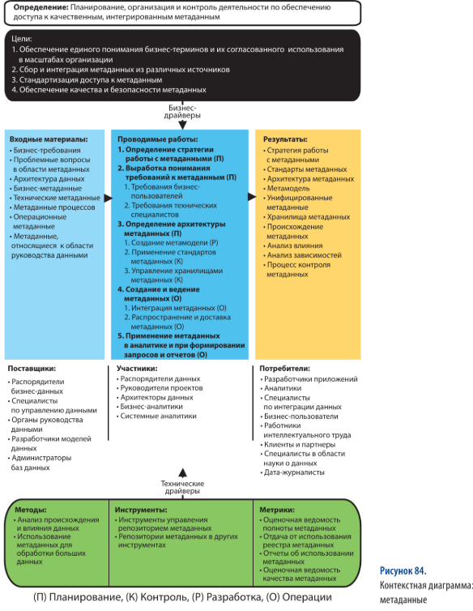
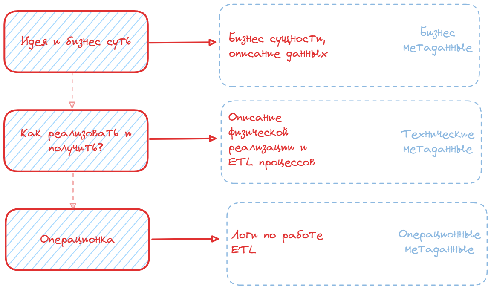
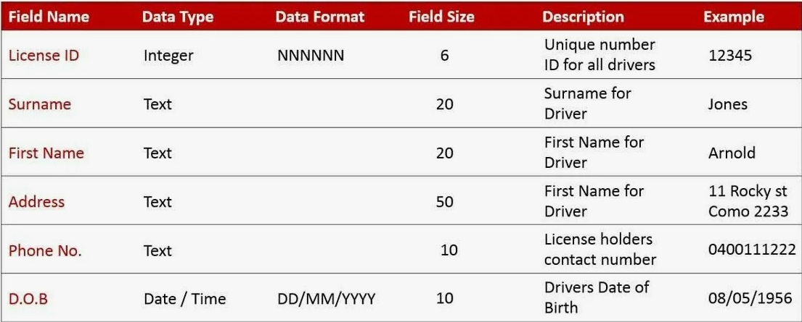

# Глава 12. Управление метаданными

## Введение

> Организация без метаданных уподобается библиотеки без карточного каталога

> Метаданные служат главным средством регистрации, формализации и упорядочивания знаний о данных, имеющихся у организации.
>

**Хорошо** управляемые метаданные обеспечивают:

- повышение доверия к данным за счет предоставления их контекста и поддержки возможности измерения качетва данных
- выявление и устранение избыточных данных и процессов по поддержке избыточных данных
- своевременное выявление и отбраковка устаревших или неверных данных
- лучшее взаимопонимание между потребителями и специалистами ИТ

**Плохо** управляемые метаданные приводят к:

- появление избыточных данных и бессмысленных процессов управления ими
- дублирующие друг друга избыточные, устаревшие или вовсе не используемые словари, репозитории и иные хранилища метаданных
- противоричивые определения объектов и эллементов данных
- конфликтующие между собой источники и версии метаданных и, как следствие, подрыв доверия пользователей к любым определениям данных

## Основные понятия и концепции

Виды метаданных:

- **Бизнес метаданные**  
Бизнес-метаданные описывают содержание и состояние данных (их бизнес суть), а также детали необходимые для реализации дата-стюардшипмента.  
Например: *нетехнические наименования и определение понятий, типы данных, диапазоны и области допустимых значений данных, расчетные формулы, алгоритмы и бизнес правила, правила и резулультаты качества данных, первоисточники и происхождение данных, расписание обновления данных*
- **Технические метаданные**  
Технические метаданные описываби техническую реализацию хранения данных, процессов их перемещения (как их получать). **Описание** интеграции, хранения и обработки данных.  
Например: *имена таблиц названия столбцов в физической модели данных; существующие группы доступа; свойства объекта БД и связи между ними; правила создания, замены или удаления записей; описание ETL процессов; название и описание программ и приложений*
- **Операционные метаданные**
**Фактические** (в отличие от технических метаданных, где только описание) события на жизненном цикле работе с данными.  
Например: *Фактически выданные права доступа; Логи выполнения ETL процессов*

### Цели для управления метаданными

- обеспечение единой трактовки данных и бизнес-терминов всеми кто их использует
- сбор и интеграция метаданных из различных источников, для понимания сходств и различий между данными, поступающими из различных частей организации
- обеспечение качества, согласованности, актуальности и защищенности методанных
- организация и стандартизация доступа к метаданным
- создание и контроль стандартов метаданных

### Руководящие принципы по управлению метаднными

- **Приверженость со стороны организации** и достаточные объемы финансирования
- **Наличие стратегии по работе с метаданными**, описывающеей всеорганизационный план создания, сопровождения, интеграции и использования метаданных
- **Корпоративная перспектива** по расширению и дополнению в будушем, после **ощутимой финансовой отдачи** после первых этапов
- **Социализация**, разъяснительные работы и обоснование необходимости метаданных каждого типа
- **Доступность**
- **Качество**, лица отвечающие за процессы, порождающие метаданные, должны нести персональную ответсвенность и за качество метаданных, которые порождают их процессы
- **Аудит**. Утсановка стандартов метаданных и строгий контроль их соблюдения
  **Совершенствование**. Создание механизма для обратной связи, обработка обратной связи и сигналов об ошибочных или недостоверных метаданных

## Метаданные для неструктурированных данных

**Неструктурированные данные** - это данные которые не могут быть отструктурированы в виде привычных строчек и столбцов в СУБД или упорядочненных файлов. (фото, видео, аудио, изображения и т.п.)

Для управления неструктированнными данными, верятно, метаданные нужны еще больше чем для структурированных.
Какие виды могу быть:

- описательные - ключевые слова, рубрика каталога, теги, и т.п.
- стуктурные - формат данных, поля внутри, размер изображения и т.п.
- административные - название, источник, дата поступления и обновления, расписание обновления, права доступа
- учетные - сроки и правила хранения

## Источники метаданных
>
> Здесь буду описывать только заинтересовавшие меня источники метаданных

### Бизнес глоссарий

**Бизнес глоссарий** (Business Glossary) - это документ в котором описаны термины и определения, а также связи между ними.
Пример наполнения бизнес глоссария:

- **Термин** (слово или словосочетание)
- **Определение термина**
- **Бизнес подразделение и/или приложение** к которому относиться термин
- **Лицо, ответсвенное за сопровождение термина**
- **Версионность** определений
- **Противоречия определению термина**, а также планы и сроки по их разрешению/устранению
- **Распространенные неверные трактовки термина** с объяснениями сути ошибок
- **Алгоритмы выработки** определения  

### Словарь данных

**Словарь данных** (Data Dictionary) - документ содержащий бизнес описание структуры данных. Часто используют при создании логической модели данных
Он описыват:

- Названия
- Тип данных
- Диапазоны
- Бизнес смысл
- Первичный и внешние ключи
- Пример данных
- Nullable
- Формат даты
  

c 533
