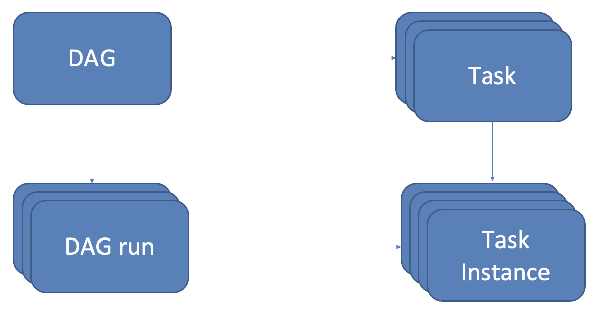
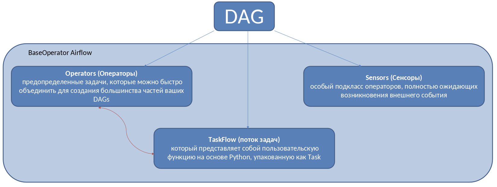
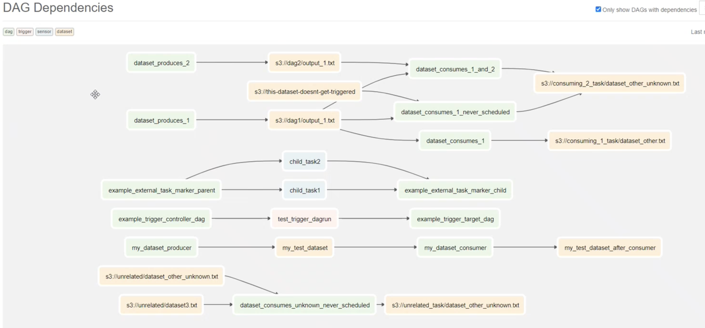
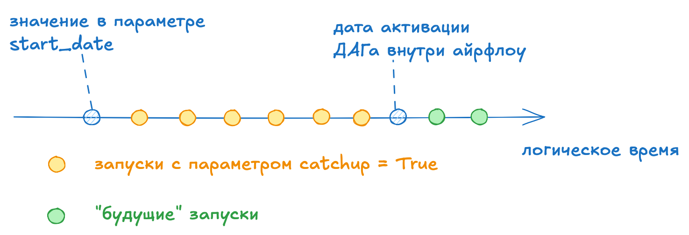

# Введение в Apache Airflow

## Нумерация версий

Начиная с версии 2.0.0 нумерация версий осуществяется следующим образом  
X.Y.Z  

- X - основной номер версии (**major release**), меняется при мажорном релизе и не имеет обратной совместимости с предыдущими версиями. То есть при переходе с версии X на X+1 нужно бедет переписывать логику взаимодействия
- Y - дополнительный номер версии (**feature release**), выпускаются раз в несколько месяцев содержан новые функции внутри основной версии
- Z - номер исправления (**patch release**), выпускаются по мере необходимости. Эти выпуски на 100% совместимы с предыдущими версиями и **всегда** необходимы для установки

## Базовые абстракции

- **DAG** - класс дага с набор тасок и зависимостями между ними, а также прочих настроек
- **Task** - класс тех или иных операторов или сенсоров.
- **DAG run** - конкретный *"запуск"* ДАГа. Имеет атрибуты: когда запустился, статус выполнения и т.д.
- **Task Instance** - конкретный *"запуск"* таски, также имеют собственные атрибуты


## Эллементы DAGа

Элементы ДАГа:


- Все эллементы ДАГа имеют зависимости друг от друга.
- Выстраивание зависимостей между элементами  создается с помощью операторов `>>` и `<<` или при помощи методов `set_upstream` и `set _downstream`

```python
task_1 >> [task_2, task_3]
task_4 << task_3

task_1.set_downstream([task_2, task_3])
task_4.set_upstream(task_3)
```

## Датасеты

Dataset - это просто абстрактная сущность в apache airfow который не привязан к физической файловой системе.
К данной сущности могут быть привязаны к этому датасету, как создавать/обновлять так и стартовать при обновлении одного или нескольких датасетов

## DAG Dependcies

В айрфлоу можно выстраивать отношения между дагами  

Сделать это можно используя TriggerDagRunOperator, DagSensor или DataSet

## Некоторые свойства DAG

- Для создания ДАГа файл пайтон должен содержать создание экземпляра класса DAG
`airflow.DAG`
- За имя ДАГа внутри апач айрфлоу отвечает параметр `dag_id`. Имя файла может отличаться от имени дага
- Параметр `start_date` отвечает за момент времени с которого начнет работать ДАГ, она также может быть в будущем
- параметр `catchup` (True|False) отвечает за необходимость выполнения дагов с момента `start_date` через каждый промежуток согласно `schedule`

- `default_args` параметры передающиеся во все операторы внутри ДАГа, если они не указаны в нем явно
- **бест практисом** является создание и вызов дага через контекстный менеджер:

```python
with DAG(
    *args,
    **kwargs,
) as dag:
    pass
```
