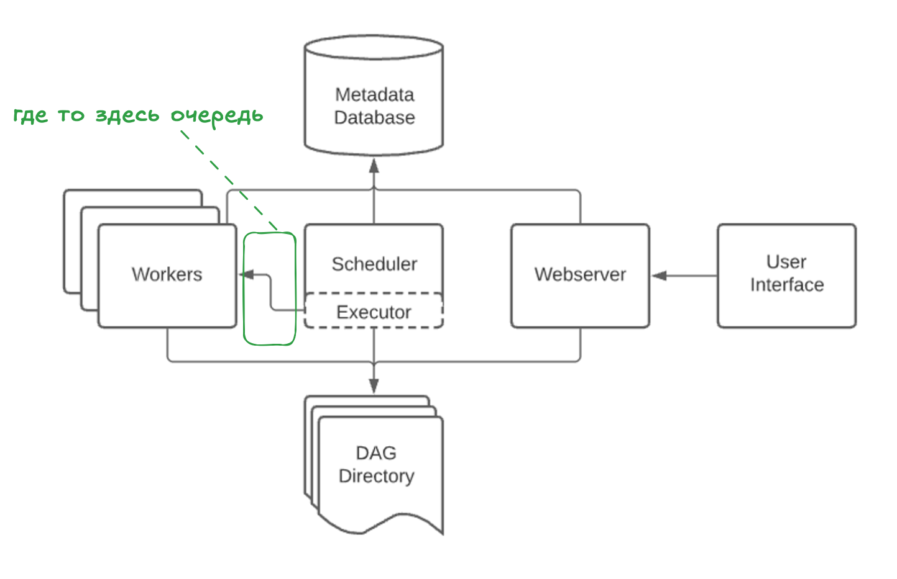
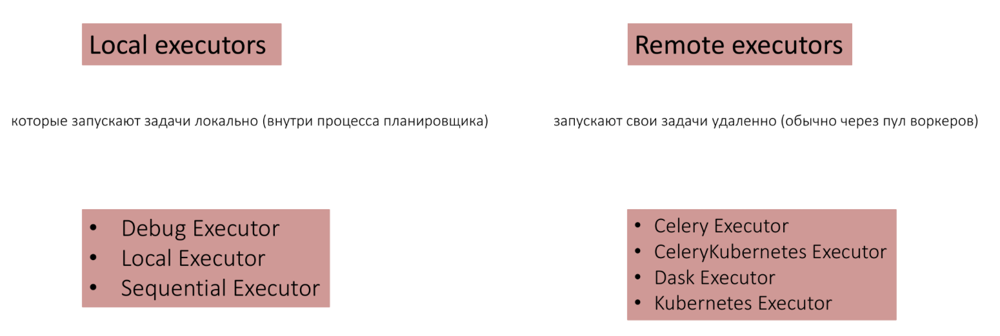
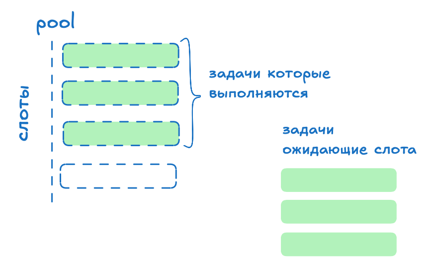
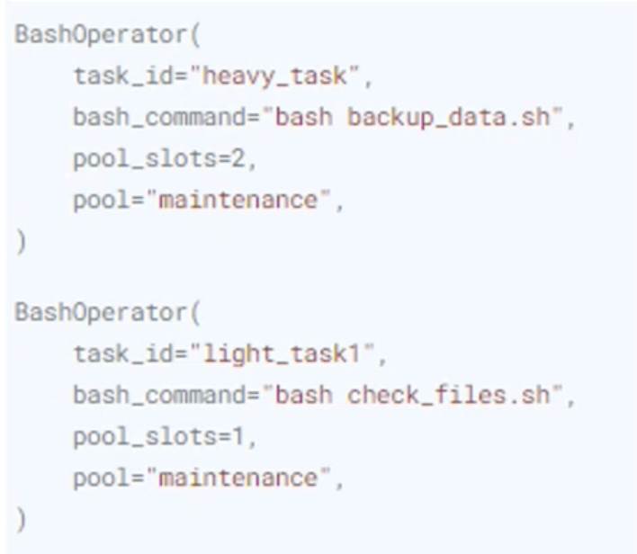
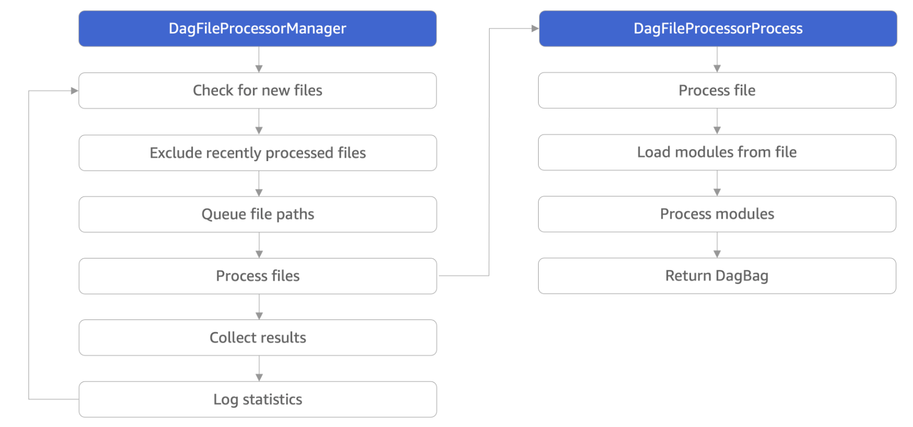
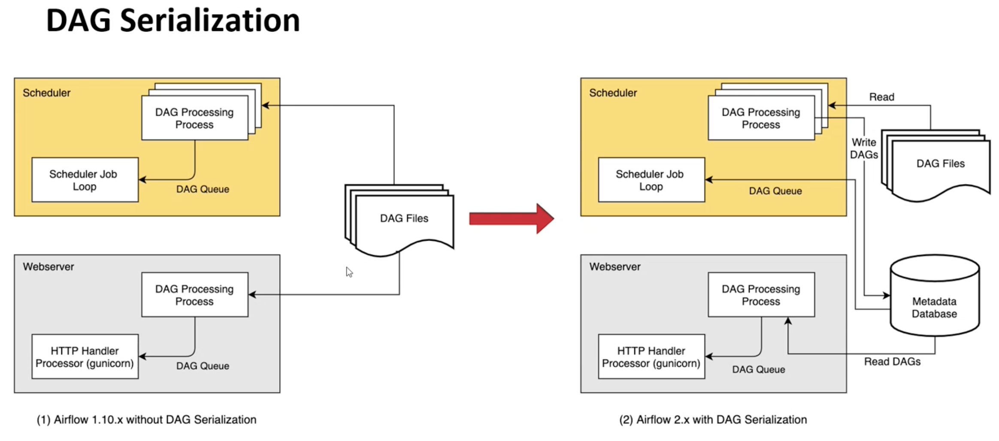
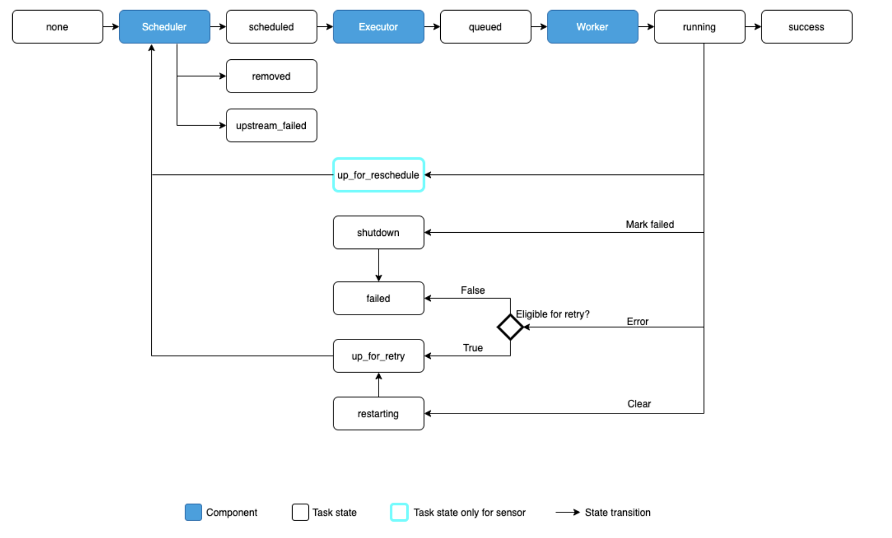

# Архитектура Apache Airflow

Для создания ДАГа внутри айрфлоу - нужно создать python файл и физически разместить его в папку dags или во вложенные в нее папки, то есть папку в которой программа ожидает увидеть наши даги. Апач айрфлоу рекурсивно сканирует папку с ДАГами и пытается добавить их в БД как даг

## Основные компоненты

Общая архитектурная схема:  

### Scheduler (Планировщик)

- отслеживает появление ДАГов запуски ДАГов и тасок, а также обновляет статусы у ДАГ ранов и ТАСК инстансов

Если упрощенно, планировщик это бесконечный цикл, который делает следующие шаги:

1. Проверяет наличие ДАГов (классов внутри файлов в папке с дагами), которым требуется новый экземпляр ДАГ рана и создает их
2. Проверяет ДАГ инстансы на задачи требующие выполнения (sheduleable)
3. Проверяет запланированные таск-инстансы и ставит их в очередь на выполнение (передает в экзекьютор), соблюдая ограничения **пулла**

Возможен запуск нескольких планировщиков, в этом случае коллизии работы над одним ДАГом или задачей будут решаться на уровне базы данных

Виды тригеров:  

### **Executor (Исполнитель)**

- компонент на стороне Scheduler который определяет, как и где будут выполняться задачи (локально или на удаленных воркерах, последовательно или паралельно)
То есть механизм с помощью которого запускаются экземпляры задач

Айрфлоу может иметь только одного исполнителя - это настраивается в файле конфигурации айрфлоу: `airflow.cfg`

Виды некоторых экзекьюторов:

### **Pools**

- некая настраиваемая абстракция внутри айрфлоу позволяющая управлять нагрузкой и паралелизмом задач
Slots - максимально количество одновременно запущенных задач. Если все слоты заняты, таска будет одидать освобождение слота для начала работы

В айрфлоу можно создавать несколько пулов при необходимости, например можно создать отдельный пул для задач которые точно должны быть выполнены.

Пуллы назначаются задачам

### **База данных с метаданными**

- реляционная база данных (чаще всего PostgeSQL) используются планировщиком, исполнителем и веб сервером для хранения состояния  

### **Queue (Очередь)**

- компонент между планировщиком и исполнителем позволяющая масштабировать горизонтально айрфлоу. Также позволяет выбрать определенные машины для исполнения задач, т.к. машины могут быть распределены между разными очередями
- дефолтная очередь настривается в `airflow.cfg`

## **Worker (Работник)**

- исполняет таски переданные из планировщика. Причем задачи могут выполняться на той же машине что и планировщик, так и отдельно

### **Папка файлов с DAGs**

- папка содержащая код ДАГов читаемая как планировщиком и исполнителем  
  
Может содержать как файлы с ДАГами так и без них.

В корне папки можно создать файл `.airflowirnore` в котором описать файлы которые шедулер будет игнорировать.

Планировщик рассматривает для дальнейшей обработки только python файлы со строкой **airflow** и **dag** внутри (без учета регистра)

### Triggerer

Служба направленная на отслеживание срабатывания trigger, это отдельная концепция в airflow, не путать со способами запуска ДАГов

**Процесс обработки файлов**:

В процессе обработки файла учавстувуют два основных компонентов:

- **DagFileProcessorManager** - процесс, выполняющий бесконечный цикл, который определяет какие файлы необходимо обработать
- **DagFileProcessorProcess** - процесс который преобразует файл в один или несколько объектов ДАГ

С версии 2.x айрфлоу сериализует ДАГи из папки в БД:  

### **Webserver (Веб-сервер)**

- пользовательский веб интерфейс.

## Жизненный цикл задачи и ДАГа

