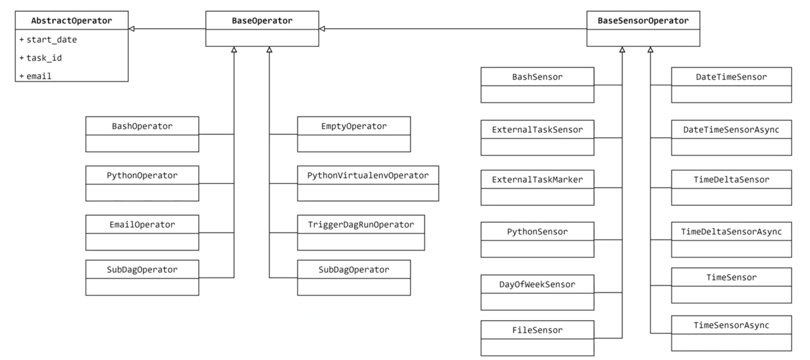
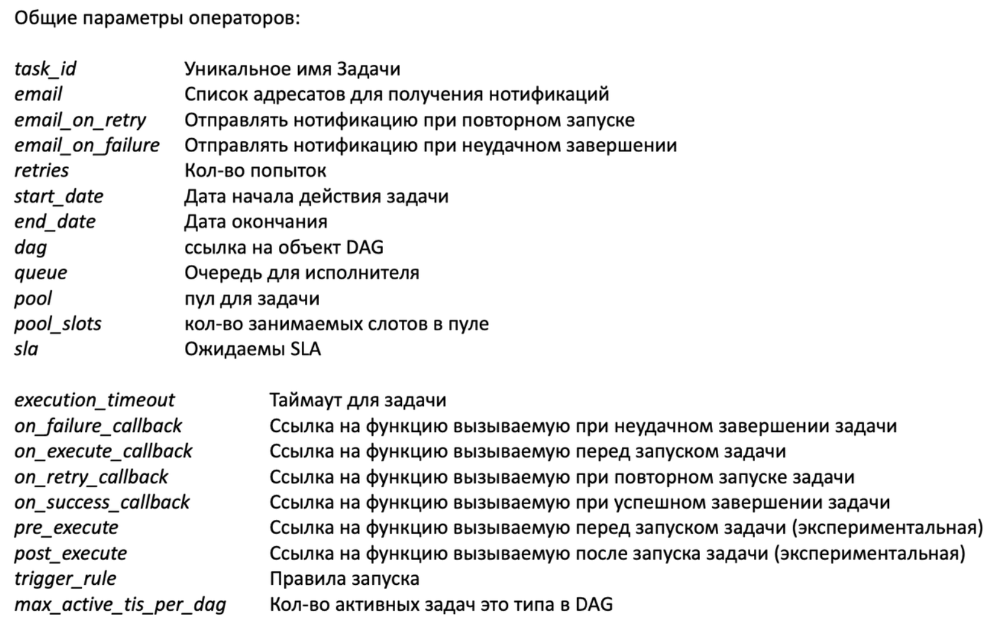

# Operators

## Базовые операторы Apache Airflow

## Базовые параметры операторов

## Сенсоры

**Сенсор** - это особый тип оператора, единственная цель которого - ожидидание пока пройзойдет какое либо событие и установка статуса success, чтобы следующие таски могли запуститься

Сенсоры имеют два режима работы (насраивается в параметре `mode`):

- **poke** (от слова "тыкать") - параметр по умолчанию, сенсор занимает слов в пулле на весь срок работы
- **reschedule** - сенсор занимает слот только во время проверки, но при этом отнимает ресурсы у планировщика

Сенсор имеет параметр `soft_fail`, который устанавливает статус SKIPPED вместо FAILED, если сенсор не отработает.

## Отложенные операторы и тригеры

С версии 2.2. в apache airflow появилась концеция отложенных операторов и тригеров.  

Они необходимы для случаев когда нет необходимости в выполнении какой либо воркерами айрфлоу, а нужно лишь ждать (например передача работы в spark cluster и т.п.)

Вся концепция построена на библиотеке python asyncio, когда оператору необходимо ожидать какое либо событие, он создает `TriggerEvent` - это отдельная концепция которая направлена конкретно на отслеживание какого либо события. Проверка наступления события вынесена в отдельную службу которая называется **airflow-triggerer**

Основным преимуществом перед сенсорами, является то что **отложенные задачи не занимают слот в пулле задач**, так как отслеживание статуса вынесено в отдельную службу под которые выделены отдельные ресурсы, **а также освобождются мощности воркера** т.к. сенсор - это оператор, и он тоже выполняется на воркере.

## Connections and hooks

- **Connections** - это просто набор параметров которые airflow в хранит внутри себя, чтобы не писать учетные записи внутри кода
- **Hooks** - инструмент предоставляющий интерфейс для взаимодействия с внешней системой с помощью **connections**, не прибегая к аутентификации в коде.

01:31
