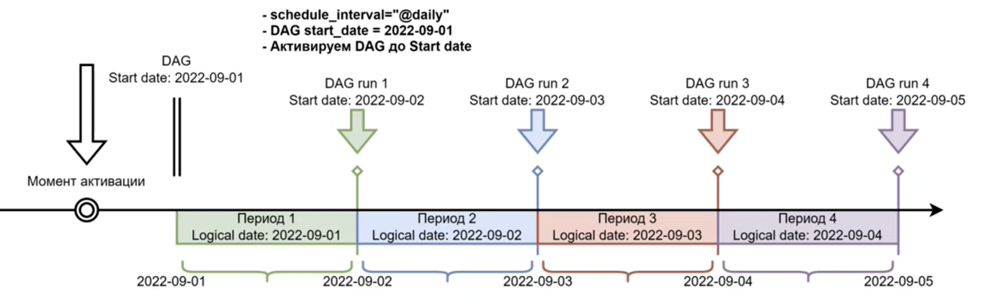

# Schedule and API

Виды тригеров:  

## Основные концепции расписания Airflow

- **Data Interval** - интервал данных это период с которым должна работать каждая задача. Например для ДАГа который запускается ежечастно, каждый интервал будет начинаться в начала часа (0 минут) и заканчиваться в конце часа (59 минут)  
- **Logical Date** - логическая дата (и время) запуска ДАГа, совпадает с началом интервала данных. Это дата не отражает время когда ДАГ фактически был запущен. (до версии 2.2. называлась **Execution Date** и путало пользователей так как к execution то есть исполнение эта дата не имеет отношение)  

Стоит обратить внимание что при использовании TimeTable логика получения темплейтов измениться  
**Schedule interval:**  

**Timetable:**  

- **Timeteble или Schedule Interval** - свойство которое определяет интервал данных и логическую дату для каждого ДАГа
- **DAG Start Date** - стартовая дата от которой планировщик начинает планировать расписание
- **DAG End Date** - дата когда планировщик прекратит планировать расписание
- **Catchup** - концепция, в соответсвии с которой планировщик запланирует выполнение ДАГов для всех пропущенных интервалов данных от **предыдущего запуска** или от Start Date до текущей даты.  

- **Backfilling** - возможность запустить несколько ДАГ за определенный исторический период
- **Next Run в UI** - поле в UI отображающее **Logical Date** (если огрубить то это время послежнего запуска) для следующего запланированного запуска ДАГа (**но не время фактического запуска**)

38:00
