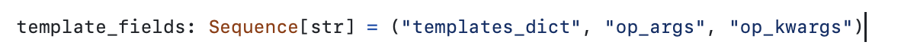

# Параметризация

Способы параметризации сущностей Airflow:

- Переменные среды - переменные операционной среды
- Переменные **airflow**
- Connections **airflow**
- Jinja templates для параметризации задач
- JSON BLOB при внешнем запуске через CLI, REST API или WEB UI
- Файлы конфигурации (json, yaml ...) к которым у **airflow** есть доступ  
- Параметры из внешней БД

## Файлы конфигурации (json, yaml ...)

Главное преимущесто - это возможность хранить конфигурационные параметры в git-е. Исключения - это секреты, которые в гите хранить конечно же нельзя.

## Variables

Переменные airflow внутри дага можно получать и изменять через отдельный объект айрфлоу `Variable`:

```py
from airflow.models.variable import Variable

# не рекомендуется
Variable.set(
    key="some_var_name",
    value="key",
    description="key_description",
)

some_var = Variable.get("some_var_name")
```

а также через **jinja templates**:

```py
bash_task = BashOperator(task_id="bash_task", bash_command="echo my_key {{ var.value.some_var_name }}")
```

## Jinja

**Jinja** - это библиотека python которую использует айрфлоу для своих темплейтов. Jinja - это инструмент для обработки шаблонов.

**Jinja в airflow**
С помощью джинжи мы можем передавать **строковые** значения для передачи в оператор.

> **Важно** с помощью джинжи получиться передавать **строковые** значения только в те параметры оператора, которые указанны в параметре `template_fields` кода оператора



В айрфлоу есть предподготовленные темплейты которые можно передать из коробки, например:


**Jinja Filters** - фильтры не совсем коректное название для этой сущности. Это **функции**, которые применяются к вашим данным определенным образом.
Фильтры применяются к переменным с помощью символа `|` и могут изменять их значение.
Например  
`{{ "hello" | upper }}  <!-- HELLO -->`

В airflow также существуют собственные фильтры jinja

## Xcom

Задачи - это асинхронные процессы которые могут выполняться на разных машинах.

Xcom (сокращение от cross-communication) - система кросс-комуникации между задачами. Предназначена для передачи маленьких объемов данных. Как правило - это какие то параметры сгенерированные в одной задаче и используемые в другой.

Значения xcom храняться в базе данных airflow.

Значения xcom ассоциированны с определеннным task_instans-ом

# Dynamic Task Mapping

**Dynamic Task Mapping** - это механизм, начиная с версии 2.3., позволяющий генерировать таски динамически, в зависимости от какого либо динамического параметра.

Работает с помощью двух методов `BaseOperator`:

- `partial` - метод с помощью которого передаются параметры для функции остающиеся **одинаковыми во всех** созданных задачах
- `expand` - метод которые принимает параметр или параметры которые **специфичны для каждого конкретного** экземпляра задачи

Например:

```py
@task
def simple_mapping(
    base: int,
    rand_int: int,
):
    return base + rand_int

rand_list: list = [random.randint(1, 4) for i in range(random.randint(1, 4))]

simple_mapping = simple_mapping.partial(base=5).expand(rand_int=rand_list)
```


1:12
