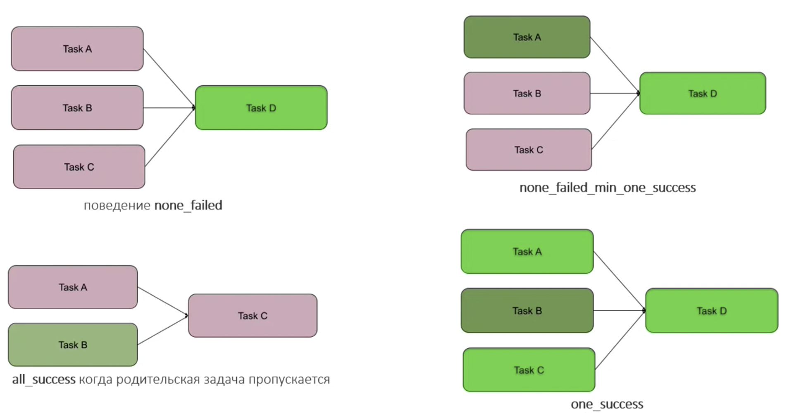

# Best practice

## Triger rules / depens on past / Weight

- **triger_rule** - параметр для таски. Работает в пределах одного ДАГ рана. Это условие при каком статусе предыдущей или предыдущих (если таски паралельные) тасок запускается текущая задача.
- **depends_on_past** - если установлено True, то задача будет ожидать `successed` или `failed` статусов экземляра задачи в **предыдущем ДАГ ране**
- **wait_for_downstream** - если установлено True, то задача будет ожидать `successed` или `failed` статусов экземляра задачи в **предыдущем ДАГ ране** и всех зависимых от нее задач. Если **wait_for_downstream=True** то и **depends_on_past=True**
- **priority_weight** - вес задачи, определяет приоритет запуска нескольких паралелльных задач

**Примеры trigger_rules**:

## Watcher

Т.к. весь получает конечный статус по статусу последней выполненной таски, в случае когда таски внутри дага упадут, но последняя таска будет иметь статус success (например нотификации), то и весь ДАГ будет иметь статус succsess. Что не всегда хорошо т.к. при просмотре всех дагов можно пропустить ДАГи с проблемой.

Для таких случаем делают **watcher**  

## Imports into DAGs

При каждой итерации у планировщика, он ВЫПОЛНЯЕТ каждый файл с ДАГом. Исходя их этого **нужно стараться избегать исполняемого кода** в top level структуре кода.

Также стоит уносить все импорты внутрь операторов которые их используют, тем самым ипорт будет происходить в момент execute (выполнения) оператора и не будет вызван планировщиком во время скана файла.

