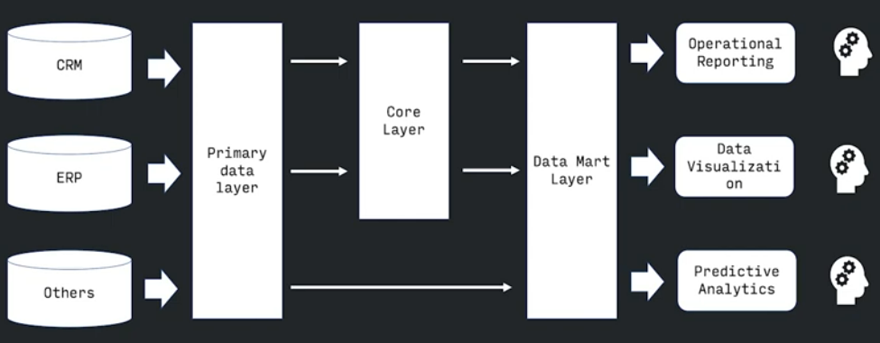

# DWH
Общий вид на дата верхаус из DAMADMBOOK

## Как данные попадают в систему

**OLTP** (On-Line Transaction Processing) - оперативная обработка транзакций.  
**Транзакция** - это некоторый набор операций над базой данных, которое рассматривается как единое целое (несколько операций которые выполняются все либо не выполняются вовсе (атомарно))  
**Главное требование к OLTP системе** - быстрое обслуживание относительно простых запросов большого числа пользователей при этом время выполнения запроса не должно превышать микро, мили секунд

**DSS** (desigion support system) - система поддержки принятия решений - компьютерная система направленная на поддержку людей, принимающих решения в сложных условиях для полного и объективного анализа предметной деятельности. **То есть процесс принятия решения происходит на уровне данных**

> Когда специалисты решили имплиметировать OLTP системы к DSS они столкнулись с тем, что OLTP системы заточены под другое и что нужен новый класс систем.

**OLAP** системы (on-line analyst process) - онлайн аналитическая обработка - в отличии от транзакционных систем, системы OLAP направлены на сложные не стандартизированные запросы (т.к. при разных решениях могут быть разные запросы). Часто имеют дело с историческими данными или архивными данными

Системы olap заняло свое место в системе принятия решений.

OLTP системы и OLAP системы не могут быть совмещены по ряду структурных разногласий:
- для выполнения аналитических запросов часто требуется обработка данных из разных источников.
- для выполнения запросов связанных с прогнозированием, анализом тенденций, необходимы исторические данные накопленные за достаточно длительный срок, что не всегда обеспечивают OLTP системы. (в транзакционных системах зачастую важно лишь последнее состояние данных, и не так важна история)
- сама структура данных может различаться между двумя системами: для анализа данных зачастую можно пользоваться не детальными, а предагрегированными данными (в транзакционных системах данные детализированные)

> невозможно в одной системе сочетать эффективно и OLTP и OLAP системы

### Хранилища данных

Следовательно развитием DSS стало хранилище данных

> Хранилища данных -   
> предметно-ориентированный,  
> интегрированный,  
> неизменчивый,  
> поддерживающий хронологию,
> 
> набор данных,
>
> организованный для **целей поддержки принятия решения**

**Предметно-ориентированный** - хранилище данных описывает опредленную **предметную** область, ненужные атрибуты отсееваются (а в озере данных чуть другой подход, собираем все потом разбираемся нужно или нет).

**Интегрированный** - целостность и внутренняя взаимосвязь, то есть отсутсвие противоречий внутри данных (которые могут возникать из разных источников, лагов данных и т.д.)

**Неизменчивый** - модификация данных не производяться, поскольку может привести к нарушению их целостости (например то есть мы не перезаписываем данные задним числом)

**Поддерживающий хронологию** - временная привязка, хранилизе данных предоставляет данные за максимально возможный промежуток времени. (чем больше историчность данных, тем богаче хранилище)

DWH в данном случае выступает как черный ящик, для большей прозрачности разработали послойную (или **уровневую**) архитектуру

> Уровневая структура - это средство борьбы со сложностью системы. Каждый следующий уровень абстрагируется от сложности внутренней организации предыдущего

Есть три основые сущности уровней:
- **primary data layer** - операционный слой первичных данных, получен из OLTP системы, на котором выполняется загрузка информации из систем-источников в исходном качестве и сохранением полной истории изменений. **Здесь происходит абстрагирование от физического устройства данных источника**
- **core data layer** - ядро хранилища - центральный слой, в котором происходит консолидация данных из разных источников, приводя их к единым структурам и ключам. Здесь происходит основная работа с качеством данных и происходит транформации, чтобы **абстрагироваться от особенностей логического устройства источников данных и необходимости их взаимного сопоставления**
- **data mart layer** - здесь данные преобразуются к структурам необходимым для конкретной бизнес единице. (тематическая, узконаправленная информация)