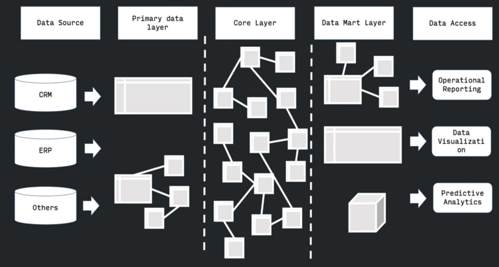

# Архитектура DWH

В зависимости от наличия центрального слоя (core layer) существует два основопологающих подхода:

## **DWH по Инмону:**
Проектирование происходит 
**сверху-вниз**
- анализируем бизнес в целом
- выявляем бизнес-области
- в них - ключевые бизнес-сущности
- затем характиристики и связи между ними

В результате анализа появляется понимание, какие сущности участвуют в бизнес-процессах и как они взаимодействуют друг с другом. То есть логическую модель. Затем уже эту логическую модель мы транслируем на DWH и отсюда появляется центральный слой.

Сверху - вниз - означает что мы идем сверху бизнеса вниз. Пока мы не понимаем бизнес целиком - мы не строим хранилище данных. То есть в работу мы берем только ту область которую уже поняли.

Вот так выглядит dwh по инману в проекции на слои:

**Плюсы**:
- **"Единая версия правды"** - главное преимущество такого подхода, это то что при проходе сверху вниз и охватываем все аспекты нашего бизнеса, мы единовременно придумываем(оглашаем) и распространяем по всему бизнесу понимание: какие у него есть метрики, сущности, какие связи между ними есть, как устроены бизнес процессы и т.д. И все это проецируется на данные, то есть у нас изначально исключается противоричивости данных
- **Отсутствие противоречий в данных**
- **Детальный слой содержит проекцию бизнес-процессов**
- **Лекго поддерживать при увеличении количества источников** - если эти бизнес при этом не изменяется  

**Недостатки**
- Соответсвенно от необходимости работы сверху, нужны аналитики способные охватить весь бизнес
- По той же причине это очень долго и дорого

## **DWH по Киллману**
DWH по Киллману - это копия транзакционных данных, специально структурированных для запроса и аналитики.

Хранилище по Кимбалу можно назвать коллекцией витрин данных (отчетов)

Проектирование происходит **снизу-вверх**:
- Анализ потребностей - узнаем какие отчеты нужны
- Анализ источников - узнаем в каких источниках есть данные
- Проектируем витрину под конкретного потребителя
- Первичные данные из источников преобразуются в витрины

5:36