# Архитектура DWH

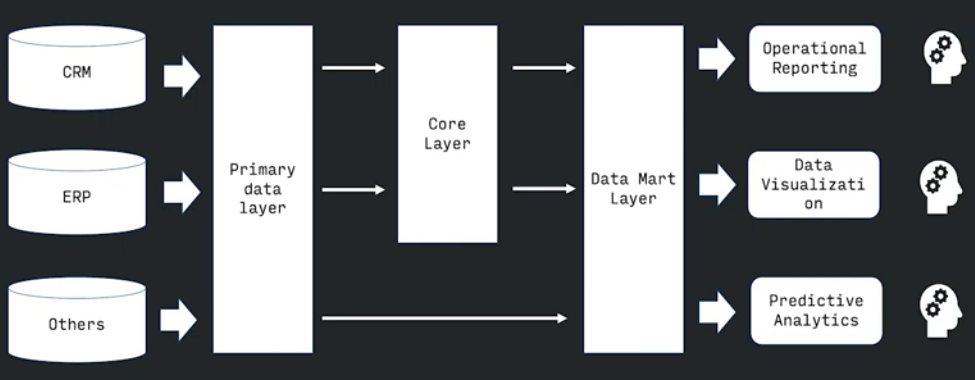

В зависимости от наличия центрального слоя (core layer) существует два основопологающих подхода:

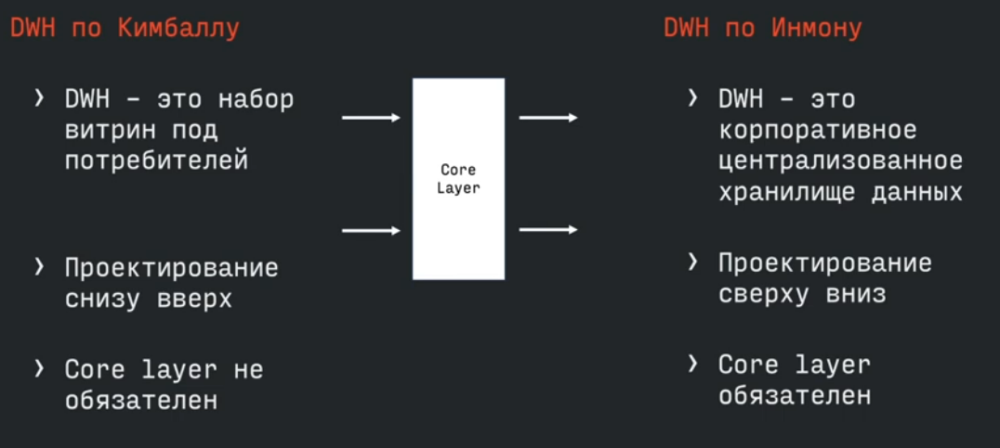

## **DWH по Инмону:**
Проектирование происходит 
**сверху-вниз**
- анализируем бизнес в целом
- выявляем бизнес-области
- в них - ключевые бизнес-сущности
- затем характиристики и связи между ними

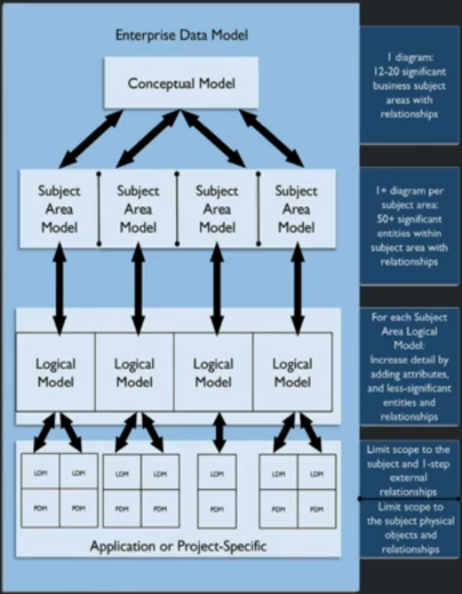

В результате анализа появляется понимание, какие сущности участвуют в бизнес-процессах и как они взаимодействуют друг с другом. То есть логическую модель. Затем уже эту логическую модель мы транслируем на DWH и отсюда появляется центральный слой.

Сверху - вниз - означает что мы идем сверху бизнеса вниз. Пока мы не понимаем бизнес целиком - мы не строим хранилище данных. То есть в работу мы берем только ту область которую уже поняли.

Вот так выглядит dwh по инману в проекции на слои:

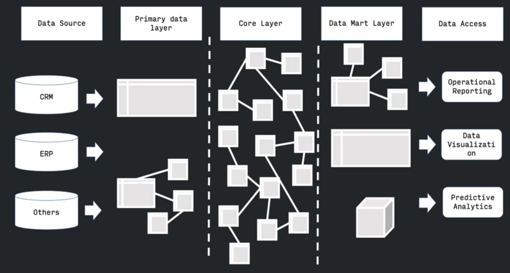

**Плюсы**:
- **"Единая версия правды"** - главное преимущество такого подхода, это то что при проходе сверху вниз и охватываем все аспекты нашего бизнеса, мы единовременно придумываем(оглашаем) и распространяем по всему бизнесу понимание: какие у него есть метрики, сущности, какие связи между ними есть, как устроены бизнес процессы и т.д. И все это проецируется на данные, то есть у нас изначально исключается противоричивости данных
- **Отсутствие противоречий в данных**
- **Детальный слой содержит проекцию бизнес-процессов**
- **Лекго поддерживать при увеличении количества источников** - если эти бизнес при этом не изменяется  

**Недостатки**
- Соответсвенно от необходимости работы сверху, нужны аналитики способные охватить весь бизнес
- По той же причине это очень долго и дорого

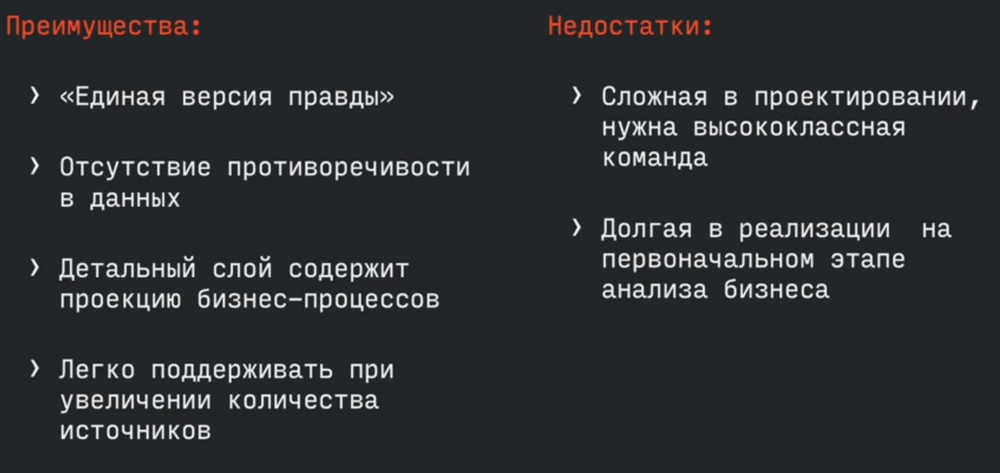

## **DWH по Киллману**
DWH по Киллману - это копия транзакционных данных, специально структурированных для запроса и аналитики.

Хранилище по Кимбалу можно назвать коллекцией витрин данных (отчетов)

Проектирование происходит **снизу-вверх**:
- Анализ потребностей - узнаем какие отчеты нужны
- Анализ источников - узнаем в каких источниках есть данные
- Проектируем витрину под конкретного потребителя
- Первичные данные из источников преобразуются в витрины

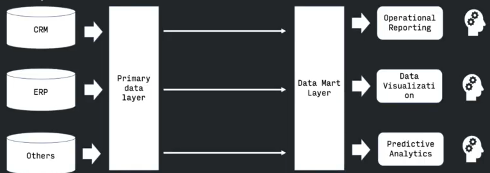

Вот так выглядит пректирование DWH по Кимбалу:
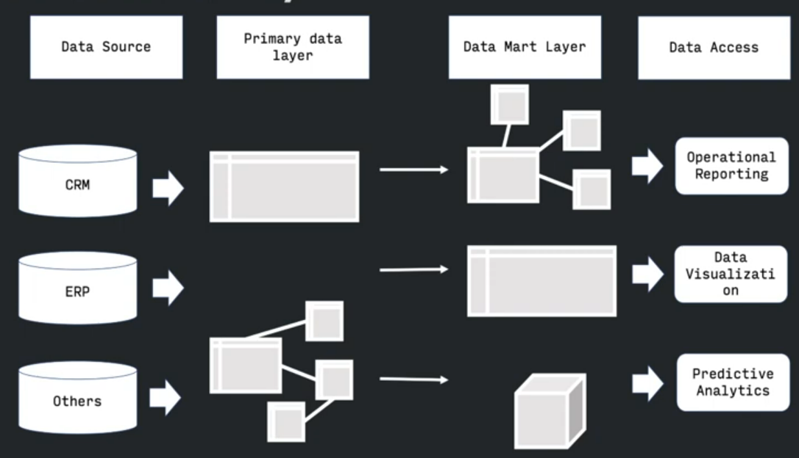

**Плюсы**:
- **Быстрый эффект** - т.к. нет длительного анализа **всего** бизнеса, мы идем к определенному бизнес юниту и делаем витрины под него
- **Достаточно поэтапного анализа бизнеса**
- **Не требует высококвалифицированных специалистов (на старте)**

**Минусы:**
- **Высокая стоимость поддержки новых источников** - т.к. отсутсвует буферная зона, то новый источник нужно будет тянуть в каждую из витрин где он необходим
- **Отсутствие стандартизация показателей** - в каждой витрине может быть свой алгоритм расчета одних и тех же показателей. У разных бизнес юнитов может быть собственное видение на один и тот же бизнес показатель

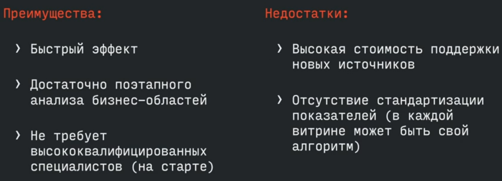

## Особенности аналитического хранилища данных
Слева мы видим источники данных - пользователей и OLTP системы. А посередине видем DWH подходы к которому описаны выше, как мы видим есть слой первичных данных (Staring Area) и центральный слой или ядро (Central Warehouse) которого может и не быть в зависимости от выбранного способа проектирования DWH

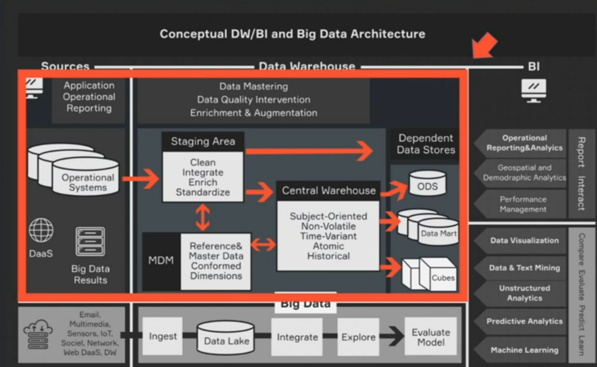

На изображении представлено **аналитическое хранилище данных**.
- В нем храняться только полезные данные (что мы знает из определения предметно-ориентированные)
- Четко структурированные данные одного формата
- При таком подходе существует низкая гибкость: структуры и типы данных продумываются заранее и не подлежат изменению в процессе эксплуатации
- Благодаря четкой структуре данных процесс извлечения данных для анализа и обработки происходит быстро
- Достаточно высокая стоимость проектирования и создания (особенно при подходе Инмана)

## Озеро данных
**Озеро данных** - это хранилище большого объема **неструктурированных** данных. Здесь отходят от постулата, что мы храним только **нужные данные**, здесь мы храним все данные.

- В озере данных храняться как **необходимые** так и **ненужные** данные, которые могут когда-то пригодится, а могут и не пригодится
- В озере данных могут храниться **структурированные**, **полуструктурированные** и **неструктурированные** данные любых форматов: мултимедия, текстовые, бинарные и т.п. файлы
- Высокая гибкость, которая позволяет добавлять новые типы и структуры данных
- Из-за остутствия четкой структуры **необходима дополнительная обработка** данных для их практического использования
- Озеро данных дешевле DWH с точки зрения проектирования

- **масштабируемость** - распределенная система позволяет горизонтально расширяться
- **экономичность** - озеро данных можно постоить на открытом Apache Hadoop, не тратившись на дорогие лицензии и ПО. (но мы всегда платим специалистам которые умеют работать со свободным ПО)
- **универсальность** - большие данные разнородных форматов могут использоваться в широком спектре аналитических задач
- **быстрота запуска** - запуска моделей или эксериментов, т.к. большой объем данных позволяет не тратить время на сбор информации

## Болото данных
Озеро данных легко может превратиться в **болото данных**
- **низкое качество данных** - ввиду отсутствия контроля при загрузке, а так же простота загрузки и дешевизна хранения
- **сложность определения ценности данных** - не ясно какая информация нужна без предворительной оценки

## Озеро и хранилище данных
При объединении аналитического хранилища и озера данных, это можно представить вот так:
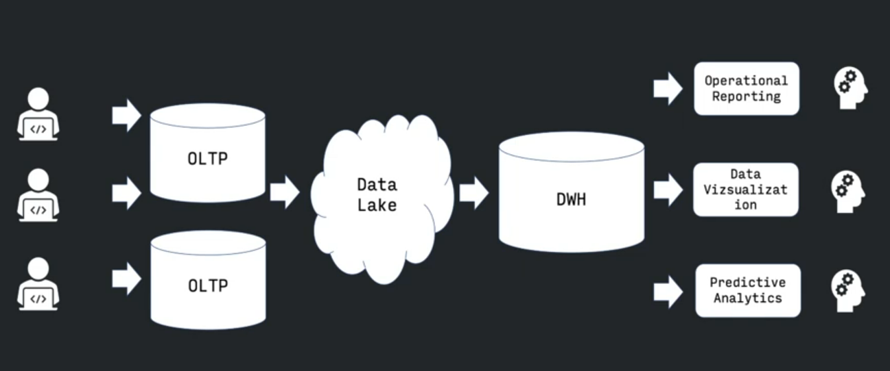
При проекции на слои это выглядит вот так:

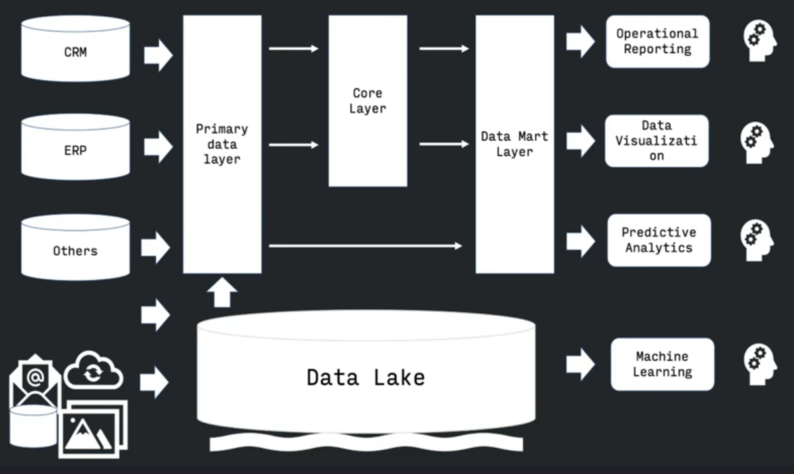

## ETL
Каждая из стрелочек указанных на всех изображениях выше это **ETL** (export, transform, load) - процесс преобразования данных