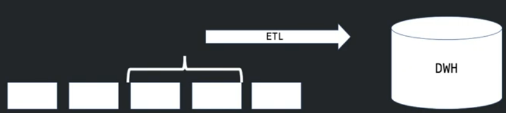
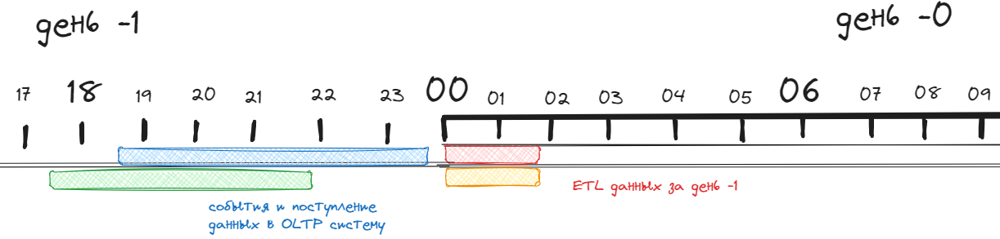
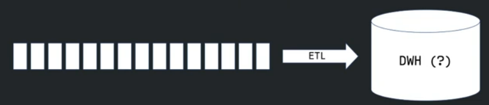
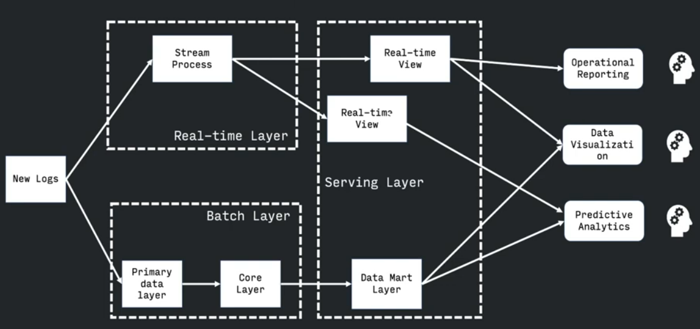
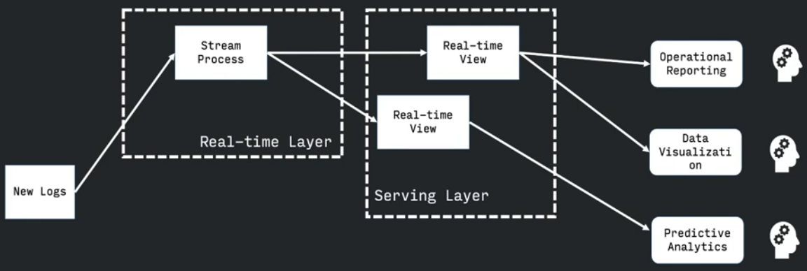
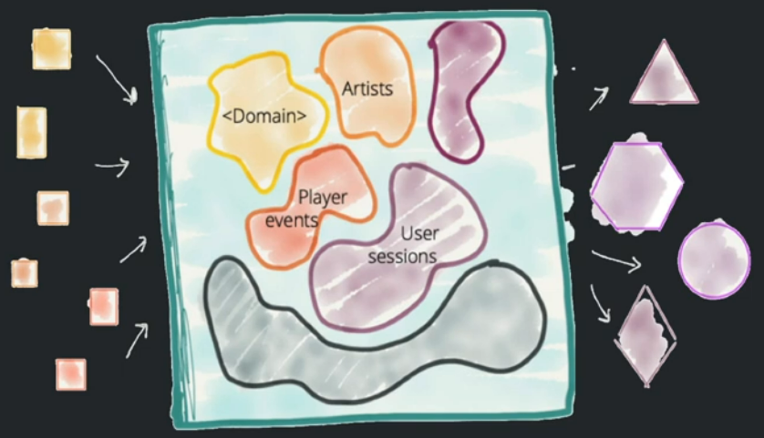
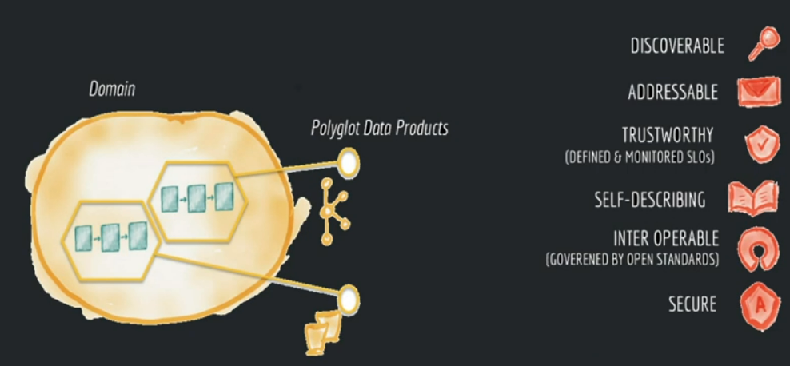
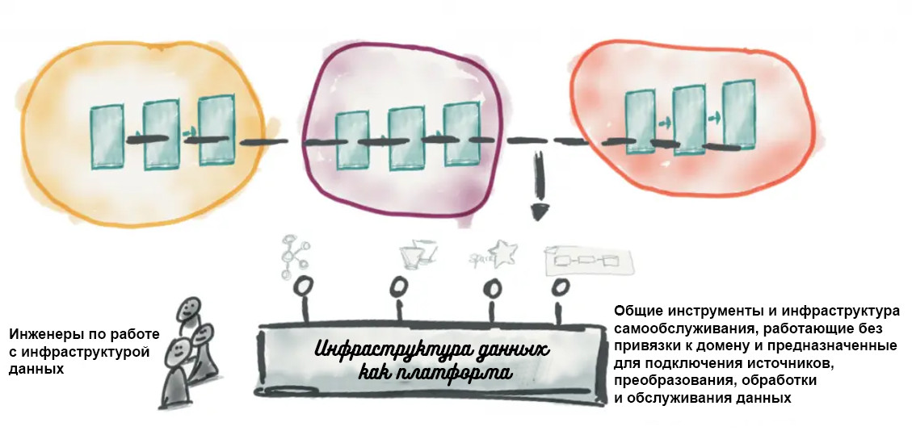

# Потоковая и пакетная обработка данных
## Пакетная обработка
**Пакетная обработка** - это обработка данных частями(пакетами), через определенное время

При пакетной обработке:
- Данные доставляются с задержкой из-за лага между событием и началом обработки пакете
- Простая обработка и тестирование (относительно потоковой обработки)
- Высокая эффективность для OLAP систем
- Пиковая нагрузка на железо из-за возможного большого объема данных
  
Как правило, OLAP система построенная на пакетной обработке имеет временной лаг `t-1`. За день все данные доезжают до OLTP систем и ночью начинается их прогрузка в OLAP систему

Но пакетная обработка может быть и за час и полчаса

## Потоковая обработка
**Потоковая обработка** - обработка события сразу (практически) после того как оно произошло и попало в OLTP систему

При потоковой обработке:
- Результат в режиме реального времени
- Сложная разработка и тестирование
- Низкая эффективность для OLAP систем
- Равномерная нагрузка на железо

## Lambda-архитектура
При объединении пакетной и потоковой обработок, получается лямбда архитектура обработки данных

При лямбде архитектуре разделяют обработку на два стима на пакетную и на потоковую. И аналитические запросы отправляются в оба стрима
**Плюсы**:
- сочетание пакетной и потоковой обработки
**Минус**:
- необходимость дублирования логики и в потоковую и в пакетную обработку

## Kappa-архитектура
В каппа архитектуре отрицается любая пакетная обработка в принципе.
При этом из real-time view есть возможность скидывания данных в какое то долгое хранилище для просмотра истории

## Data Mesh
Дата меш - приминение микросервисного подхода к хранилищу данных.

Суть в том что всё **dwh** можно разбить на **домены**, как отдельные процессы. Данными владеют доменные команды, а не централизованная дата-команда.
**Домен** - это часть организации, выполняющая определённую бизнес-функцию.

У нас появляются разные доммены (как микросервисы) и к данным разных доменов могут обращаться другие домены.

Основные понятия data mesh:
1) **Domain-oriented ownership** - данными владеют доменные команды, а не централизованная дата-команда. Домен - это часть организации, выполняющая определённую бизнес-функцию, например, в нашем случае это могут быть продуктовые домены (маммография, флюорография, КТ органов грудной клетки) или домен по работе с врачами-разметчиками.

2) **Data as a product** - данные воспринимаются не как статичный датасет, а как динамичный продукт со своими пользователями, метриками качества, бэклогом развития, за которым следит выделенный продакт оунер.

3) **Self-serve data platform**. Основная функция дата-платформы в дата меш - это устранять лишнюю когнитивную нагрузку. Она позволяет разрабам в доменных командах (data product developers и data product consumers), которые не являются спецами по работе с данными, удобно создавать дата-продукты, билдить, деплоить, тестить, обновлять их, получать к ним доступ и использовать в своих целях.

4) **Federated computational governance** - вместо централизованного управления данными создаётся специальный федеративный орган, состоящий из представителей доменных команд, дата-платформы и экспертов (например, юристов и врачей), который устанавливает глобальные политики в области работы с данными и обсуждает развитие дата-платформы.