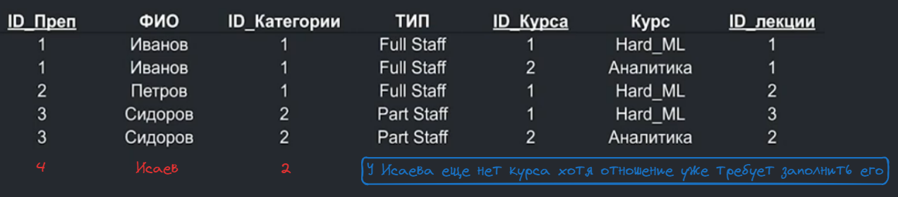
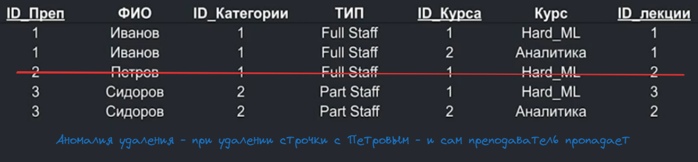
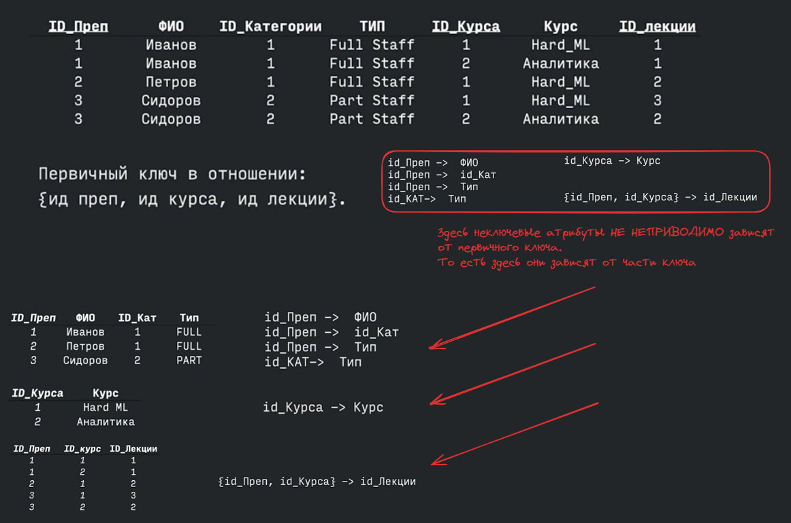
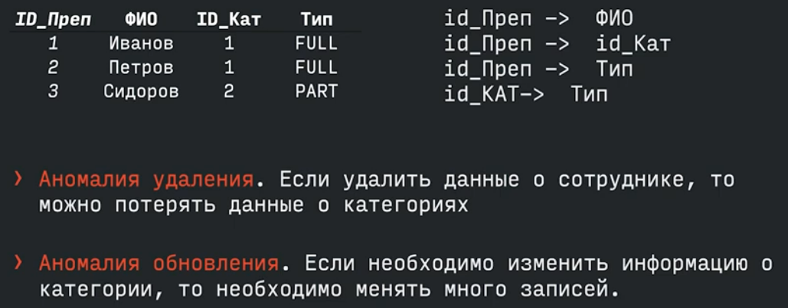
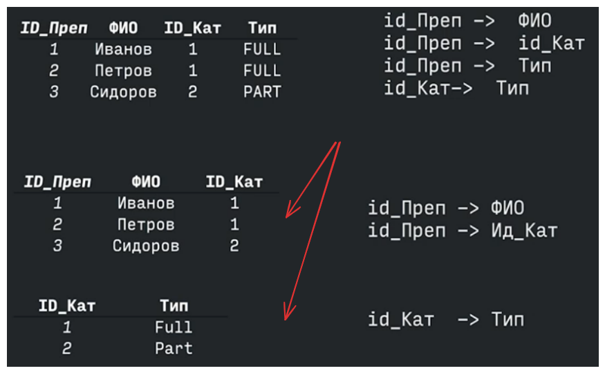
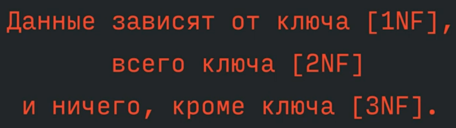

# Нормальные формы
Основые понятия:
- **Атрибут** - свойство некоторой сущности. Часто называеют *полем таблицы* (*столбец*)
- **Домен атрибута** - множество значений, которые атрибут может принимать (*тип данных*)
- **Кортеж** - конечное множество взаимоствязанных допустимых значений **атрибутов**, которое вместе описывают некоторою сущность (*строка таблицы*)
- **Отношение** - конечное множество **кортежей** (*таблица*) 

Сопоставление "реляционных терминов" и "табличных аналогов" для упрощенного понимания:

В **отношении** нет одинаковых **кортежей**. Тело **отношения** есть множество **кортежей** и, как всякое множество, не может содержать неразличимые эллементы (таблицы в отличие от отношений могут содержать одинаковые строки)

**Кортежи** не упорядочены (сверху вниз) в **отношении**. Причина та же - тело отношения есть множество, а множество не упорядочено. Одно и то же отношение может быть изображено разными таблицами, в которых строки идут в различном порядке

**Атрибуты** не упорядочены (слева направо) в **отношении**, каждый из **атрибутов** имеет уникальное имя в пределах **отношений**, следовательно порядок не имеет значение.
Одно и то же отношение может быть изображено разными таблицами, в которых порядок столбцов (атрибутов) различен.

Все значения атрибутов **атомарны**, то есть ценны сами по себе. Атомарность атрибутов означает, что значения всех атрибутов должны быть неделимыми, то есть не могут содержать внутри себя другие значения или структуры. Это значит, что если у вас есть атрибут, например, “имя”, то его значением будет одно слово или строка, а не список имен. Это упрощает работу с данными и обеспечивает их целостность.

Если атрибут содержит ФИО и мы используем ФИО - **атрибут атомарен**, но если нам понадобится отдельно имя, отдельно фамилия, отдельно отчество - нам будет необходимо парсить наш атрибут и он перестает быть **атомарным**.

Что с точки теоретической точки зрения - неправильно

## 1 нормальная форма
> 1 НФ(нормальная форма) - это приведение всех атрибутов к **атомарности**

## Потенциальный ключ
**Потенциальный ключ** - это подмножество **атрибутов** в отношении, которое:
- Обладает свойством **уникальности** - в отношении не может быть кортежей с одинаковым значение ключа
- Обладает свойством **неизбыточности** - любое **меньшее** подможетво ключа не будет уникальным (то есть минимально необходимый набор атрибутов)

**Потенциальный ключ** состоящий из одного атрибута называется **простым**. Состоящий из нескольких атрибутов - называется **составным**.

Отношение **может иметь несколько потенциальных ключей**.
Традиционно, один из потенциальных ключей объявляется **первичным**, а остальные - **альтернативными**

## Функциональная зависимость

**Функциональная зависимость** между двумя атрибутами **X** и **Y** в некотором **отношении**, означает, что для каждого уникального значения **X** существует только одно соответствующее значение **Y**. Например, если у нас есть таблица с данными студентов, где атрибут “номер студента” (**X**) уникален для каждого студента, то атрибут “имя студента” (**Y**) будет зависеть от номера студента, то есть для каждого номера студента будет только одно имя. Это помогает поддерживать целостность данных и избегать аномалий в базе данных.
Обозначение: {X} -> {Y}

## Аномалии
При таком **отношении** у нас есть некоторые аномалии:
- **Аномалия вставки** - например в отношение нельзя вставить данные о преподаватели, который пока не участвует ни в одном блоке. То есть нужно добавить информацию о новом преподавателе, но система требует указать оценки студентов, хотя у этого преподавателя ещё нет студентов.
- 

- **Аномалия удаления** - когда при удалении данных из одной части базы данных теряются важные данные, которые должны были остаться. Представьте, что у вас есть база данных с информацией о книгах и авторах. Если вы удалите книгу, то вместе с ней удалится и информация об авторе, даже если автор написал много других книг.

- **Аномалия обновления** - это когда нужно изменить какую либо информацию о преподователе, то придется изменять значения атрибутов **во всех записях**

## 2 нормальная форма
Нужна для того чтобы аномалии были принипиально невозможны.
> **2 НФ (нормальная форма)** - когда отношения находиться в **1 НФ** и каждый его неключевой атрибут **неприводимо** зависит от первичного ключа.
> **Неприводимо** - означает что в составе потенциального ключа нет подмножества (части) от которого также можно вывести функциональную зависимость. 
> То есть 2НФ - это когда отношение находиться в 1НФ и нет неключевых атрибутов, зависящих от **части** сложного ключа

# 3 нормальная форма

> **3 НФ (нормальная форма)** - когда отношение находится в **2 НФ** и каждый не ключевой атрибут **нетразитивно** зависит от первичного ключа (все неключенвые атрибуты зависят от первичного ключа **и не зависят друг от друга**)

## Сравнение нормализаций с точки зрения испольхования

## Темпоральные БД и 6 НФ

## Схема сущность-связь (Entity-Reletionship) ER-диаграмма

18:00