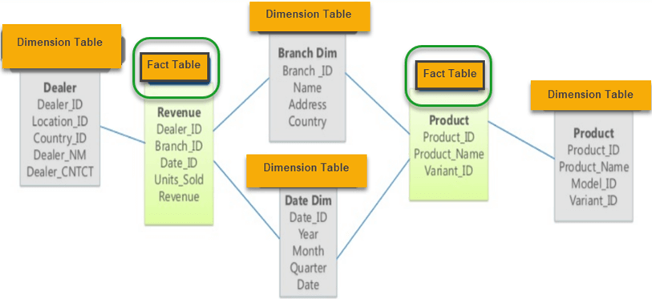

# Пространственное моделирование data warehouse
Витрина данных - это некий тематичесий (то есть под конкретные задачи бизнес анализа) срез их хранилища данных. Витрина данных позволяет определенной группе бизнес лиц принять решения на основе узконаправленной информации.
Взаимодействие с витриной данных происходит без использования **join**в, вся необходимая информация должна быть в витрине
## Модель "**звезда**"
**Придумал**: Ральф Кимбалл  
**Другие названия:** пространственная модель, модель измерений и фактов, модель "сущность-связь", dimentional model, star schema

Модель представляется двумя видами таблиц:
- Таблица **фактов** (facts) - это какие то события (продажи и т.п.), а также идентификаторы измерений 
- Таблица **измерений** (dimentions) - это описательные характеристики этих фактов (то есть **расширяют наше понимание** что это за событие) (какой регион продажи, какой месяц продажи (дата как правило есть) что за покупатель и т.п.)

Согласно Ральфу Кимбалу:
> "Может еще сущестовать измерение без фактов, но не может существовать факта без измерения"

## Модель **снежинка**
Схема снежинка (snowflake) - это добавление некой иерархии в таблицы измерений (то есть выделение более крупных категорий в измерениях (регион, период продаж и т.п.)). Можно сказать что это процесс нормализации таблиц измерений.

## Сравнение звезды и снежинки

## Схема созвездие

## Таблица фактов
**Таблица фактов** - это основная таблица, которая содержит сведения об объектах событиях, процессах которые будут использоваться в дальнейшей аналитике.

Таблица фактов состоит из:
1. Числовых метрик
2. **Составного ключа**, состоящий из первичных ключей **таблиц измерений**. Первичный ключ **таблицы измерений** является внешним ключом в **таблице фактов**
  
Таблицы фактов бывают:
- **Аддитивные факты**(Additive facts) - это такие факты которые можно **суммировать по любым измерениям **для получения значимого результата. (Например объем продаж, можем смотреть по региону, клиенту, дате и т.д.)
- **Полуаддитивные факты** (Semiadditive facts) - это такие факты которые мы можем **суммировать только по каким то определенным измерениям** (мера, представляющая количество товаров на складе, может быть статистически вычислена вдоль измерения географии для получения суммарного количества товаров на всех складах, но эта мера не может быть статистически вычислена вдоль измерения времени, поскольку это будут одни и те же товары которые нет смысла суммировать)
- **Неадитивные факты** (Non-additive facts) - это такие факты которые **нет смысла суммировать ни по каким измерениям** (например комнатная температура)
- **Числовые меры интенсивности** (Numeric Measures of Intensity) - это такие факты которые являются неадитивными по времени, но при этом допускают агрегацию и суммирование по некторому числу временных периодов (возможно здесь имеется ввиду агрегации кроме суммирования, я не нашел прозрачных примеров)

### Виды таблиц фактов:
- **транзакционная таблица фактов** (transaction facts) - в таких таблицах фиксируются определенные события (транзакции). Это факты описывающие каждое событие бизнеса. Например, продажи товара (каждая продажа - одна строка)
- **таблица фактов периодических моментальных снимков** (snapshot) - в такой таблицы собираются факты за данный период времени. Например, продажи организации на определенную дату
- **таблица фактов кумулятивных моментальных снимков** (accamulated snapshot) - в такой таблице собирают факты, фиксирующие некоторые итоговое состояние определенного направления бизнеса. Это **промежуточные итоги** деятельности органзации по определенному направлению бизнеса. Например продажи этого года на опредеоенную дату (с начала года до определенной даты)

**Кардинальность** - это характеризует уникальность данных. Высокая кардинальность - уникальные данные, низкая кардинальность - повторяющиеся данные

## Таблица измерений
**Таблица измерений** - это таблица в структуре многомерных базы данных, которая содержит текстовые или иные описания событий, сохраненных в таблицах фактов.
Таблица измерений состоит из:
- первичного ключа
- атрибуты описывающие факты с точки зрения некоторого направления деятельности организации

Основные характеристики таблицы измерений:
- Содержат данные о детализации фактов
- Содержат описательную информацию о числовых значениях в таблицах фактов
- Как правило, содержат большое количество полей 
- Как правило, содержат значительно меньше строк, чем таблица фактов
- Атрибуты таблицы измерений обычно используют при визуализации данных в отчетах и запросах
  
### Виды таблиц измерений:
#### **Медленно меняющиеся измерения** (SLowly Changing Dimentions) (**SCD**) - идея в том что измерения могут изменяться со временем, причем частота изменений является не большой, поэтому необходимо хранить версионность измерений.
- **SCD 0** - данные после первого попадания в таблицу далее **никогда** не изменяются. Этот метод практически никем не используется, т.к. не поддерживает версионности. Нужен как нулевая точка отсчета для методологии SCD.   
Например таблица, которая хранит год создания чего либо, она не требует ведения истории.
- **SCD 1** - это обычная перезапись старых данных новыми. Этот метод тоже не содержит версионности и используется лишь там, где история фактически не нужна  
**Достоинства**: не добавляет избыточности, очень простая структура.  
**Недостатки:** не хранит историю  
**Пример:** паспортные данные изменились и были перезаписаны
- **SCD 2** - для каждой **версии** создается отдельная запись в таблице с добавлением двух полей-актуальности данной версии ("актуально с" и "актуально до").   
**Достоинства:**   
  - хранит полную и неограниченную историю версий
  - удобный и простой доступ к данным необходимого периода  
**Недостатки**:
  - провоцирует на избыточность (если изменился только один атрибут из 40 нужно все равно создавать новую строчку) 

- **SCD 3** - содержит столбцы с предыдущими значениями атрбута.При получении новых данных старые перезаписываются текущими значениями.  
**достоинства** - небольшой объем данных, простой и быстрых доступ к данных  
**недостатки**- ограниченная история

- **SCD 4** - история изменений содержиться в отдельной таблице: основная таблица всегда переписывается текущими данными с перенесением старых данных в другую таблицу. Обычно этот тип используют для аудита изменений или создания архивных таблиц. (причем историческая таблица может быть в **SCD 2**)  
**Достоинства**-быстрая работа с текущими версиями  
**Недостатки** - разделение единой сущности на разные таблицы
- **SCD 5** - её нет
- **SCD 6** - комбинация вышеназванных методов и предназначен он для ситуаций, которые они не учитывают или для большего удобства работы с данными.  

#### Быстро меняющиеся измерения - основной прием моделирования быстро меняющихся значений является логическое разбиение таблицы на две сущности, одна из которых содержит медленно меняющиеся измерения, а другая быстро меняющиеся