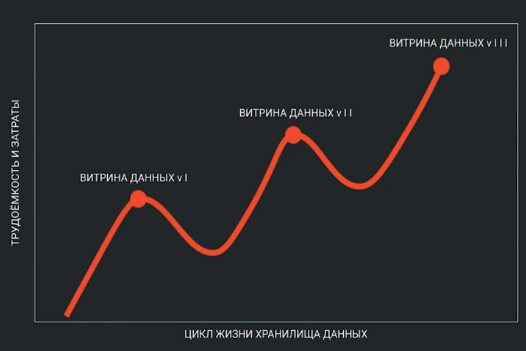
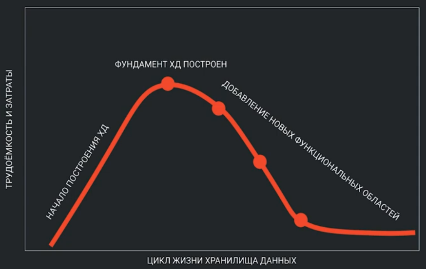
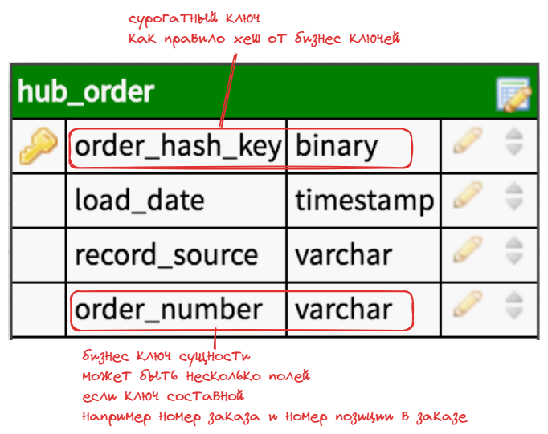
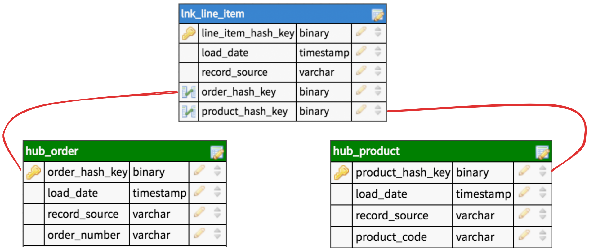
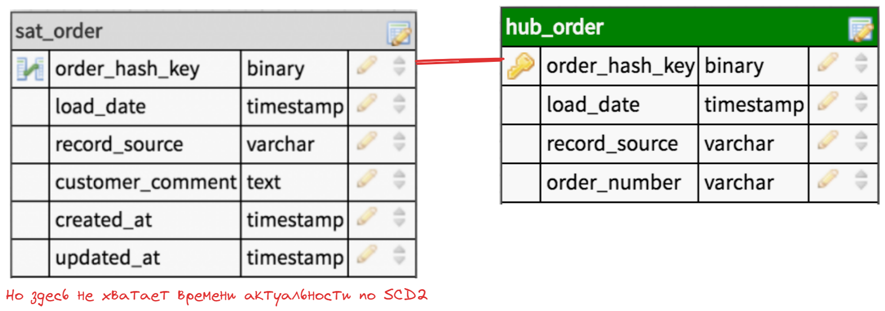
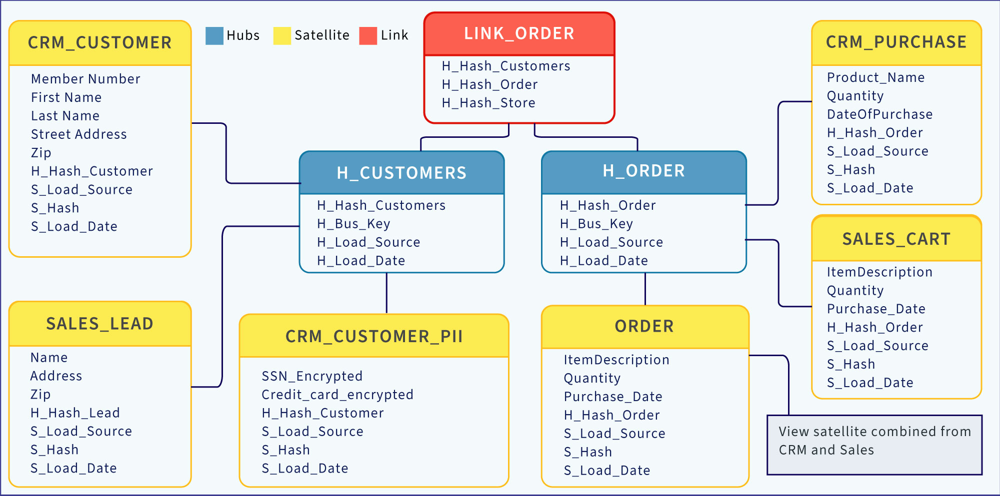

# Data Vault
При изменении бизнеса, например изменении связи от одного ко многим к много ко многим, хранилище данных нужно сильно переделать (удалить связь один ко многим, ввести доп. таблицу со связью).

Вот так выглядит сложность внесения новых изменений в классические версии ДВХ со временем и усложнением процессов: 

Для решения этих проблем были разработаны **гибкие методологии проектирования хранилища данны**х. Их цикл внесения новых изменений выглядит вот так: 

Существует две гибкие методологии:
- **Data vault** - создатель Dan Linstend 
- **Anchormodeling** - создатель Lars Ronnback
  
Обе метололгии:
- Повышают уровень нормальности **выше 3НФ**
- Вводят **свои таблицы** и накладывают жесткие ограничения на использование этих таблиц
- При использовании создают **over 100500** таблиц

Взамен этого эти методологии обещают:
- уменьшить количество дублирования в SCD2 от изменения всего одного атрибута
- Избавить от деструктивности изменений, только расширение модели (даже при изменении кардинальности связи) (как раз кейс с изменением **1 ко много** на **много на много**)
- Позволяют дорабатывать хранилище легко и быстро (agile-based)

## Типы таблиц Data Vault

- **Хаб (Hub)** - хранит сущности
  - Ключ бизнес сущности из внешней системы (набор ключей)
  - Сурогатный ключ (рекомендуется хеш бизнес-ключей)
  - Временная отметка даты загрузки
  - Источник данных
  
- **Связь (Link)** - обеспечивает связь между хабами (связь между сущностями)
  - Включают в себя суррогатный ключ
  - Сурогатные ключи **хабов**
  - Временная отметка даты загрузки
  - Источник данных
  
- **Саттелит (Satellite)** - предоставляет контекст первичного ключа **Хаба** (то есть предоставляет атрибуты), **обычно с историзмом по SCD2**
  - Саттелит включает первичный ключ хаба или связи
  - Даты действия записи (если по SCD2)
  - Временная отретка даты загрузки
  - Источник данных
  

С версии 2.0:
- **Мост (Bridge)** - упрощает соединение данных через несколько связей
- **PIT (point in time)** - упрощает получение информации из **саттелитов** одной сущности с разной частотой обновления
- **Predefined Dervations** - представялют собой предрассчитанные значения

5:58