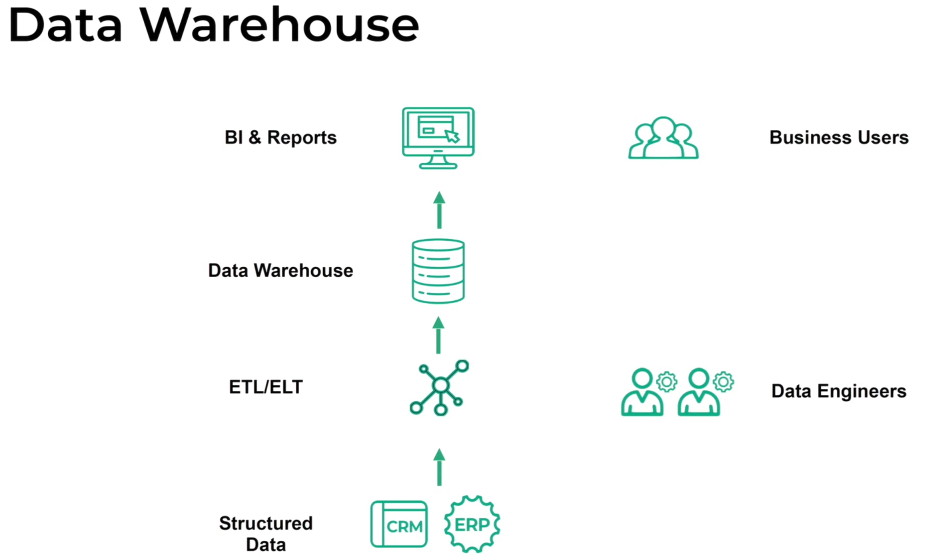
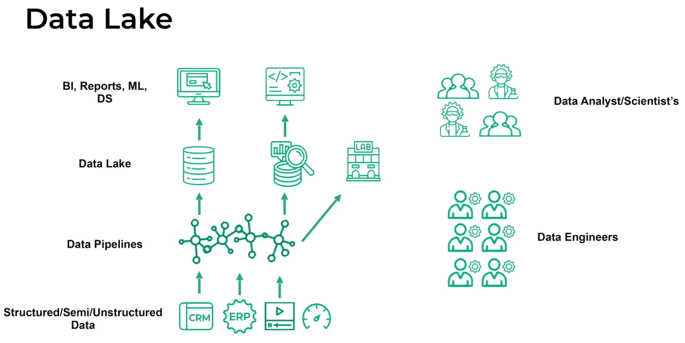
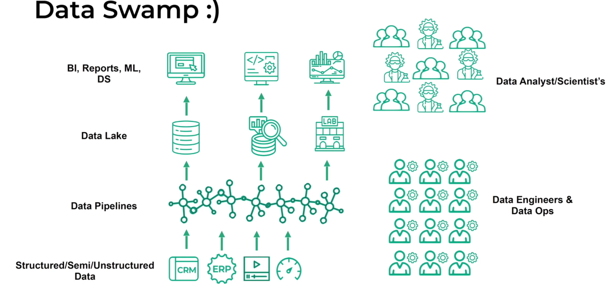
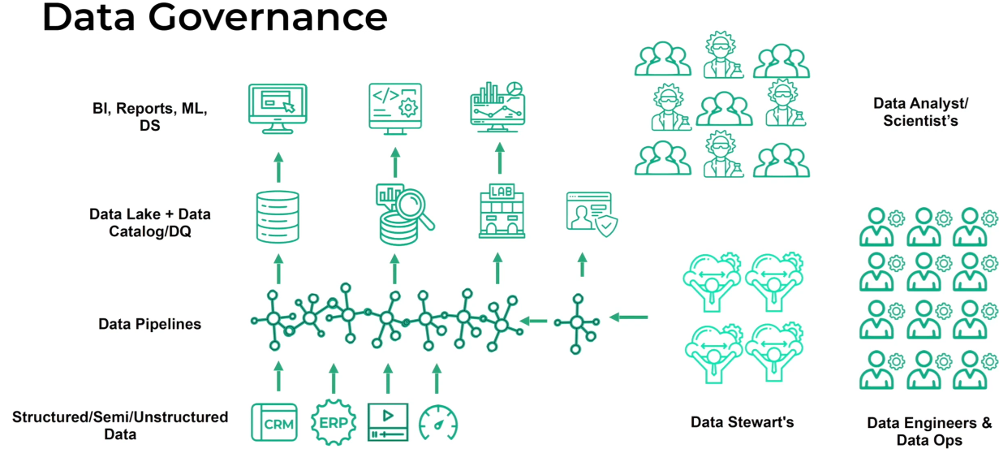
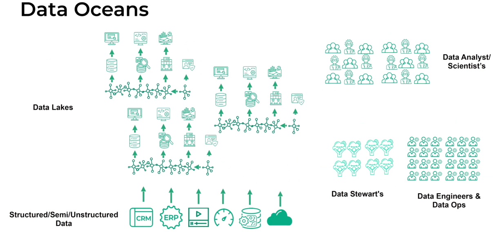
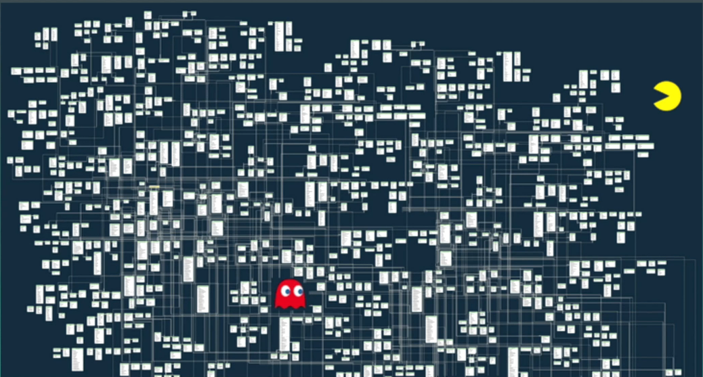
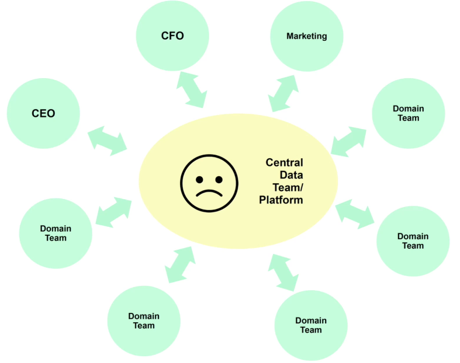
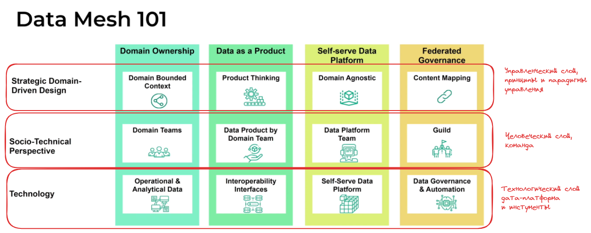

# Data Mesh by Arena Data
https://smartdataconf.ru/archive/2022/talks/ee2dac35f84e45c8968e3f49cf86cc68/ 

## Предпосылки создания data mesh архитектуры
Изначально были структурированные данные необходимые для аналитики:

Дальше подход изменился в сторону накопления разных данных в том числе и не структурированных, необходимых для проведения различных экспериментов и аналитики, так появились **озера данных**:

Однако часто озера данных стали превращяться в **болота данных**, стало появлятся еще больше персонала занимающегося сопровождением данных

Для решения проблем появившихся в болотах данных сформировалось новое направление **data governance**, в рамках которых появлялись дата стюарды, а также дата каталоги и дата кволити. Тем самым появилось еще больше дата-инженеров и сопутсвующего персонала. Все сотрудники работали со всеми **доменами**(условное разделение бизнеса на направления) данных

В некоторых компаниях получались целые **океаны данных**, с централизованной дата-командой, которой приходилось все это поддерживать

Разрастание данных приводило примерно к вот такой моделе данных, которую все еще приходилось поддерживать централизованной дата команде:

>Огромные объемы модели данных и единственная дата команда, привели к тому, что централизованная платформа данных стала, **бутылочным горлышком** т.к. отвечала на запросы всех доменов и бизнес потребителей данных

## Data Mesh
Основые концепции парадигмы дата мех:

10:00