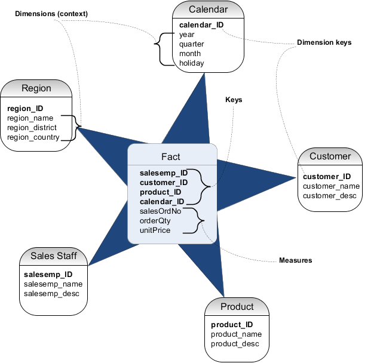
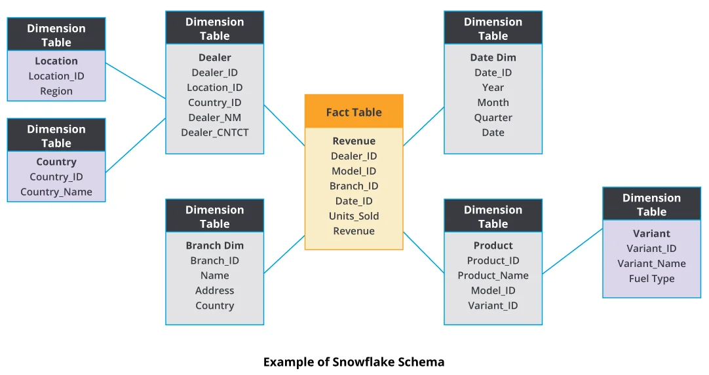

# Пространственное моделирование data warehouse
Витрина данных - это некий тематичесий (то есть под конкретные задачи бизнес анализа) срез их хранилища данных. Витрина данных позволяет определенной группе бизнес лиц принять решения на основе узконаправленной информации.
Взаимодействие с витриной данных происходит без использования **join**в, вся необходимая информация должна быть в витрине
## Модель "**звезда**"
**Придумал**: Ральф Кимбалл  
**Другие названия:** пространственная модель, модель измерений и фактов, модель "сущность-связь", dimentional model, star schema

Модель представляется двумя видами таблиц:
- Таблица **фактов** (facts) - это какие то события (продажи и т.п.), а также идентификаторы измерений 
- Таблица **измерений** (dimentions) - это описательные характеристики этих фактов (то есть **расширяют наше понимание** что это за событие) (какой регион продажи, какой месяц продажи (дата как правило есть) что за покупатель и т.п.)

Согласно Ральфу Кимбалу:
> "Может еще сущестовать измерение без фактов, но не может существовать факта без измерения"

## Модель **снежинка**
Схема снежинка (snowflake) - это добавление некой иерархии в таблицы измерений (то есть выделение более крупных категорий в измерениях (регион, период продаж и т.п.)). Можно сказать что это процесс нормализации таблиц измерений.

## Сравнение звезды и снежинки

## Схема созвездие
fact constellation schema

4:31

