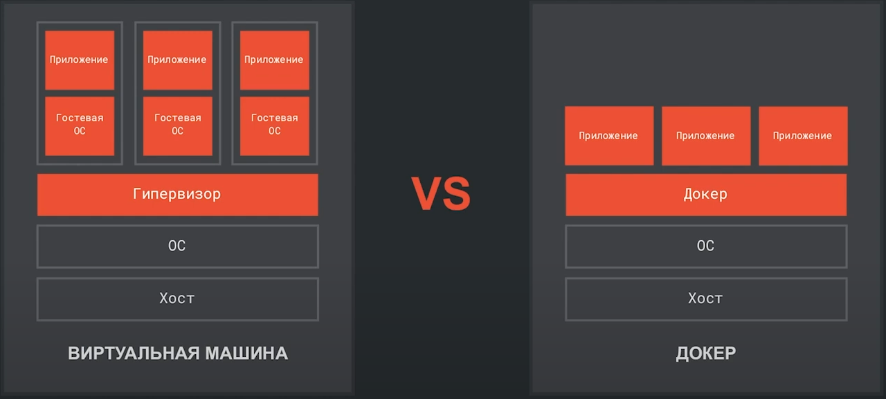
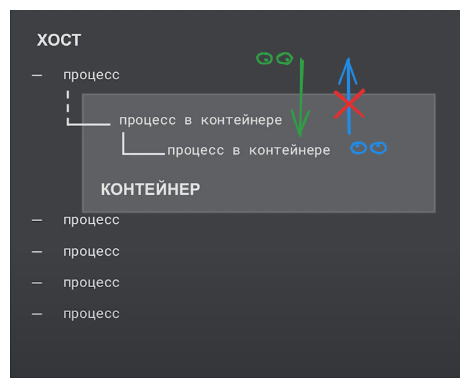
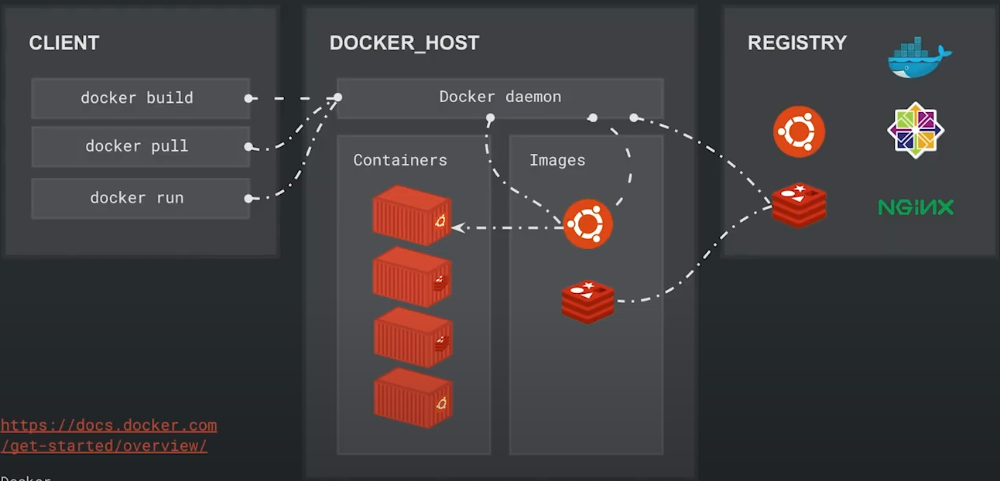
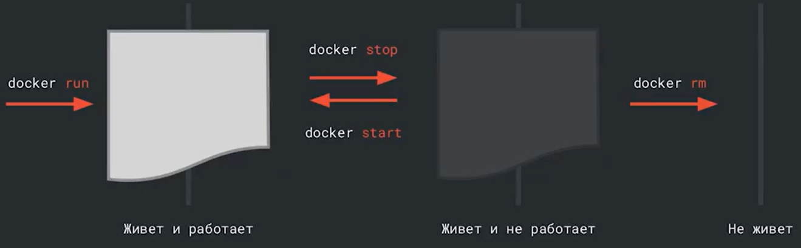

**Docker** - ПО для "контейниризации" приложении, в одном контейнере с приложением, помимо самого приложения создается необходимое для него окружение.
Сравнение вирт машины и докер:

**Плюсы Докер**:

- разрешать зависимости
- доставка программы "в коробке"
- изолированность от других программ
- стандартизация (стандартизация процессов запуска, останова, переноса контейнеров вне зависимости от того что находится в контейнере)
- воспроизводимость

**Изолированность** - система на которой запущен контейнер видит что происходит в контейнере, а контейнер не видит что происходит снаружи. (значит контейнер не будет видеть что происходит в других контейнерах если они есть)

## Сущности докера

- **Демон** (**docker deamon**) - это программа которая управляет всеми объектами докера, она всегда работает в фоновом режиме
- **Образ** (**docker image**) - инструкция того каким должен быть контейнер (какие файлы и приложения должны быть в контейнере). Образы строяться "слоями" от "фундамента" до "крыши"
- **Контейнер** (**docker container**) - сущность внутри которой будет работать программа. Сущность является изолированной
- **Репозиторий / Реестр** (**docker registry**) - это сервер где храняться готовые **образы**. (**Docker hub** - глобальный репозиторий образов для докера)

**Client** - это интерфейс докера и взаимодействия с **демоном**  
**Docker host** - это "железо", локальная машина, сервер или виртуальная машина на которую установлен докер

Слои в Docker — это набор изменений. Когда все слои складываются вместе, получается новый образ, который содержит все накопленные изменения.

Каждый слой доступен только для чтения, кроме последнего — он располагается над остальными. Docker-файл указывает порядок добавления слоёв.

Базовый слой, его ещё называют родительским, — это начальный слой. При загрузке Docker-образа из удалённого репозитория скачиваются только отсутствующие слои. Docker экономит место и время, повторно используя уже существующие слои.

## Получение и создание образа

Ссылка на cli - <https://docs.docker.com/reference/cli/docker/>

`ps` - просмотр запущенных процессов на **linux**

- `docker images` - просмотреть какие образы есть на хосте
- `docker ps` (`docker container list`) - список запущенных контейнеров
- `docker ps -a` - список всех контейнеров
- `docker pull <образ>` - скачать образ из репозитория
- `docker run <образ>` - создание контейнера по образу
- `docker run -it <образ>` - запуск контейнера с входом внутрь конейнера через терминал **-i** подключает стандартный поток ввода (STDIN) процесса внутри контейнера к хост-терминалу, **-t** создаёт для запущенного приложения псевдотерминал
- `docker stop <имя контейнера|id>` - остановить контейнер
- `docker start <имя контейнера|id>` - стартануть остановленный контейнер
- `docker commit <контейнер>` - создать образ на основе контейнера на хосте

- `docker run --name <имя> <образ>` - при создании присвоить имя контейнеру
- `docker run --rm <образ>` - удалять контейнер после завершения его работы
- `docker exec -d <образ>` - запуск контейнера в фоновом режиме. То есть программа не перехватывает управление
- `docker exec -it <имя контейнера> <имя программы>` - "вход"  и выполнение указанной программы внутри контейнера. В качестве <имя программы> можно использовать **bash**
- `docker stop $(docker ps -q)` - остановка всех контейнеров по их id. Конструкция **`$(<команда>)`** передает результат команды внутри скобок наружу то-есть в ту команду где прописан доллар и скобки, это работает как для докера так и для **Bash**
- `docker image rm` - удаление одного или нескольких образов
- `docker rm` - удаление одного или нескольких контейнеров

- `docker cp <host_path> <container_name>:<container_path>` - копирование **host_path** из хоста в работающий **container_name** в **container_path**
- `docker cp <container_name>:<container_path> <host_path>` - копирование из контейнера на хост

Упрощенный цикл жизни докера

У образа существуют теги для привязки версий.
Например есть тег `latest` - с таким тегом скачиваются и запускаются образы, если не указан другой тег
Тег `alpine` - версия образа с только самым необходимым функционалом
