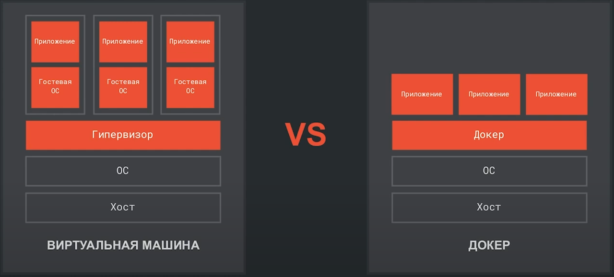

**Docker** - ПО для "контейниризации" приложении, в одном контейнере с приложением, помимо самого приложения создается необходимое для него окружение.
Сравнение вирт машины и докер:

**Плюсы Докер**:
- разрешать зависимости
- доставка программы "в коробке"
- изолированность от других программ
- стандартизация (стандартизация процессов запуска, останова, переноса контейнеров вне зависимости от того что находится в контейнере)
- воспроизводимость

**Изолированность** - система на которой запущен контейнер видит что происходит в контейнере, а контейнер не видит что происходит снаружи. (значит контейнер не будет видеть что происходит в других контейнерах если они есть)

## Сущности докера
- **Демон** (**docker deamon**) - это программа которая управляет всеми объектами докера, она всегда работает в фоновом режиме
- **Образ** (**docker image**) - инструкция того каким должен быть контейнер (какие файлы и приложения должны быть в контейнере). Образы строяться "слоями" от "фундамента" до "крыши"
- **Контейнер** (**docker container**) - сущность внутри которой будет работать программа. Сущность является изолированной 
- **Репозиторий / Реестр** (**docker registry**) - это сервер где храняться готовые **образы**. (**Docker hub** - глобальный репозиторий образов для докера)

**Client** - это интерфейс докера и взаимодействия с **демоном**  
**Docker host** - это "железо", локальная машина, сервер или виртуальная машина на которую установлен докер

## Получение и создание образа
Ссылка на cli - https://docs.docker.com/reference/cli/docker/

`docker pull <образ>` - скачать образ из репозитория
`docker commit <контейнер>` - создать образ на основе контейнера
`docker images` - просмотреть какие образы есть на хосте
`docker ps` (`docker container list`) - список контейнеров

`docker run --name <имя> <образ>` - при создании присвоить имя контейнеру
`docker run --rm <образ>` - удалять контейнер после завершения его работы  

Упрощенный цикл жизни докера
