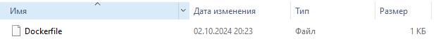
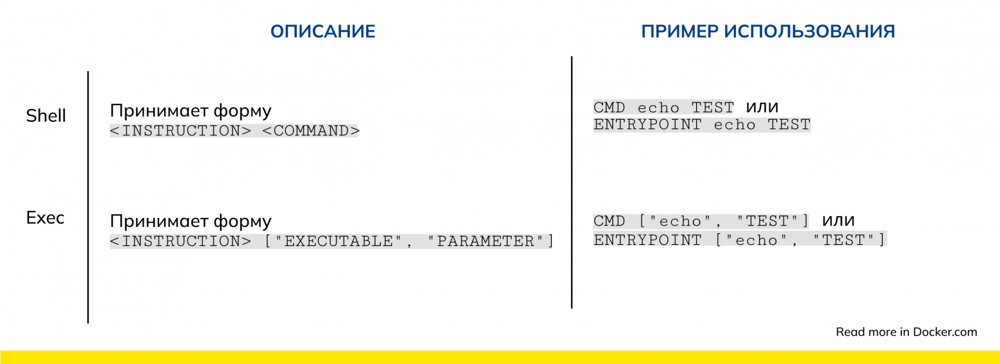
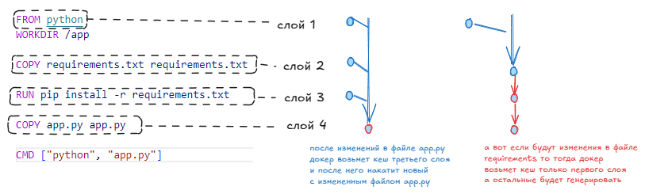

## Dockerfile
**Dockerfile** - это файл (без разрешения), содержащий в себе текс, который докер использует как инструкцию для автоматического создания образа. (то есть скрипт по которому докер соберет новый образ).



Формат, структура и все команды описаны в https://docs.docker.com/reference/dockerfile/

### Команды внутри докерфайла
`docker build -t <таргетное имя:тег> <путь до папки>` - создание образа докера используя докер файл из указанной папки

`docker build -t <имя:тег> -f <путь до докерфайла>` - атрибут **-f** позволяет указать какой именно докерфайл нужно использовать (для случаев когда есть несколько докерфайлов, например дев и прод)

`docker history <имя:тег>` - отображает историю действий произведенных в том или ином контейнере при его сборке

- `FROM <image>` - команда для выбора образа на котором будет основываться наш образ (например `FROM ubuntu:latest`)
- `WORKDIR <path>` - установка рабочей директории внутри докерфайла для других команд докерфайла
- `COPY <localPath> <imagePath>` - копирование с компьютера где находиться докерфайл внутрь докер образа 
- `RUN <команда>` - запуск некой команды (`RUN echo "Hello"`)
- `ENV <key>=<value> [<key>=<value>...]` - создание переменной окружения внутри контейнера
- `EXPOSE <port>` - команда в докерфайле указывающая на то какой порт будет прослушивать программа (но при этом это именно порт в контейнере, а не с хоста)

- `CMD ["<команда>"]` - запуск команды при поднятии контейнера. Команда прописанная в `docker run` после названия образа **заменяет** ту команду которая прописана в CMD
- `ENTRYPOINT ["<команда>"]` - запуск команды при поднятии контейнера. Команда прописанная в `docker run` после названия образа **добавляется** к той команде которая прописана в ENTRYPOINT **(имитируя &&)** .   
  
То есть ипользуя инструкцию **ENTRYPOINT**, контейнер всегда будет выполнять одну и ту же функцию, но пользователи будут иметь возможность добавлять дополнительные команды в конце.  
В то время как **CMD** можно переопределить. Например `docker run -it <image> /bin/bash` запустит `bash` вместо инструкции записанной в **CMD**

Инструкция CMD в формате exeс может использоваться для предоставления аргументов по умолчанию для ENTRYPOINT. Эта настройка позволяет использовать точку входа в качестве основного исполняемого файла, а CMD — указывать дополнительные аргументы, которые могут быть переопределены пользователем.

**Использование ENTRYPOINT и CMD в одном докер файле.**  
Инструкция **CMD** в формате exeс может использоваться для предоставления аргументов по умолчанию для **ENTRYPOINT**  
Например:
```dockerfile
ENTRYPOINT ["python", "/app/my_script.py"]
CMD ["--default-arg"]
```

## Формы shell и exec

В формате **shell** команда выполняется в подоболочке (bash)  
Формат **exec** не вызывает командную оболочку, будет выполняться указанная вами команда.




Подробнее:
https://habr.com/ru/companies/nixys/articles/830830/

## dockerignore

Стоит использовать **.dockerignore** файл для исключения файлов из папки. Стоит включать в этот файл (исключать для докера) ненужные папки **т.к. при создании образа докер будет считывать всю корневую папку и отправлять ее в демон**.

## Слои

Нужно стараться уменьшать количество слоев для избежания проблем когда нам нужно заново запустить какую либо команду, а докер видя что команда была в предыдущем слое просто переиспользует его из кеша (инвалидность кеша).

Новые слои создают команды `FROM`, `RUN`, `COPY`, `ADD`




## Создание собственного репозитория
`docker login` - авторизация в docker hub  
`docker logout` - разлогивание локально на хосте  
`docker tag <исходный_образ на нашем компьютьере> <username/target_image_name:tag>`  - смена названия образа и тега
`docker push <образ>` - отправка образа на Docker Hub
`docker pull <<username/image_name:tag>` - скачивание образа на компьютер
