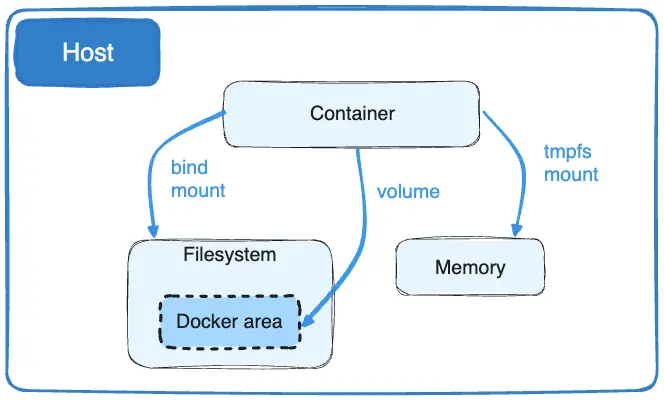

# Синхронизация файлов между хостом и контейнером

Для синхронизации файлов между хостом и контенеров сущестует три сущности:
- **Docker volumes** - так называемые "тома" (это рекомендуемый способ хранения данных). **Docker volume** - это **каталог** на хост-системе, который монтируется в один или несколько контейнеров и **управляется Docker**.

`docker volume create <volume_name>` - создание тома в каталоге, указанном в конфигурации Docker. По умолчанию Docker использует каталог /var/lib/docker/volumes  
`docker volume ls` - список томов  
`docker volume inspect <volume_name>` - описание тома 
`docker volume rm <volume_name>` - удаление тома
`docker volume prune` - удаление томов, которые не используются ни одним из контейнеров

**КАК УКАЗАТЬ VOLUME ДЛЯ КОНТЕЙНЕРА?**

- **Bind mounts** -
- **tmpfs** (но его рассматривать не будем)
https://habr.com/ru/companies/slurm/articles/534334/

Данные сущности необходимы для сохранения данных из контейнера даже после его удаления