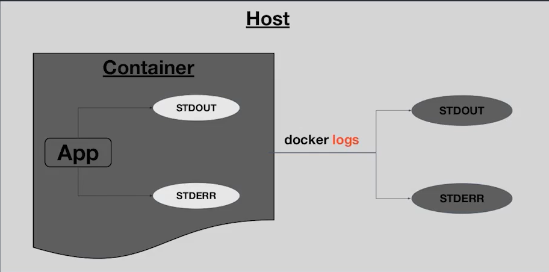
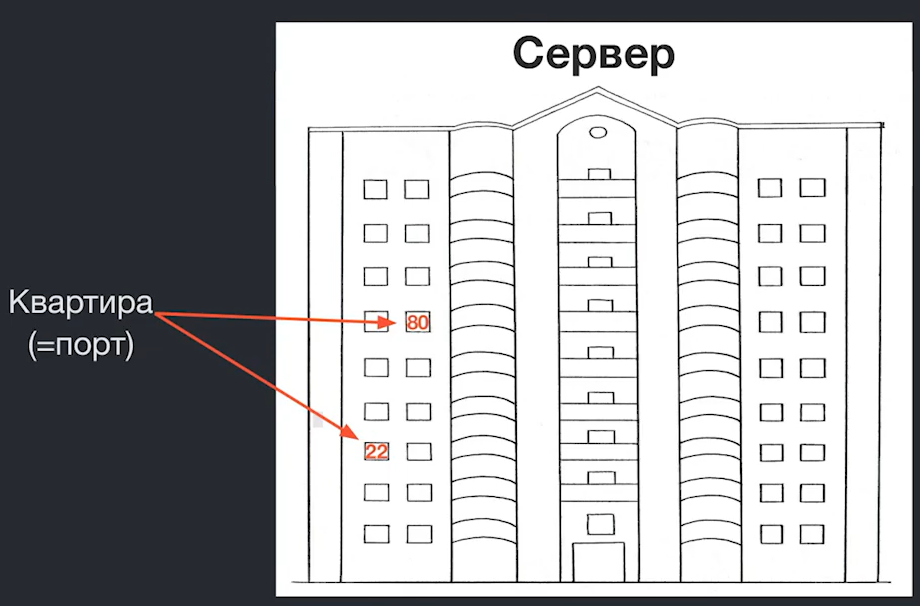
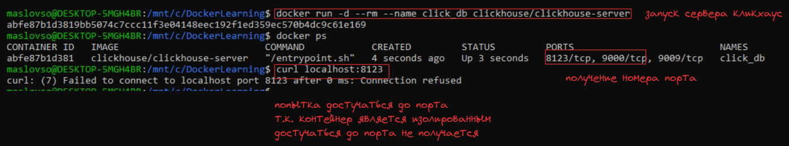

## Перменные окружения
**Перменные окружения** - это набор переменных характерных для среды выполнения. Например:
- **PATH** - список директорий, в которых операционная система ищет исполняемые файлы
- **HOME** - домашняя директория пользователя

Для создания переменной среды в **образе** используется команда `ENV` в докер файле, но тогда нужно будет прописать значение переменной внутри докерфайла, что не безопасно.

`docker run -e <ENV_VAR>=<VALUE> <image_name>` - создание переменной среды внутри контейнера при его создании
`docker run -e <ENV_VAR> <image_name>` - автоматически передача ENV_VAR хоста в контейнер

```bash
$ cat env.list
# This is a comment
VAR1=value1
VAR2=value2
USER

$ docker run --env-file env.list ubuntu env | grep -E 'VAR|USER'
VAR1=value1
VAR2=value2
USER=jonzeolla
```
передача переменных среды с помощью листа


## Логи и потоки вывода
Логи - это текстовая информация с помощью которой программа оповещает нас о своем состоянии

В Linux все процессы работают в рамках трёх потоков: 
- **stdin (0)** - стандартный ввод
- **stdout (1)** - стандартный вывода  
- **stderr (2)** - стандартная ошибка

Вывод данных с любого из трёх потоков можно перенаправить в другой поток или в файл. 
Для этого зарезервированы спецсимволы перенаправления (`<` и `>`)  
- `<` - символ перенаправление **ввода** (`cat < file.txt`)
- `>>` - двой символ перенаправление **дописывает** данные с вывода в целевой объект  
- `>` - одинарный символ **заменяет** содержимое целевого объекта на перенапрвленный выход
- `|` - **перенаправление** **вывода** одной программы на **поток ввода** другой
- `1>` - перенаправление потока стандартного вывода
- `2>` - перенаправление потока ошибок
- `&>` - перенапрвление и потока вывода и потока ошибок
- `>& <descriptor>` - перенаправление из одного потока в другой например `1>&2` перенаправление потока вывода в поток ошибок (еще пример `ls -gge 2>&1 | grep option` grep работает только с потоком вывода)


Команды докер для работы с логами:

- `docker logs <container_name>` - просмотр логов у контейнера container_name даже если он был остановлен
- `docekr logs -t <container_name>` - просмотрлогов у контейнера с временными отметками



## Порты
**Что такое порты:**
На сервере работает одновременно много служб, когда на сервер приходит запрос порт позволяет определить какая именно служба его обработает



`curl` - утилита командной строки, которая позволяет передавать или загружать данные с сервера
например можно отправить запрос GET на какой либо адрес
`curl localhost:1000` - отправка GET запроса на тот же хост на котором была введена команда в порт 1000




Для получения окна внутрь контейнера необходимо указать опцию `-p`:
- `docker run -p <host_port>:<container_port> <image>` - запуск контейнера 
04:10