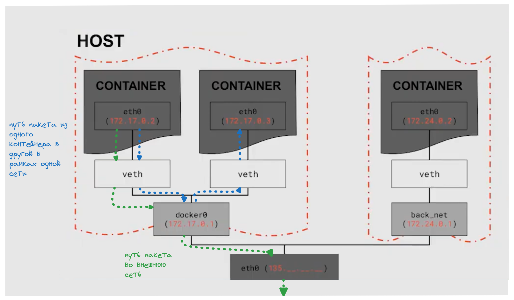

# Введение в сети

- Взаимодейтсвие между контейнерами происходит на уровне протокола **IP**

## IP-адрес
Протокол **IP** (**Internet Protocol**) - протокол обмена данными.  
**IP-адрес** - чаще всего это четыре числа, которые разделены между собой точками (такой формат поддерживается в протоколе IPv4)
Каждое из чисел в адресе — это восьмизначное двоичное число, или **октет**

Существует две версии IP адресов (IPv4 и IPv6, остальные версии эксперементальные)

IP-адрес - всегда состоит из двух частей: **номера хоста (устройства)** и **номера сети**

В нём первая часть означает номер сети, а вторая — номер хоста (то есть вашего устройства).
- Однако мы не можем определить, какая часть IP-адреса используется в качестве сетевого или хост-адреса, если не получим дополнительную информацию из таблицы **масок подсети**

**Маска подсети указывает**, какая часть IP-адреса отводится под сеть, а какая — под хосты. Маска может быть записана в десятичном формате, например, `255.255.255.0`, или в префиксном формате, например, `/24`
Также маска подсети определяет сколько хостов может быть в подсети

> `127.0.0.1` - или `localhost` адрес сети означающий тот же компрьютер

> `0.0.0.0` - этот адрес означает все адреса IPv4 на локальном компьютере (то есть приложение будет случать все ip адреса)

## Docker nets

- **None** - контейнер полностью изолирован от хоста и других контейнеров
- `docker run --network none <image>` - запуск контейнера с драйверов **none**

- **Host** - контейнер имеет связь с другими контейнерами и хостом (сделовательно и с интернетом)  
- `docker run --network host <image>` - запуск контейнера с драйверов **host**  
  

- **Bridge** - (является подсетью по умолчанию) используется для создания частной внутренней сети, в которой контейнеры могут взаимодействовать друг с другом, но при этом они изолированы от внешней сети хоста. Внешние сети не могут напрямую взаимодействовать с контейнерами в сети bridge, **если не настроен проброс портов.** 
**Однако доступ из контейнера в сеть есть**
- `docker run --network bridge <image>` - запуск контейнера с драйверов **bridge**

## docker networks

- `docker network` - утилита для работы с сетями докера(а также вывод всех команд для утилиты)
- `docker networks ls` - вывод всех сетей используемых в докере
- `docker network inspect <net_name>` - вывод информации о сети (поле **Containers** показывает какие контейнеры находяться в этой сети)
- `docker network rm <net_name>` - удаление сети
- `docker network connect <net_name> <container>` - подключение контейнера к определенной сети
- `docker network disconnect <net_name> <container>` - отключение контейнера от сети
- `docker network create <custom_net_name>` - создание собственной подсети

## Сетевое взаимодействие
- `ss` - утилита UNIX для вывода сетевой статистики (в том числе для просмотра какие порты прослушиваются)  
- `ss -l` - просмотр сокетов которые прослушиваются (-l, --listening) 
- `ifconfig` - утилита UNIX для просмотра сетевых интерфейсов (установка `apt-get install net-tools`)
- `tcpdump` — утилита UNIX для анализа и перехвата сетевого трафика. С попощю нее можно перехватить трафик проходящий через тот или иной сетевой интерфейс (а также отследить через какой интерфейс проходит трафик)
- `tcpdump -i <interface_name>` - перехвать пакетов данных в определенном интерфейсе (например eth0) (установка `apt-get install tcpdump`)
- `ping <ip_address>` -  это инструмент командной строки, который используется для проверки целостности и качества соединений в сетях на основе TCP/IP. Она отправляет запросы (ICMP Echo-Request) к указанному узлу сети и фиксирует поступающие ответы (ICMP Echo-Reply) (для установки нужно использовать `apt-get install iputils-ping`)

**Схема сетевых интерфейсов для нескольких сетей**

