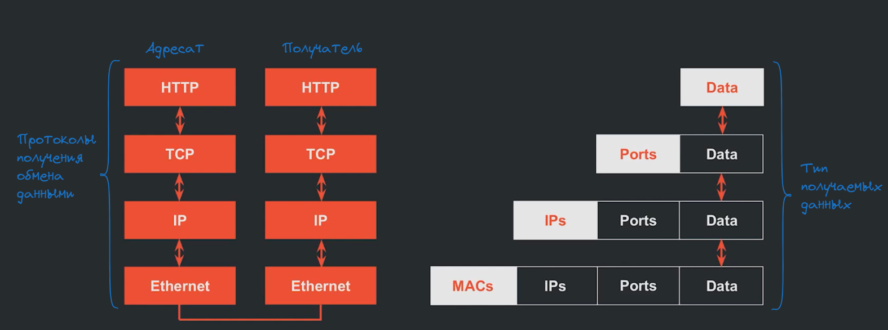
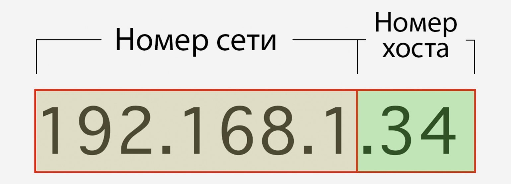
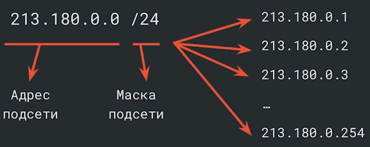
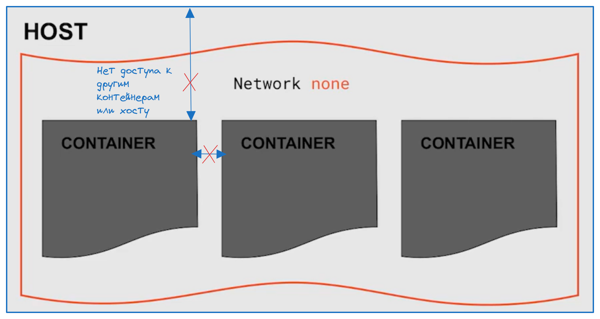
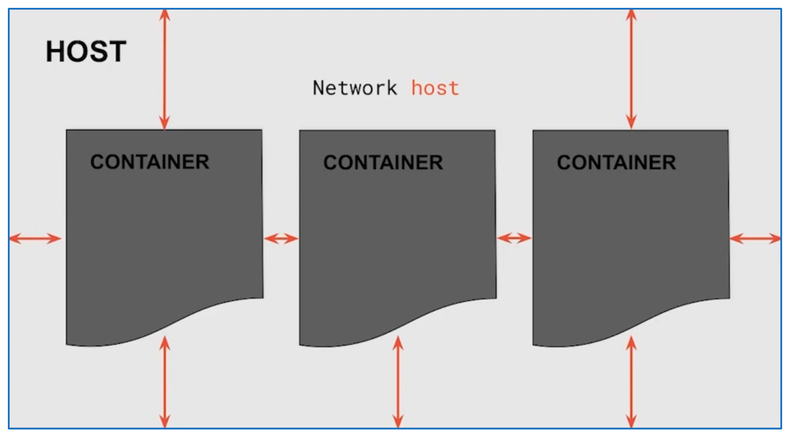
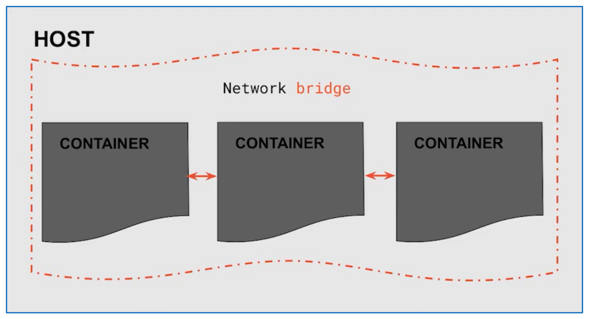

# Введение в сети

- Взаимодейтсвие между контейнерами происходит на уровне протокола **IP**

## IP-адрес
Протокол **IP** (**Internet Protocol**) - протокол обмена данными.  
**IP-адрес** - чаще всего это четыре числа, которые разделены между собой точками (такой формат поддерживается в протоколе IPv4)
Каждое из чисел в адресе — это восьмизначное двоичное число, или **октет**

Существует две версии IP адресов (IPv4 и IPv6, остальные версии эксперементальные)

IP-адрес - всегда состоит из двух частей: **номера хоста (устройства)** и **номера сети**

В нём первая часть означает номер сети, а вторая — номер хоста (то есть вашего устройства).
- Однако мы не можем определить, какая часть IP-адреса используется в качестве сетевого или хост-адреса, если не получим дополнительную информацию из таблицы **масок подсети**

**Маска подсети указывает**, какая часть IP-адреса отводится под сеть, а какая — под хосты. Маска может быть записана в десятичном формате, например, `255.255.255.0`, или в префиксном формате, например, `/24`
Также маска подсети определяет сколько хостов может быть в подсети

> `128.0.0.1` - или `localhost` адрес сети означающий тот же компрьютер

> `0.0.0.0` - этот адрес означает все адреса IPv4 на локальном компьютере (то есть приложение будет случать все ip адреса)

## Docker nets

- **None** - контейнер полностью изолирован от хоста и других контейнеров
- `docker run --network none <image>` - запуск контейнера с драйверов **none**

- **Host** - контейнер имеет связь с другими контейнерами и хостом (сделовательно и с интернетом)
- `docker run --network host <image>` - запуск контейнера с драйверов **host**

- **Bridge** - (является подсетью по умолчанию) используется для создания частной внутренней сети, в которой контейнеры могут взаимодействовать друг с другом, но при этом они изолированы от внешней сети хоста. Внешние сети не могут напрямую взаимодействовать с контейнерами в сети bridge, **если не настроен проброс портов.**
- `docker run --network bridge <image>` - запуск контейнера с драйверов **bridge**

