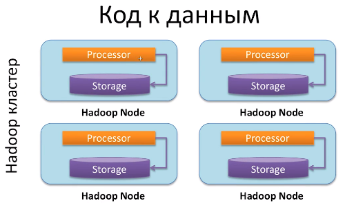
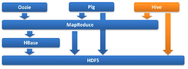
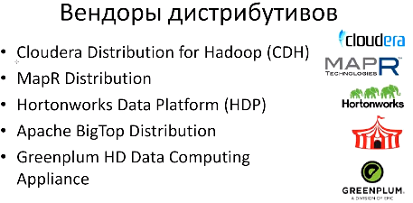

# Что такое hadoop

> http://hadoop.apache.org

> Hadoop: The Definitive Guide (Hadoop. Подробное руководство). Tom White.
> MapReduce Design Patterns. Donald Miner, Adam Shook. O'Reilly Media

## Принцип обработки данных на hadoop

В отличие от класического метода обработки данных  

когда данные из хранилища загружаются в ноды для обработки (где передача данных может занимать больше времени чем сама обработка)
в hadoop применяют подход "Код к данным"

здесь код который должен обрабатывать данные передается в ноды на которых храняться данные и данные обрабатываются **на этих нодах** согласно переданному коду (это позволяет избегать передачи большого объема данных т.к. код весит много меньше чем данные)

Следовательно система hadoop поддерживает горизонтальное масштабирование

## Экосистема hadoop

Главные компоненты:
- **HDFS** - распределенная файловая система для хранения данных
- **MapReduce** - фреймворк позволяющий распределенно обрабатывать данные

Другие компоненты:
- **Hbase** - key-value хранилище реализованное поверх HDFS для быстрого доступа к части данных
- **Zookeeper** - сервис для координации работы внутри hadoop
- **Oozie** - диспетчер задач для Hadoop
- **Pig** - язык позволяющий писать mapReduce задачи высокоуровневым языком
- **Hive** - еще один снструмент позволяющий писать mapReduce задачи высокоуровневым языком (на SQL)

## Дистрибутивы hadoop
 
При самостоятельно установки того или иного компонета экосистемы hadoop, выбранная версия элемента может не работать с версией другого элемента.
Существуют так называемые вендоры которые собирают пакеты дистрибутивов и проводят интеграционные тесты
