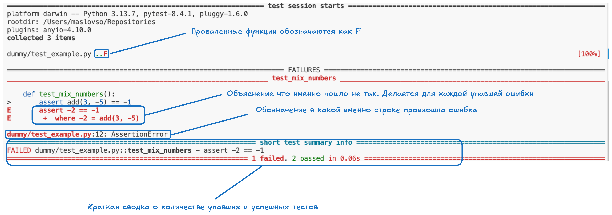
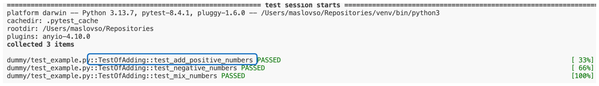
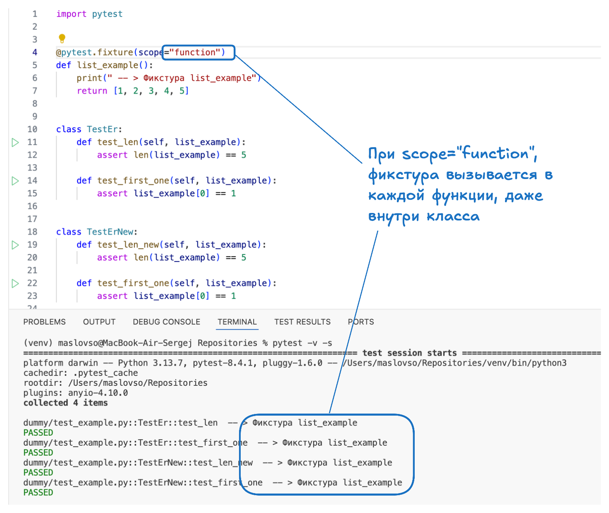
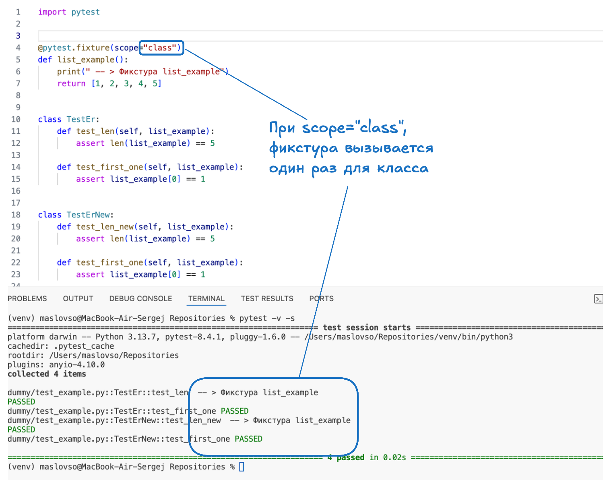
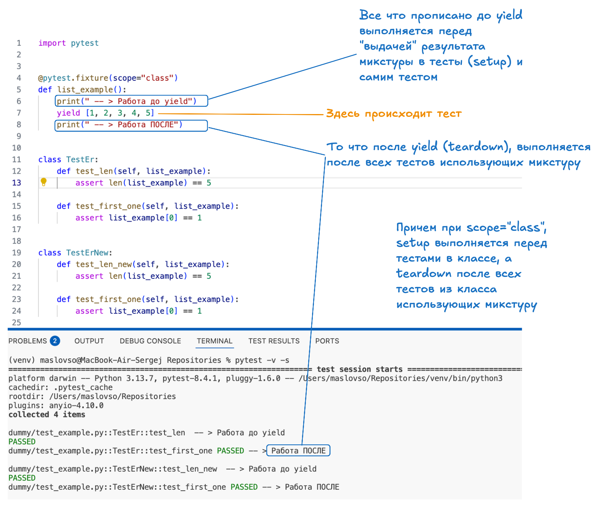

# Testing

## Теория

### А для чего вообще нужно тестирование?

- **Тестирование помогает выявить проблемы на ранних стадиях**, когда их исправление требует меньше времени и ресурсов.
- **Уверенность при внесении изменений и рефакторинге**. При прохождении тестов вы будете уверены что не сломаете продукт в покрытых тестами зонах.
- **Хорошо написанные тесты служат формой живой, исполняемой документации.** Они наглядно демонстрируют, как должен использоваться ваш код и какое поведение от него ожидается
- Процесс написания тестов **часто заставляет задуматься о структуре и дизайне кода**. Т.к. не весь код удобно тестировать
- Предотвращение регрессий - это ошибки, которые появляются в уже работавшем коде, в который напрямую не вносяться изменения, но могут быть какие то зависимости.

### Типы тестов

- **Unit tests** - или модульные тесты. Модульные тесты проверяют самые маленькие, изолированные части вашей программы — отдельные функции, методы или классы. То-есть **помодульно**. Цель — убедиться, что каждый "кирпичик" вашего кода работает правильно сам по себе.
- **Integration Tests** - интеграционные тесты. Интеграционные тесты проверяют взаимодействие между несколькими модулями или компонентами системы. Например, как ваш модуль обработки заказов взаимодействует с модулем уведомлений или базой данных. **Например**: Проверка того, что после успешного создания пользователя в базе данных (один модуль), система аутентификации (другой модуль) может его распознать.
- **Functional / End-to-End, E2E Tests** - функциональные / сквозные тесты. Эти тесты проверяют всю систему или значительную ее часть с точки зрения пользователя. Они имитируют реальные пользовательские сценарии, проходя через все слои приложения — от пользовательского интерфейса (если он есть) до базы данных. **Пример**: Полный сценарий регистрации нового пользователя на сайте: заполнение формы, отправка данных, получение письма с подтверждением, первый вход в систему.

### Пирамида тестирования

Пирамида тестирования - это модель которая демонстриреут рекомендательное соотношение различных типов тестирования в проекте.  


- Модульные тесты - составляют основу. Их должно быть больше всего так как они быстрые, дешевые и точно указывают на чать программы в которой находиться ошибка.
- Интеграционные тесты - проверяют взаимодействие компонетнтов. Дешевле чем e2e тесты, но дороже чем unit.
- E2e тесты - наиболее медленные, хрупкие и дорогие в поддержке.

### Принцип хорошего теста (FIRST)

- **F** (Fast) - **быстрые**. медленные тесты **замедляют** разработку и из-за этого их реже запускают
- **I** (Independent/Isolated) - независимые/изолированные. **Тесты не должны зависить друг от друга**. Порядок их выполнения не должен влиять на результат. При необходимости, каждый тест должен настраивать свое окружение и отчищать его.
- **R** (Repeatable) - повторяемые. Тесты должны выдавать один и тот же результат при каждом запуске в одной и той же среде. Не должно быть случайных сбоев или зависимости от внешних изменяемых факторов.
- **S** (Self-Validating) - само-проверяемые. Тест сам должен определить, прошел он или нет, без необходимости ручной проверки результатов.
- **T** (Timely/Thorough) - своевременные/тщательные. Тесты **нужно писать своевременно** (в идеале, до или вместе с кодом, который они тестируют – **TDD**). Они должны быть **достаточно тщательными**, чтобы покрывать важные аспекты тестируемого кода, включая граничные случаи.

## Pytest

Pytest обладает:

- **Простым синтаксисом** - для написания тестов используются стандартные функции Python и обычные assert утверждения
- **Автоматическое обнаружение тестов**. -- pytest **автоматически находит тестовые файлы** (по умолчанию test_{name}.py или {name}_test.py) и тестовые функции внутри файлов (по умолчанию test_{name}) без необходимости явной регистрации.
- **Информативный вывод**: - При сбоях тестов pytest предоставляет подробную информацию, помогающую быстро найти причину проблемы
- **Мощная экосистема** - Существует множество плагинов, расширяющих функциональность pytest

### Запуск и интерпритация pytest

Запуск `pytest` осуществляется в терминале в той папке в которой написаны файлы с тестами (те которые имеют `_test` или `test_` в названии).

Вид файла:

```py
# test_example.py

def add(x, y):
    return x + y

def test_add_positive_numbers():
    assert add(1, 2) == 3

def test_add_negative_numbers():
    assert add(-1, -2) == -3

def test_add_mixed_numbers():
    assert add(5, -2) == 3

```

В файле прописана функция которая будет проверяться (def add()), а также тесты которые будут прогоняться на этой функции (контрольные примеры).
Для того чтобы тест смог "упасть" нужно прописать внутри функци-теста ключевое слово `assert`. Если его не указать тесты всегда будут проходить успешно

- `pytest` - запуск pytest, он автоматически найдет все файлы с тестами и функции внутри файлов и запусит их
- `pytest -v` - запуск pytest с более подробным описанием
- `pytest {file_name}.py` - запуск определенного файла с тестами




Для лучшей организации вы можете группировать связанные тесты в классы. Имена таких классов должны начинаться с `Test`

Например:

```py
def add(x, y):
    return x + y


class TestOfAdding:
    
    def test_add_positive_numbers(self):
        assert add(2,3) == 5

    def test_negative_numbers(self):
        assert add(-2, -4) == -6

    def test_mix_numbers(self):
        assert add(3, -5) == -2
```



### Фикстуры

Фикстура (fixture - от англ. приспособление) - это такакая штука, которая **подготавливает** исходные данные, подключения, создает временные папки и прочие ресурсы, необходимые в ходе тестов.  
Фикстуры позволяют не дублировать код, внутри тестов.  
Наиболее часто фикстуры используются для создания коннекшенов к БД или создания сессий в спарк.  

Фикстура определяется с помощью декоратора `@pytest.fixture`

```py
import pytest


@pytest.fixture
def list_example():
    print(" -- > Фикстура list_example")
    return [1, 2, 3, 4, 5]


def test_len(list_example):
    len(list_example) == 5
```

- Результат выполнения фикстуры (то, что она возвращает) передается в тест как аргумент.
- Можно передавать несколько фикстур в одну тестовую функию
- Для того чтобы вывести print-ы прописанные внутри фикстур нужно указать флаг `-s` при запуске pystest `pytest -s`

**Scope**.  
Scope - параметр фикстуры, указывающий на то для какой "области" должна запускаться фикстура.
`@pytest.fixture(scope="session")`

Виды scope:

- **function** - (по умолчанию) pytest выполнит каждую фикстуру перед каждым использующим ее тестом
- **class** - фикстура выполняется один раз для каждого использующего ее тестового класса
- **module** - фикстура выполняется один раз для каждого модуля (то есть для одного файла с тестами)
- **package** - фикстура выполняется один раз для пакета (то есть директория (папка), содержащая тестовые модули (файлы))
- **session** - фикстура выполняется один раз для всей сессии тестов (на все время выполнения pytest)




**Выполнение до и после тестов**

- Если нужно выполнить какой то код до тестов использующих фикстуру (например создать коннекшен) - это называется **setup**.
- Если что-то после теста - это называется **teardown** (например закрыть коннекшен)

Для создания **setup** и **teardown** вместо `return` используется `yield`. Все что до `yield` это **setup**, после **teardown**.



## Общие фикстуры (confest.py)

Если есть фикстуры которые переиспользуются в нескольких файлах, то можно определить их в файле `conftest.py`. Питон автоматически обнаружит этот файл.

- файл находиться либо в той же директории что и тесты
- фикстуры, определенные в conftest.py, становятся доступными для всех тестов в этой директории и ее поддиректориях без необходимости их импортировать. Но их все еще нужно прописывать в функции тестирования

**Например**:  
Содержание файла `conftest.py`:

```py
import pytest

@pytest.fixture(scope="function")
def tom_and_jerry():
    return ["том", "джери"]
```

Файл непосредственно с тестами.

```py
def test_is_tom(tom_and_jerry):
    assert "том" in tom_and_jerry
```

**Автоматическое применение фикстур:**

Иногда нужно применить фикстуру по умолчанию, тогда можно использовать параметр фикстуры `autouse=True`

Тогда фикстура будет приминяться автоматически, даже если тест ее не запрашивает

Например:

```py
# conftest.py
import pytest

@pytest.fixture(autouse=True, scope="function")
def track_test_duration():
    import time
    start_time = time.time()
    yield
    duration = time.time() - start_time
    print(f"(Тест выполнялся: {duration:.4f} сек.)")
```

### Параметризация тестов

Параметризция - это запуск одного и того же теста но с несколькими параметрами. Этим можно избежать создание одинаковых тестов с разными входными данными

Для параметризации используется декоратор `@pytest.mark.parametrize`

```py
@pytest.mark.parametrize(argnames, argvalues)
def test_function(argnames):
    # сам тест
```

`argnames` - это название параметра или список с названиями параметров которые будут использоваться в тесте

`argvalues` - список с значениями (если параметр один) или список с кортежами в которых лежат значения (если параметров несколько)

```py
# пример с одним параметром
@pytest.mark.parametrize("number", [1, 2, 3, 4, 5])
def test_is_positive(number):
    assert number > 0
```

```py
# пример с несколькими параметрами

@pytest.mark.parametrize("a, b, expected_sum", [
    (1, 2, 3),
    (5, 5, 10),
    (-1, 1, 0),
    (0, 0, 0),
])
def test_addition(a, b, expected_sum):
    assert a + b == expected_sum
```

Также в итераторе есть параметр `ids` который маркирует каждый из параметров для того чтобы было понятнее какой из кейсов был проверен.

Например:

```py
import pytest

@pytest.mark.parametrize("username, password", [
    ("user1", "pass1"),
    ("user2", "pass2"),
    ("admin", "adminpass"),
], ids=["User One", "User Two", "Administrator"])
def test_login(username, password):
    # Тест логина с заданными учетными данными
    pass
```

## Мокирование

Мокирование - это **использование вместо реальных** подключений к базам данным, rest запросам к реальным api или внешних библиотек некую **заглушку**, позволяющую изолировать ваш код от внешнего взаимодействия.
Прямое использование этих зависимостей в юнит-тестах нежелательно, потому что:

Цель юнит-тестирования — **проверить логику вашего кода в изоляции**. Без привязки к внешним системам.

Прямое использование внешних зависимостей в юнит-тестах нежелательно, потому что:

- Медленно: Сетевые запросы или операции с БД могут быть долгими.
- Ненадежно: Внешний сервис может быть недоступен, или данные в БД могут измениться.
- Сложно контролировать: Трудно имитировать специфические ответы или состояния ошибок от внешних систем.
- Побочные эффекты: Тесты могут изменять реальные данные (например, создавать записи в БД или отправлять настоящие email).
  
`Python` предоставляет мощную стандартную библиотеку `unittest.mock` для создания моков, заглушек и других тестовых двойников. Она прекрасно интегрируется с `pytest`

Пример использования мока:

```py
from unittest.mock import Mock

# это не mock
@pytest.fixture(scope="session")
def spark():
    yield SparkSession.builder.appName("local_test").getOrCreate()

# внутри udf_calendar используется фикстура т.к. lit зависист от создания spark session
@pytest.fixture(scope="session")
def udf_calendar(spark):
    udf_calendar = Mock()
    udf_calendar.get_year_by_date_udf.return_value = lit(2026)
    udf_calendar.get_period_by_date_udf.return_value = lit(1)
    udf_calendar.get_week_by_date_udf.return_value = lit(1)

    yield udf_calendar
```

Помимо каких то систем или библиотек вы также можете замокать импорты, например:

Импорт внутри спарк джобы:

```py
# если у вас не установлена данная библиотека, ваш код будет падать здесь
from com.company.calendar.udf_calendar_spark import UdfCalendar

def main(
    udf_calendar : UdfCalendar,
):
...
...
pass
```

Это можно решить вот так:

```py

def patch_modules(modules: List[str]):
    mock = Mock()
    for module in modules:
        sys.modules[module] = mock

# последовательное мокирование нужно т.к. python импортирует каждый из модулей
patch_modules(
    [
        "com",
        "com.company",
        "com.company.calendar",
        "com.company.calendar.udf_calendar_spark",
    ]
)
```

## patch

`patch` — это способ временно "подменить" какую-то часть кода на "заглушку" (мок) только во время теста, внутри тестируемого кода, на который вы не можете влиять при передаче аргументов.

**`patch` подменяет ссылку внутри на _функцию_ _(или что-то еще)_ внутри какого-то модуля на mock**

Например, при работче спарк джобы используется функция `pyspark.sql.input_file_name`, она вернет значение только при чтении источника из файла, однако при тестирования, как правило используются тестовый данные получаемые через `spark.createDataFrame`, и при таком раскладе функцию вернет пустую строчку. Однако это может быть препядствием:

```py
# здесь функция to_date упадет с ошибкой если input_file_name вернет пустую строчку
to_date(
        regexp_extract(input_file_name(), DMY_DOT_DATE_REGEX_PATTERN, 0),
        "dd.MM.yyyy",
    ).alias("AsOfDt"),
```

Как это можно **запатчить**:

```py
from unittest.mock import patch

@pytest.fixture
def patch_input_file_func():
    # при патчинге нужно указать внутри какого модуля нужно подменить ссылку
    with patch("common.datamarts.common.spark_job_name.input_file_name") as input_file_func_mock:
        input_file_func_mock.return_value = lit("mocked_filename 01.01.2026.csv")
        yield input_file_func_mock


class TestSparkJobи:
    def test_prepare_source_data(self, patch_input_file_func, spark):
        ...
        ...
        pass
```
