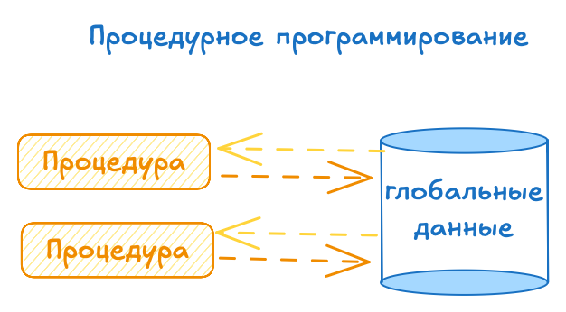
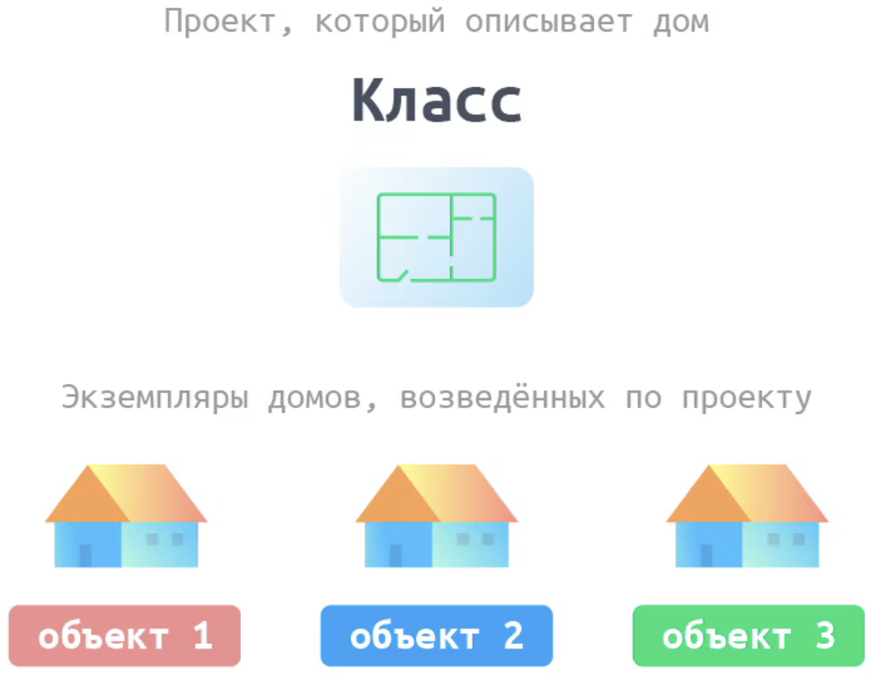

# Разница между процедурным подходом и ООП

Процедурный подход подрузамивает что будут написаны **процедуры** которые будут **взаимодействовать с глобальными данными**

ООП - это создание объектов которые уже **содержат в себе данные** и **процедуры для работы с ними**.

## Классы и экземпляр класса

Класс - это некий созданный шаблон кода с заранее прописанным списком атрибутов и методов.

Экземпляр же - это конкретный объект созданный по шаблону (то есть классу) и имеющий уже заполненые атрибуты.

## Принципы ООП
