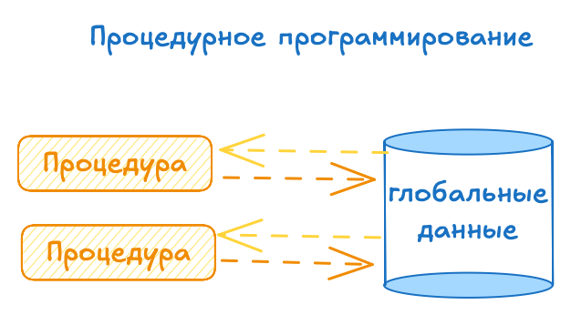
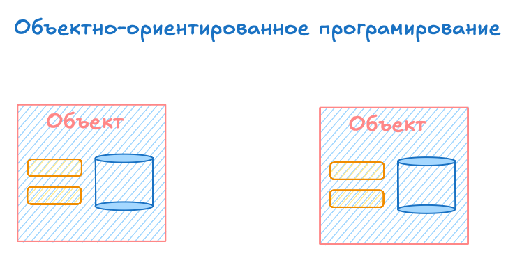
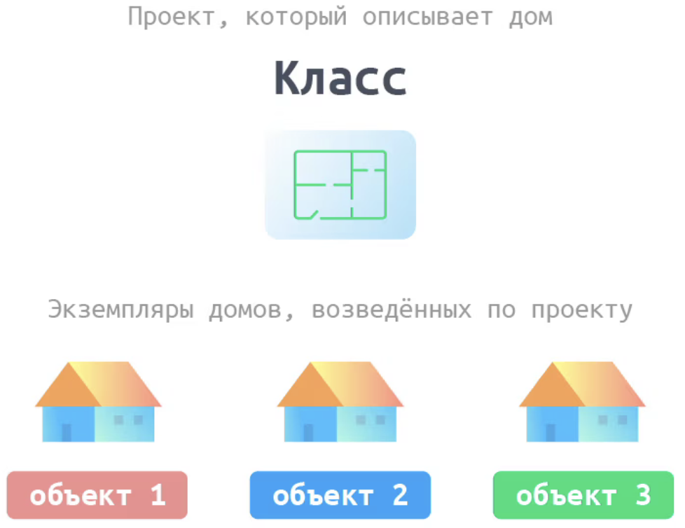
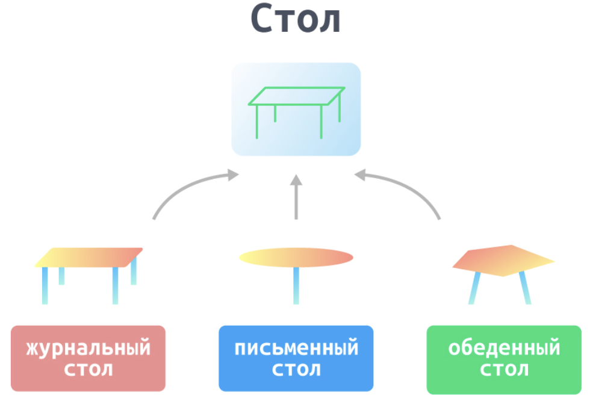

# Разница между процедурным подходом и ООП

Процедурный подход подрузамивает что будут написаны **процедуры** которые будут **взаимодействовать с глобальными данными**

ООП - это создание объектов которые уже **содержат в себе данные** и **процедуры для работы с ними**.

## Классы и экземпляр класса

Класс - это некий созданный шаблон кода с заранее прописанным списком атрибутов и методов.

Экземпляр же - это конкретный объект созданный по шаблону (то есть классу) и имеющий уже заполненые атрибуты.

## Принципы ООП

### Инкапсуляция

Это **невозможность** напрямую **получить доступ к внутренней** структуре объекта

### Наследования

Это передача атрибутов и методовов от предка к потомкам.

## Полиморфизм

Это когда один и тот же интерфейс (например `+` в python) используется в разных объектах по разному в зависимости от самого объекта.
> То есть поддержка **нескольких реализаций на основе общего интерфейса**

Так оператор `+` с целочисленными значениями даст сумму, а со строками даст конкатенацию.
Самый частый пример полиморфизма это переопределение методов, при наследовании.
