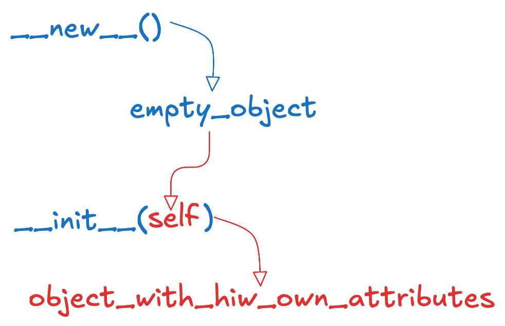
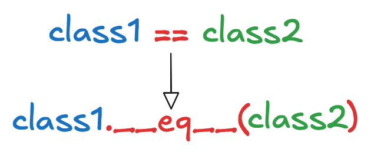

# Магические методы

## Cоздание, инициализация и очищение объектов

**Магические методы** - это методы которые вносят в классы **специальный** (*магический*) функционал. Они всегда обрамлены двойными нижними подчеркиваниями до и после названия. Например `__init__`

Магические методы не предназначены для прямого вызова, их вызов происходит **автоматически при определенных условиях.**

### Методы `__new__()` и `__init__()`

Для создания экземпляра класса (объекта) нам достаточно импортировать этот класс и вызвать его как функцию и передать аргументы, если это необходимо `MyClass()`

Когда мы это делаем запускается внутренний процесс **конструирования класса** который состоит из двух этапов:

- создание пустого объекта - **за это отвечает метод `__new__`**
- инициализация этого объекта (то есть присваивание ему его собственных атрибутов) - **за это отвечает метод `__init__`**

> **self** который использует метод `__init__` это как раз и есть пустой объект созданный методом `__new__`



Вот пример как воссоздать вручную конструирование класса:

```py
class Dog:
    def __new__(cls, *args, **kwargs):
        print('1. Создание экземпляра класса Dog')
        instance = object.__new__(cls)
        return instance

    def __init__(self, name):
        print('2. Инициализация созданного экземпляра класса Dog')
        self.name = name


rex = Dog.__new__(Dog)
Dog.__init__(rex, 'Рекс')
```

> **Добавление нижних подчеркиваний к произвольному методу не сделает его магическим**. Магические методы имеют для интерпретатора особое значение. **Имена магических методов и их смысл определены создателями языка**: создавать новые нельзя, можно только реализовывать существующие.

## Метод `__del__`

`__del__()` - это метод который используется для **финализатора**. Метод который используется для отчистке, освобождению или закрытию ресурсов, которые использовались объектом. (например, открытые файлы или соединения)

> **Финализатор** в питоне **вызывается автоматически**, когда **количество ссылок на объект становиться равным нулю**.

## Строковое представление объектов

### Функции str() и repr()

Функции `str()` и `repr()` спользуются для получения строкового представления объекта.

- `str()` используется для получения **неформального** (ту что понимает человек) представления
- `repr()` используется для получения **формального** (ту что понимает интерпритатор, то есть сможет выполнить. Например через функцию `eval()` ) представления

Например:

```py
from datetime import date

dt = date(2022, 10, 23)

print(str(dt)) #> 2022-10-23
print(repr(dt)) #> datetime.date(2022, 10, 23)
```

> Если объект передается **в функцию print()** в качестве самостоятельного аргумента, то **для его отображения автоматически вызывается функция str()**

### Магические методы `__str__()` и `__repr__()`

Магические методы `__str__()` и `__repr__()` используются для строковых представлений при вызове функций `str()` и `repr()`

> Принято, что метод **repr**() должен возвращать строку, которую можно преобразовать обратно в объект с помощью функции `eval()` (выполнение кода python в строковом представлении)

> Методы **str**() и **repr**() **всегда должны возвращать объект типа str**, в противном случае будет возбуждено исключение TypeError.

Пример реализации в собственном классе:

```py
class Dog:
    def __init__(self, name):
        self.name = name
    def __str__(self):
        return f"Собака по имени {self.name}"
    def __repr__(self):
        return f"Dog('{self.name}')"

rex = Dog("Rex")

print(str(rex)) #> Собака по имени Rex
print(repr(rex)) #> Dog('Rex')
```

## Сравнение объектов

### Магические методы `__eq__()` и `__ne__()`

Если мы самостоятельно не определим методы для сравнения объектов, то сравнение с помощью оператора `==` будет равносильно `is`. То есть **сравнение на равенство** будет являеться **сравнением на идентичность**

Сравнение на идентичность `is` - это являются ли ссылки присвоенные переменным ссылками на **один и тот же экземпляр класса**

**Магический метод `__eq__()`** определяет как именно будут сравниваться два объекта при применении к ним `==`. То есть `class1 == class2` идентично `class1.__eq__(class2)`



Хорошим примером применения метода сравнения можно увидеть на классах тоек координат:

```py
class Point:
    def __init__(self, x, y):
        self.x = x
        self.y = y

    def __eq__(self, other):
        return self.x == other.x and self.y == other.y
```

Здесь сравнение происходят по координатам присвоенным объектам.

Для того чтобы не получать ошибку при сравнении объектов разных классов стоит включить проверку на класс при реализации метода:

```py
def __eq__(self, other):
    if isinstance(other, Point):
        return self.x == other.x and self.y == other.y
    else:
        return False
```

**Магический метод `__ne__()`** - используется для сравнение на неравенство с помощью оператора `!=`

```py
def __ne__(self, other):
    if isinstance(other, Point):
        return self.x != other.x or self.y != other.y
    else:
        return True
```

> **Python автоматически реализует метод **ne**(), если метод **eq**() уже реализован**

Онако если нам требуется несколько иная реализация, мы всегда можем определить метод `__ne__()` вручную.
