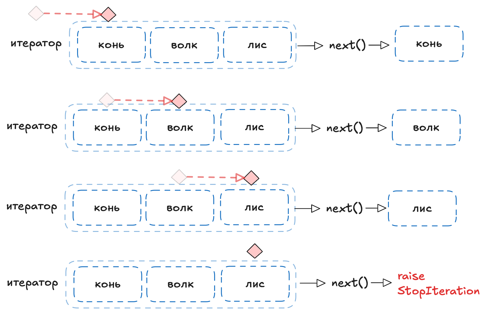
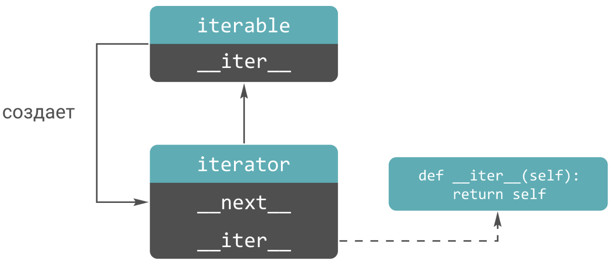
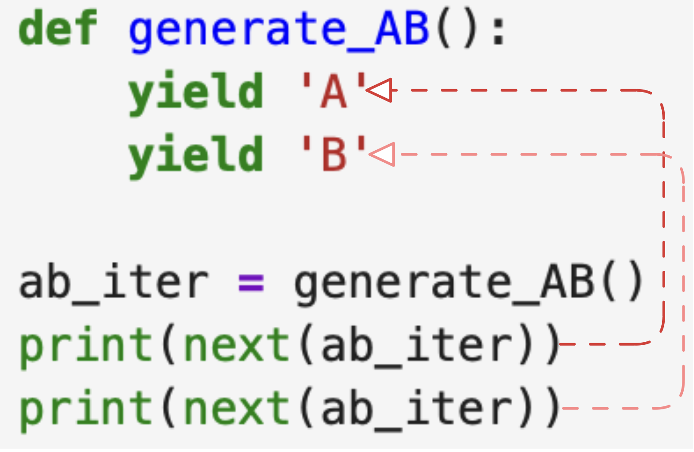
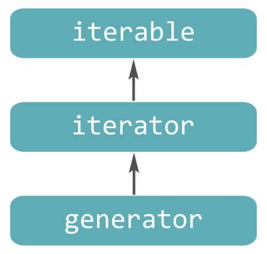

# Итераторы

## Итерируемый объекты

**Итерируемый объект** - это объект который можно **итерировать**, то есть перебирать его элементы один за другим.

В Python можно выделить два типа итерируемых объектов:

- итератор
- коллекции и последовательности

- **Итератор** - это специальный объект, который выдает по одному своему эллементу за раз. Он же является конструкцией, которая умеет перебирать элементы итерируемых объектов.

Если итератор передать во встроенную функцию `next()` то функция вернет его текущий эллемент, сам итератор сдвинется на следующий эллемент. Если элементов больше не осталось, то при передаче итератора в функцию некст приведет к исключению `StopIteration`.


- **Коллекция** - это объект, который хранит набор значений одного или различных типов, а так же позволяет обращяться к этим значениям.  
- **Последовательности** - это коллеции, эллементы которых пронумерованы индексами и расположены в строгом порядке.

> **Коллекции не являются итераторами сами по себе**, то есть они не могут перебирать собственные эллементы. Но на основе последовательностей можно создать сколько угодно итераторов.

Для того чтобы создать итератор на основе некоторой коллекции, достаточно вызвать встроенную функцию `iter()`, передав нужную коллекцию в качестве ее аргумента.

> Как только итератор становится **пустым и порождается исключение StopIteration**, он становится совершенно бесполезным.

## Примущества итераторов

### Однотипность работы с объектами разных типов

Итераторы позволяют работать с итерируемыми объектами разных типов одинаково.  
Списки, кортежи, строки, множества, словари, объекты типа range имеют разные типы, но мы можем использовать любой из этих объектов:

- в цикле `for`
- в функциях высшего порядка `map()`, `filter()`, `reduce()` и т.д.
- для проверки на принадлежность значения через `in`
- для **распаковки** элементов с помощью `*`

Все эти действия используют итераторы в своей основе.

Например, цикл `for` работает по следующему алгоритму:

1. На основе итерируемого объекта создается итератор.
2. С помощью функции `next()` запрашивают эллемент и передает его в выполняемый блок кода
3. Цикл останавливается при поличении исключения `StopIteration` цикл останавливается.

Поэтоту в цикл `for` можно передавать и `списки` и `кортежи` и `range` да и любой другой итерируемый объект.

```py
# это
numbers = [1, 2, 3, 4]

for num in numbers:
    print(num)


# неявно превращяется в это
iterator = iter(numbers)

while True:
    try:
        item = next(iterator)
        print(item)
    except StopIteration:
        break
```

### Ленивые вычисления и экономия потребляемой памяти

Тут предполагается что итератор при использовании итератора, можно не держать в памяти все эллементы, а можно получать их на ходу. Например как объект `range`, который создает новое число на лету, только тогда, когда оно потребуется.
Размер объектов `range` **не зависит от количества чисел**, которые предполагается перебрать, ведь **нужно помнить только начальное и конечное значения последовательности, шаг и текущее значение.**

### Комбинация множества итераторов

```py
sentence = 'In the face of ambiguity refuse the temptation to guess'

filter_iterator = filter(lambda word: len(word) > 4, sentence.split())
map_iterator = map(lambda word: word.upper(), filter_iterator)
enumerate_iterator = enumerate(map_iterator, 1)

for index, value in enumerate_iterator:
    print(f'{index}. {value}')
```

Все три объекта `filter_iterator`, `map_iterator`, `enumerate_iterator` являются итераторами. Они не хранят все данные в памяти, а создают и выдают их по мере того, как их запрашивают.

## Особенности итераторов

- использование в цикле `for` - в цикл `for` также можно передавать и **сами итераторы**. Однако при использовании итератора в цикле `for`, цикл опустошает его и его повторный обход ни к чему не приведет. Также стоит обратить внимание на то, что цикл `for` **сам перехватывает** исключение `StopIteration`. Если самостоятельно вызвать функцию `next()` на пустом итераторе, мы получим исключение.

- преобразование в коллекцию - итераторы можно преобразовать в коллецию с помощью встроенных функций `list()`, `tuple()` и т.к. Тут стоит отметить при преобразовании в список, **итератор опустошается**.

- Оператор принадлежности `in` - `in` также работает с итераторами. Элементы итератора переибираются пока не будет найден нужный эллемент, затем перебор останавливается. Нужно понимать что при переборе **итератор опустошается**. Соответсвенно вторая проверка на вхождение уже может не сработать так как эллемент уже был пройден итератором.
  
- распаковка итератора - с помощью `*` мы можем распаковывать итераторы, автоматически опустошая его. (`print(*map(str.upper, ['хе','хе']))`)

## Встроенные итераторы

### Функция `map()`

`map(function, *iterable)` - применяет функцию ко всем эллементам переданного итерируемого объекта. Точнее каждый эллемент итерируемого объекта отправляется в переданную функцию.

**Возвращаемое значение:** функция `map()` возвращает **итератор** типа `<class 'map'>`.

**Преимущества использования:** Функция `map()` написана на языке C и хорошо оптимизирована, ее внутренний цикл более эффективный, чем обычный цикл `for` в Python. Функция `map()` потребляет мало памяти, так как возвращает ленивый итератор, элементы которого извлекаются по запросу.

### Функция `filter()`

`filter(function, iterable)` - функция фильтрует итерируемый объект согласно функции. Если функция вернет **True** эллемент итерируемого объекта попадет в результат, если **False** то не попадет

**Возвращаемое значение.** Функция `filter()` возвращает **итератор** типа `<class 'filter'>`.

**Преимущества использования.** Функция `filter()` также написана на языке C и более оптимизирована чем цикл `for`

### Функция enumerate()

`enumerate(iterable, start=0)` - нумерует элементы итерируемого объекта iterable, начиная со значения start.

**Возвращаемое значение.** Функция `enumerate()` возвращает итератор типа `<class 'enumerate'>`, содержащий кортежи вида (счетчик, элемент).

### Функция zip()

`zip(*iterables, strict=False)` - объединяет элементы каждого из переданных итерируемых объектов `*iterables`.

**Возвращаемое значение.** Функция `zip()` возвращает итератор типа `<class 'zip'>`, содержащий кортежи.

**Примечание.** По умолчанию значение аргумента `strict=False`, то есть функция `zip()` останавливается, когда исчерпывается самый короткий итерируемый объект. Если установить значение `strict=True,` то функция `zip()` проверяет длины итерируемых объектов, вызывая ошибку `ValueError` при их несовпадении

### Функция reversed()

`reversed(seq)` - Функция `reversed(seq)` перебирает элементы итерируемого объекта `seq` в обратном порядке.

**Возвращаемое значение.** Функция `reversed()` возвращает **итератор**, содержащий элементы итерируемого объекта в обратном порядке.

> Итерируемый объект, передаваемый в функцию `reversed()`, должен являться **последовательностью**.
>
### Прочее

> > Встроенная функция `open()`, открывающая файл, также возвращает итератор, который позволяет обойти содержимое файла, не загружая его целиком в память.

## Протокол итерируемых объектов и итераторов

У итерируемых объектов есть магический метод `__iter__()`, который создает итератор на основе этого объекта.

У всех итераторов есть магический метол `__next__()`
Когда элементы в итераторе закончились, очередной вызов функции `next()` возбуждает исключение `StopIteration`.

> У всех итераторов также есть и метод `__iter__()`, который возвращает сам итератор (сам себя). Таким образом, любой итератор является итерируемым объектом.  Все дело в том, что цикл for ожидает, что у объекта, по которому идет итерирование, есть не только магический метод `__next__()`, но и `__iter__()`

- У всех итерируемых объектов есть магический метод `__iter__()`, который преобразует итерируемый объект в итератор. Встроенная функция iter() вызывает за кулисами именно этот магический метод.

- У всех итераторов есть магический метод `__next__()`, который обеспечивает выдачу очередного элемента. Встроенная функция next() вызывает за кулисами именно этот магический метод. Когда элементы в итераторе закончились, очередной вызов функции next() возбуждает исключение StopIteration.

- У всех итераторов также есть и метод `__iter__()`, который возвращает сам итератор (сам себя). Таким образом, любой итератор является итерируемым объектом, но не наоборот — не любой итерируемый объект является итератором.



Пример создания итератора:

```py
class Counter:                             
    def __init__(self, left, right):
        self.left = left
        self.right = right
    
    def __iter__(self):
        return self
    
    def __next__(self): 
        if self.left > self.right:
            raise StopIteration
        else:
            self.left += 1
            return self.left - 1
```

# Генераторы

В питоне создавать итераторы можно с помощью **генераторов**. Они делятся на два типа:

- **функции-генераторы**
- **выражения-генераторы**

## Функции генераторы

**Функция-генератор** – это функция, которая возвращает **итератор**. Она выглядит как обычная функция, за исключением того, что использует выражение `yield`, а не `return`.

```py
def generate_ints(n):
    for num in range(n):
        yield num
```

> Разница между `yield` и оператором `return` заключается в том, что для ключевого слова `yield` состояние **выполнения генератора приостанавливается** и **локальные переменные сохраняются**.

Например:



При вызове обычной функции, создается **локальное пространство имен**, в котором создаются ее локальные переменные. Когда обычная функция достигает оператора `return`, локальные переменные уничтожаются и значение возвращается вызывающей стороне. Последующий вызов той же функции создает новое локальное пространство имен и новый набор локальных переменных.

**Функция-генератор**, напротив, **сохраняет локальные переменные от вызова к вызову**. Это своего рода возобновляемая функция. Которая возвращяет класс `<class 'generator'>`

---

- Любая функция, содержащая ключевое слово `yield`, является функцией-генератором
- Когда вызывается функция-генератор, то она **не возвращает единственное значение**, как это делает обыкновенная функция.
- Функция-генератор всегда возвращает объект типа `generator`, который поддерживает протокол итератора

---

**Генератор** – это **итератор**, который порождает значения, **переданные `yield`.** Когда выполнение **доходит до конца функции**, объект генератор возбуждает исключение `StopIteration` в полном соответствии с протоколом итератора.

> Любой **итератор** является **итерируемым объектом**, а любой **генератор** является итератором, значит тоже является итерируемым объектом.



## Функции-генераторы с побочными действиями

Помимо возврата значений через `yield` в функции генераторе можно прописывать побочные действия (закрыть или открыть соединение с БД, открыть или закрыть файл и т.д.)

Например:

```py
def generate_AB():
    print('start')
    yield 'A'
    print('continue')
    yield 'B'
    print('end')
```

```py
def even_numbers(begin):
    begin += begin % 2
    while True:
        yield begin
        begin += 2
```

## Ключевое слово `return` в теле функции-генератора

До версии Python 3.3 наличие ключевого слова `return` внутри функции-генератора приводило к возникновению ошибки.

Теперь это допускается, при этом инструкция `return` приводит к возбуждению исключения `StopIteration`, при этом значение прописанное в `return` не будет возвращено.

```py
def generate_ints():
    yield 1
    yield 2
    return 3
    yield 4

for num in generate_ints():
    print(num)
## выведет только
# 1
# 2
```

## Конструкция yield from

Конструкция `yield from` позволяет упростить написание генераторной функции с циклом внутри.

Так

```py
def get_data():
    for num in range(5):
        yield num
    for char in 'ABC':
        yield char
```

Можно записать

```py
def get_data():
    yield from range(5)
    yield from 'ABC'
```

> Объединение `yield` и `for` это лишь часть возможностей этой конструкции. На самом деле конструкция `yield from` позволяет вкладывать **один генератор в другой** и таким образом создавать субгенераторы (вложенные генераторы).

Например:

```py
def generator2():
    yield 'Red'
    yield 'Blue'

def generator1():
    yield 'Green'
    yield from generator2()
    yield 'Yellow'
    yield 'Black'

for color in generator1():
    print(color, end=' ')
```

Также с помощью данной конструкции можно создавать **рекурсивные генераторные функции**.

Например

```py
def numbers(start : int ):
    yield start
    yield from numbers(start + 1)
```

## Генераторные выражения

Помимо генераторных функций в пайтон существет генераторные выражения для созания генераторов. Это выражение написанное в одну строку, **наподобие генератора списка**, только в нашем случае используются круглые скобки.

```py
capitals = (s.upper() for s in 'abc')
```

> Python поддерживает четыре вида генераторов:
>
> - генераторы списков (list comprehension)
> `[выражение for элемент in последовательность if условие]`
> - генераторы множеств (set comprehension)
> `{ключ:значение for (ключ,значение) in dict.items() if условие}`
> - генераторы словарей (dict comprehension)
> `{выражение for элемент in последовательность if условие}`
> - генераторные выражения (generator expressions)
> `(выражение for элемент in последовательность if условие)`

## Создания итерируемых объектов

Для создания итератора нам требуется определить методы `__next__()` и `__iter__()`, в то время как для создания итерируемого объекта достаточно определить только метод `__iter__()`, возвращаемым значением которого является итератор. При реализации метода `__iter__()` у итерируемых объектов удобно пользоваться всеми возможностями генераторов, а именно: генераторными выражениями и генераторными функциями (ключевые слова yield и yield from).

```py
class Order:
    def __init__(self, basket, customer):
        self.basket = list(basket)
        self.customer = customer

    def __iter__(self):
        yield from self.basket    
```
