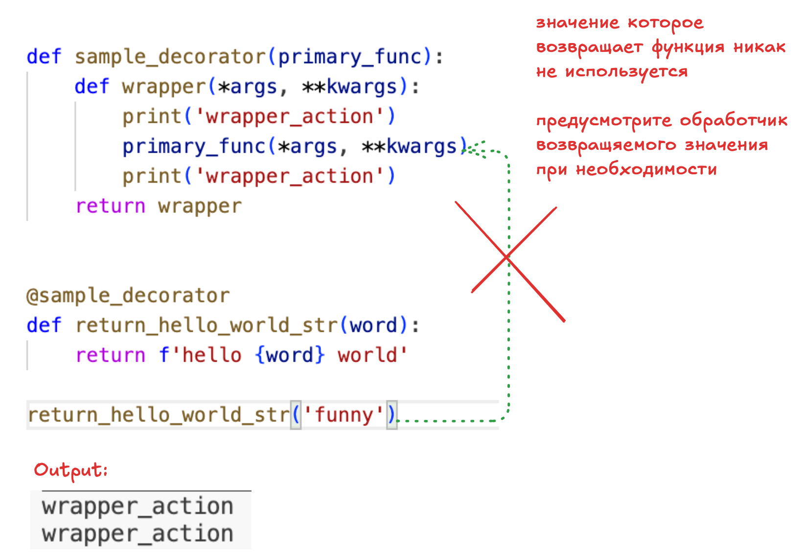
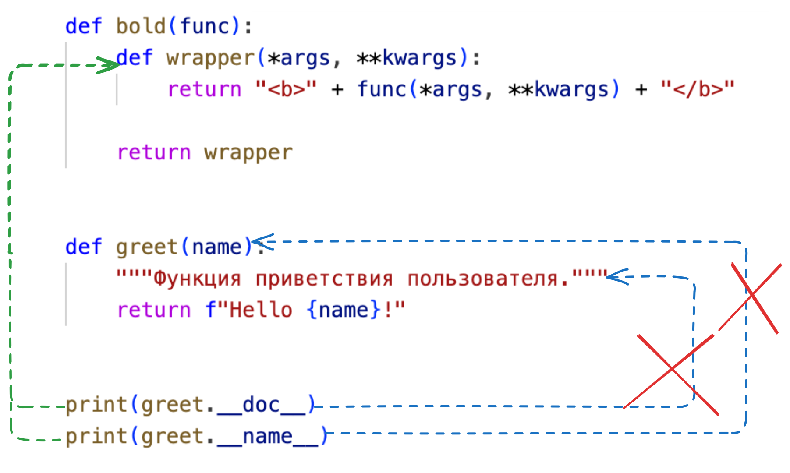

# Декораторы

**Декоратор** - это функция, которая принимает другую функцию, расширяет ее возможности не меняя при этом исходный код и возвращяет новую функцию.
То есть обертывает другую функцию внутрь себя.

Пример:

```python
def simple_decorator(primary_func):
    def wrapper():
        print("decorator activity 1")
        primary_func()
        print("decorator activity 2")

    return wrapper


def hello_world_func():
    print("hello_world")


decorator_example = simple_decorator(hello_world_func)

decorator_example()

# decorator activity 1
# hello_world
# decorator activity 2
```

## Спец синтаксис для декораторов

Вместо написания нескольких функций python позволяет использовать декораторы через специальный символ `@`, что является синтаксическим сахаром

Теперь приведенный выше код можно переписать вот так

```python

def simple_decorator(primary_func):
    def wrapper():
        print("decorator activity 1")
        primary_func()
        print("decorator activity 2")

    return wrapper


@simple_decorator
def second_hello_world_func():
    print("hello_world")


second_hello_world_func()
```

> При использовании `@` мы декорируем функцию на этапе определения и тем самым теряем доступ к самой функции. В таком случае можно использовать ручное декорирование чтобы сохранить доступ к недекорированной версии функции

Декоратор может в том числе изменять поведение декорируемой функции, например изменять вывод первоначальной функции.

```python
def uppercase_decorator(func):
    def wrapper():
        original_result = func()
        modified_result = original_result.upper()
        return modified_result

    return wrapper
```

## Применение нескольких декораторов

При использовании нескольких декораторов их эффект накапливается.
Декораторы применяются в порядке **снизу вверх**.
Например:

```python
def bold(func):
    def wrapper():
        return '<b>' + func() + '</b>'
    return wrapper

def italic(func):
    def wrapper():
        return '<i>' + func() + '</i>'
    return wrapper


@bold
@italic
def greet():
    return 'Hello world!'

print(greet())

# greet = bold(italic(greet))
# <b><i>Hello world!</i></b>
```

## Декорируемые функции с аргументами

При использовании декораторов, мы передаем параметры не в конечную функцию, а в функцию обертку (`wrapper`)  
Например:


Вызов такой функции вызовет исключение `TypeError: sample_decorator.<locals>.wrapper() takes 0 positional arguments but 1 was given`

Для переиспользования параметров в декораторе необходимо использовать `*args` (arguments) и `**kwargs` (keywords arguments) **в функции обертке**  
Например:

```python
def sample_decorator(primary_func):
    def wrapper(*args, **kwargs):
        print("first decorator action")
        primary_func(*args, **kwargs)
        print("second_decorator_func")

    return wrapper


@sample_decorator
def hello_world_func(word):
    print(f"hello_{word}_world")


hello_world_func("funny")
#first decorator action
#hello_funny_world
#second_decorator_func
```

## Возврат значений из декорируемой функции

> любая функция в python всегда возвращяет значение. Даже если в функции нет явной инструкции `return`, она вернет `None`



## Сохранение атрибутов \__name\__ и \__doc\__ для декорируемой функции

> Каждая функция имеет спекиальные атрибуты `__name__` и `__doc__`

- `__name__` - имя функции, имя для функции `def read()` является **read**
- `__doc__` - строка документации, которая распологается сразу после объявления функции

Например:

```python
def greet(name):
    """Функция приветствия пользователя."""
    return f"Hello {name}!"


print(greet.__name__) # greet
print(greet.__doc__) # Функция приветствия пользователя.

```

Но при использовании декоратора атрибуты name и doc вызываются из функции обертки, а не из декорирумой функции


Вариант решения данной проблемы:

```python
def bold(func):
    def wrapper(*args, **kwargs):
        return '<b>' + func(*args, **kwargs) + '</b>'
    wrapper.__name__ = func.__name__
    wrapper.__doc__ = func.__doc__
    return wrapper
```

Но как правило этот подход не используют, а используют декоратр `wraps` из модуля `functools` внутри своего декоратора, например:

```python
import functools

def bold(func):
    @functools.wraps(func)
    def wrapper(*args, **kwargs):
        return '<b>' + func(*args, **kwargs) + '</b>'
    return wrapper
```
