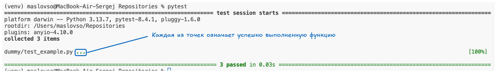
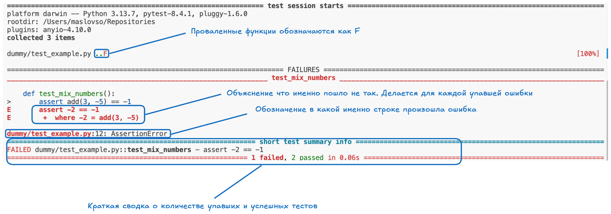

# Testing

## Теория

### А для чего вообще нужно тестирование?

- **Тестирование помогает выявить проблемы на ранних стадиях**, когда их исправление требует меньше времени и ресурсов.
- **Уверенность при внесении изменений и рефакторинге**. При прохождении тестов вы будете уверены что не сломаете продукт в покрытых тестами зонах.
- **Хорошо написанные тесты служат формой живой, исполняемой документации.** Они наглядно демонстрируют, как должен использоваться ваш код и какое поведение от него ожидается
- Процесс написания тестов **часто заставляет задуматься о структуре и дизайне кода**. Т.к. не весь код удобно тестировать
- Предотвращение регрессий - это ошибки, которые появляются в уже работавшем коде, в который напрямую не вносяться изменения, но могут быть какие то зависимости.

### Типы тестов

- **Unit tests** - или модульные тесты. Модульные тесты проверяют самые маленькие, изолированные части вашей программы — отдельные функции, методы или классы. То-есть **помодульно**. Цель — убедиться, что каждый "кирпичик" вашего кода работает правильно сам по себе.
- **Integration Tests** - интеграционные тесты. Интеграционные тесты проверяют взаимодействие между несколькими модулями или компонентами системы. Например, как ваш модуль обработки заказов взаимодействует с модулем уведомлений или базой данных. **Например**: Проверка того, что после успешного создания пользователя в базе данных (один модуль), система аутентификации (другой модуль) может его распознать.
- **Functional / End-to-End, E2E Tests** - функциональные / сквозные тесты. Эти тесты проверяют всю систему или значительную ее часть с точки зрения пользователя. Они имитируют реальные пользовательские сценарии, проходя через все слои приложения — от пользовательского интерфейса (если он есть) до базы данных. **Пример**: Полный сценарий регистрации нового пользователя на сайте: заполнение формы, отправка данных, получение письма с подтверждением, первый вход в систему.

### Пирамида тестирования

Пирамида тестирования - это модель которая демонстриреут рекомендательное соотношение различных типов тестирования в проекте.  


- Модульные тесты - составляют основу. Их должно быть больше всего так как они быстрые, дешевые и точно указывают на чать программы в которой находиться ошибка.
- Интеграционные тесты - проверяют взаимодействие компонетнтов. Дешевле чем e2e тесты, но дороже чем unit.
- E2e тесты - наиболее медленные, хрупкие и дорогие в поддержке.

### Принцип хорошего теста (FIRST)

- **F** (Fast) - **быстрые**. медленные тесты **замедляют** разработку и из-за этого их реже запускают
- **I** (Independent/Isolated) - независимые/изолированные. **Тесты не должны зависить друг от друга**. Порядок их выполнения не должен влиять на результат. При необходимости, каждый тест должен настраивать свое окружение и отчищать его.
- **R** (Repeatable) - повторяемые. Тесты должны выдавать один и тот же результат при каждом запуске в одной и той же среде. Не должно быть случайных сбоев или зависимости от внешних изменяемых факторов.
- **S** (Self-Validating) - само-проверяемые. Тест сам должен определить, прошел он или нет, без необходимости ручной проверки результатов.
- **T** (Timely/Thorough) - своевременные/тщательные. Тесты **нужно писать своевременно** (в идеале, до или вместе с кодом, который они тестируют – **TDD**). Они должны быть **достаточно тщательными**, чтобы покрывать важные аспекты тестируемого кода, включая граничные случаи.

## Pytest

Pytest обладает:

- **Простым синтаксисом** - для написания тестов используются стандартные функции Python и обычные assert утверждения
- **Автоматическое обнаружение тестов**. -- pytest **автоматически находит тестовые файлы** (по умолчанию test_{name}.py или {name}_test.py) и тестовые функции внутри файлов (по умолчанию test_{name}) без необходимости явной регистрации.
- **Информативный вывод**: - При сбоях тестов pytest предоставляет подробную информацию, помогающую быстро найти причину проблемы
- **Мощная экосистема** - Существует множество плагинов, расширяющих функциональность pytest

### Запуск и интерпритация pytest

Запуск `pytest` осуществляется в терминале в той папке в которой написаны файлы с тестами (те которые имеют `_test` или `test_` в названии).

Вид файла:

```py
# test_example.py

def add(x, y):
    return x + y

def test_add_positive_numbers():
    assert add(1, 2) == 3

def test_add_negative_numbers():
    assert add(-1, -2) == -3

def test_add_mixed_numbers():
    assert add(5, -2) == 3

```

В файле прописана функция которая будет проверяться (def add()), а также тесты которые будут прогоняться на этой функции (контрольные примеры).
Для того чтобы тест смог "упасть" нужно прописать внутри функци-теста ключевое слово `assert`. Если его не указать тесты всегда будут проходить успешно

- `pytest` - запуск pytest, он автоматически найдет все файлы с тестами и функции внутри файлов и запусит их
- `pytest -v` - запуск pytest с более подробным описанием
- `pytest {file_name}.py` - запуск определенного файла с тестами





Для лучшей организации вы можете группировать связанные тесты в классы. Имена таких классов должны начинаться с `Test`

Например:

```py
def add(x, y):
    return x + y


class TestOfAdding:
    
    def test_add_positive_numbers(self):
        assert add(2,3) == 5

    def test_negative_numbers(self):
        assert add(-2, -4) == -6

    def test_mix_numbers(self):
        assert add(3, -5) == -2
```


### Фикстуры
