## Что такое Hadoop

### Предпосылки

**dwh** - data ware house - некая модель данных с сущностями и связями между ними, отражающий бизнес

**etl** - extract transport load - процесс используемый для построения dwh, **extract** загружаем исходные данные, **transform** преобразуем в форму утвержденную для **dwh**, **load** - загружаем в **dwh**.
Плюсы:
- удобно работать с dwh т.к. в ней понятны и наваны сущности в табличной форме (как правило), имеющие предопределенные типы данных.
Минусы:
- неоптимальны для работы с не табличными данными
- хранение в данных в оптимальном виде занимает меньше места

**elt** - extract load tranform - используется с **data lake**, то есть работаем с исходными форматами данных т.к. иногда не все источники можно преобразовать в табличную форму

Плюсы:
- Работаем с исходными форматами файлов
- быстрее подключаем источники (т.к. можем юзать разные форматы)
Минусы:
- источники занимают больше места чем при **dwh**
- в **data lake** качество может скакать + сущность столбцов зачастую может быть не понятным

Для "незаболачивания" озера данных можно использовать:
- apache atlas - Стоит линэйджы данных. Помогает анализировать метаданные. 
- amundsen data catalog - дата каталог
- great_excpectentions - data quolaty

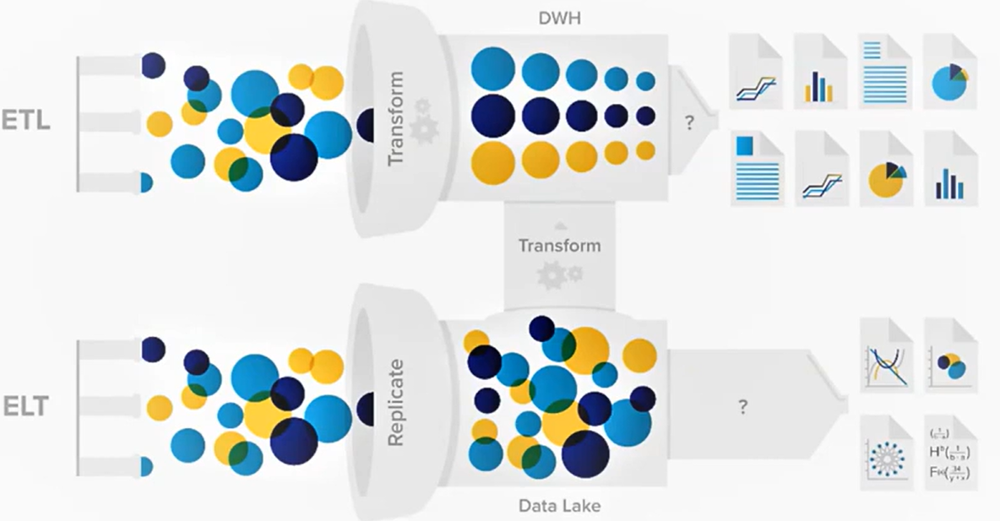

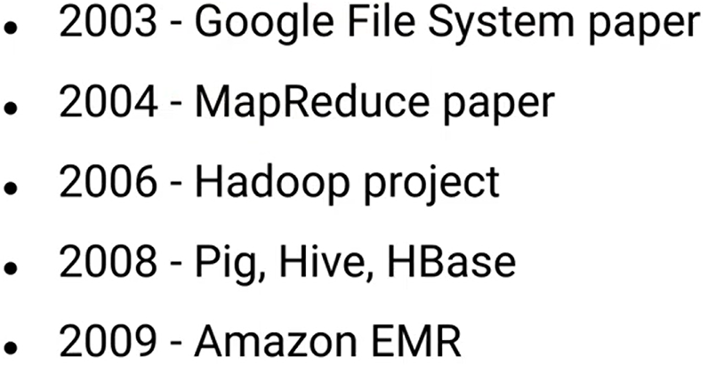

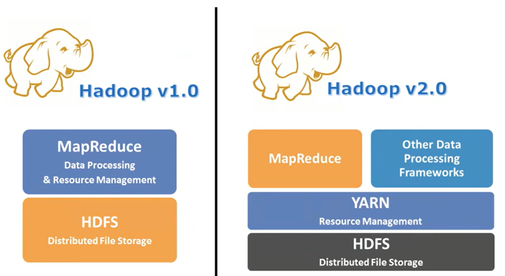

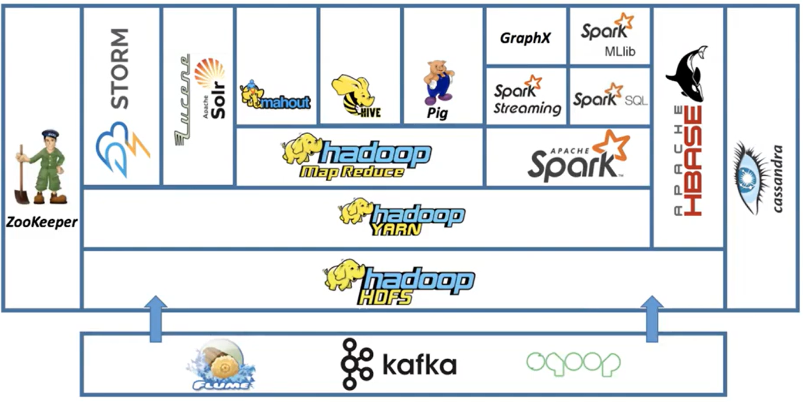

### ZooKeeper
**ZooKeeper** - это хранилище **мета**информации распределенных систем для конфигурирования и обеспечения синхронизации распределенных систем (какая нода является ведущей, какие топики лежат в кафке, количество нод их адреса)
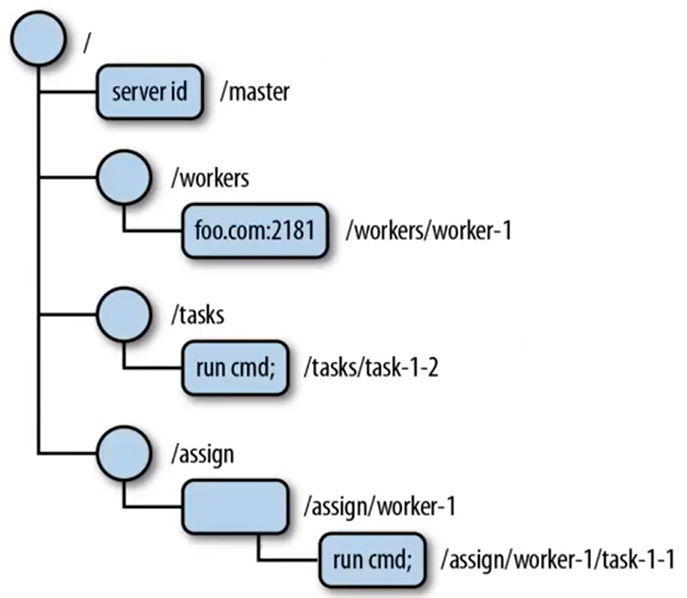 

### hdfs
**HDFS** - hadoop distributed file system - файловая система, предназначенная для хранения файлов больших размеров, **поблочно** распределенных между узлами вычислительного кластера.

**Object storage** (протокол s3) - оч похожа на hadoop, которая по ключу (который может выглядить как пусть в стандартной файловой системе) хранит некое количество байт на неком сервере. И мы по ключу можем получить все блоки байт ассоциирующиеся с этим ключом

Разница s3 и hdfs:
- s3 это протокол чаще всего в облачных хранилищах
- интерфейс hdfs (api) похож на работу с обычной файловой системой

### Архитектура hdfs
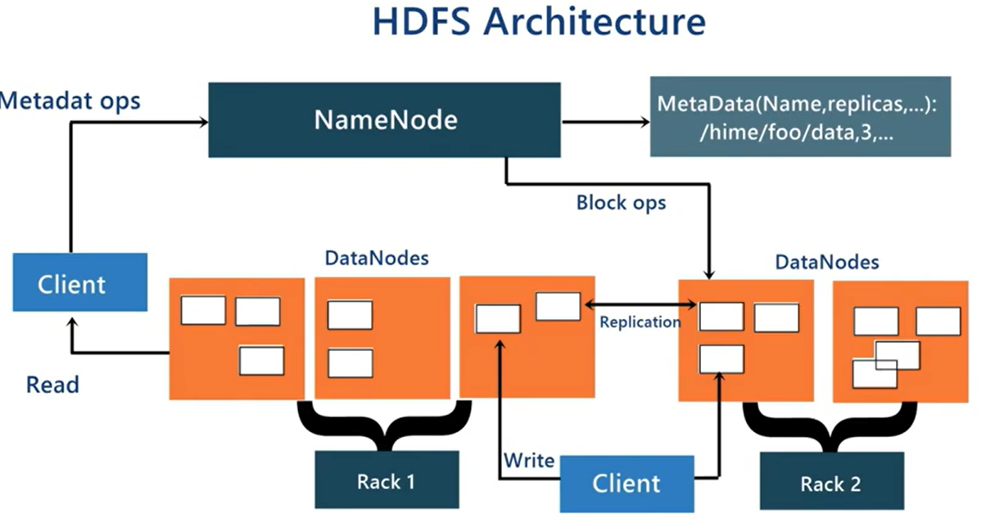

**NameNode** - одна - хранит метаинформацию про файл (название, что файл разбит на блоки 1,2,7 и что эти блоки лежат на тех или иных data node)
**DataNodes** - несколько - ноды непосредственно хранящие данные в блоках. Здесь же происходят операции над блоками

**Rack** - стойка или серверный шкаф.

**Файл** - это только запись в метаданных

**Блок** - это атомарная (в данном случае в одном блоке не может быть несколько файлов) неделимая единица. 

Содержимое файла храниться в **блоках одинакового размера**. Это позволяет ускорить обработку т.к. обработка происходин над блоком данных.
Одинаковый размер обусловлен тем что при паралельной обработки время будет обусловлено временем обработки самой большой части. 
Также можно балансить такие блоки.  
Размер блока варьрируется на уровне всего hdfs (32,64,128,256,512 MB)
Как рекомендация - это делать наиболее меньшее количество блоков т.к. большое количество блоков съедает количество памяти в **NameNode** + будет много сопутствуюей работы по опросу адреса блоков.

> Практический совет - пойти и посмотреть как записались данные в систему т.к. условности работы спарка могут сохранить файл на множество блоков по 1 kB. И прям руками подобрать количество партиций

### Репиликация

При replication_factor в настройке hdsf равном 2 **каждый блок** будет в двух экземпляров.
Факторы репликации есть дефолтные для всего hdfs, а есть фактор репликации для отдельных файлов 

Например: на изображении файл catalina.log разбит на блоки с номерами 1,2 и 4
- блок 1 есть на data node 1 и data node 3
- блок 2 есть на data node 1 и data node 2
- блок 4 есть на data node 1 и data node 3
  

### Чтение
- Клиент создает distributed file system
- distributed file system обращяется в **Name Node** для получение расположения блоков
- Клиент создает Data Input Stream
- И идет читать блоки и **собирает файл внутри себя**
   
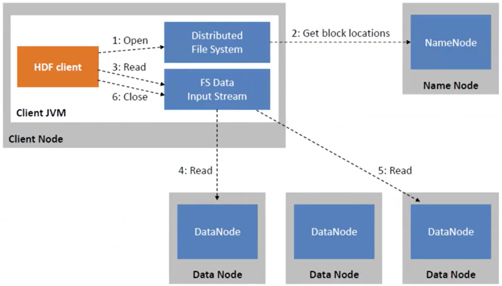

Высокая скорость передачи данных подрузомивается тем что и клиент горизонтально масштабируется и файловая система горизонтально масштабируется, соответсвенно больше сетевых соединения выше скорость за счет распаралеливания

### Запись
- Клиент создает distributed file system
- Идем к data node и говорим что хотим записать файл дата нода возвращяет нам ключ для записи и список нод на которые нам нужно это записывать.
- начинаем писать пакеты, каждый пакет кладем в **очередь ожидания**
- при записи дата нода на которую была запись передает этот же блок следующей ноде для репликации, после репликации отправляется ответ что блок записан
- из очереди береться следующий блок
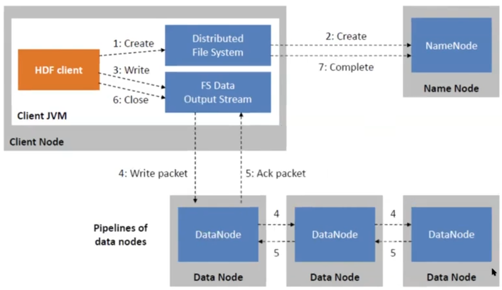

### High-Availability
Режим **High-Availability** нужен для исключения точки отказа в виде одной **Name Node**.
Здесь создается еще одна NameNode в режиме standby (ожидание), синхронизация произведенных операций происходит через Journal Node, которых тоже несколько для репликации

**ZKFC** (ZooKeeper Failover Controller) — это компонент распределенной файловой системы HDFS, который обеспечивает высокую доступность NameNode. Он следит за состоянием NameNode и в случае его сбоя автоматически переключается на резервный узел, обеспечивая непрерывную работу системы.

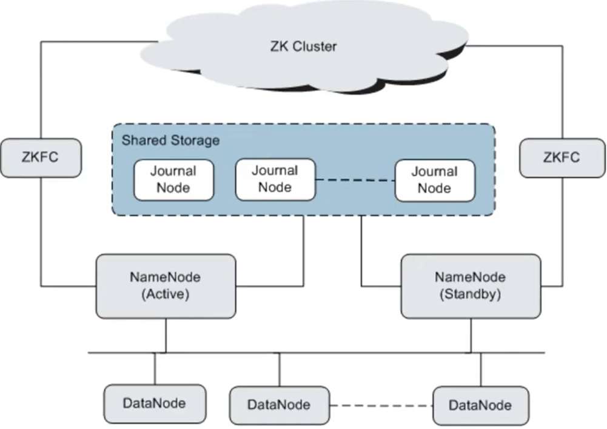

### Federation
На одних и тех же DataNode можно хранить блоки от разных Namespace (то есть по сути из разных файловых систем ведь файл это всего лишь запись в NameNode)
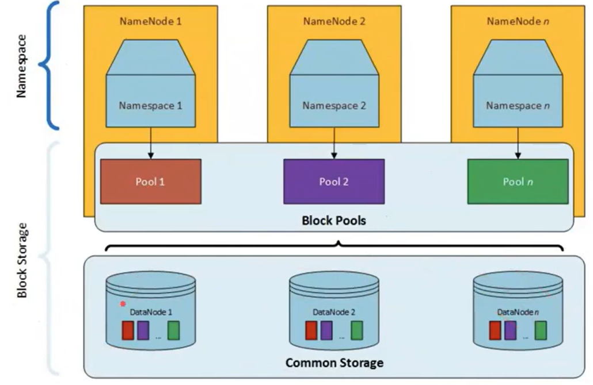

### Факты
> hdfs не любит мелкие файлы, но и гигабайтные файлы для обработки тоже не есть хорошо
> hdfs не поддерживает редактирование файлов (то есть это просто блоки битов и отредачить их нельзя)
> hdfs не требовательно к качеству железа

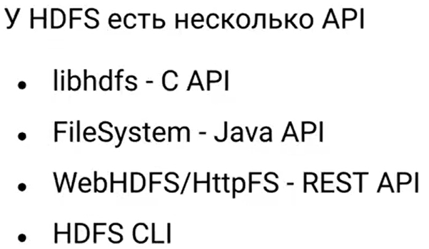
Ссылка на русскую документацию по hdfs cli (comand line) от дистрибютера арена-дата
https://docs.arenadata.io/ru/ADH/current/references/hdfs-cli.html