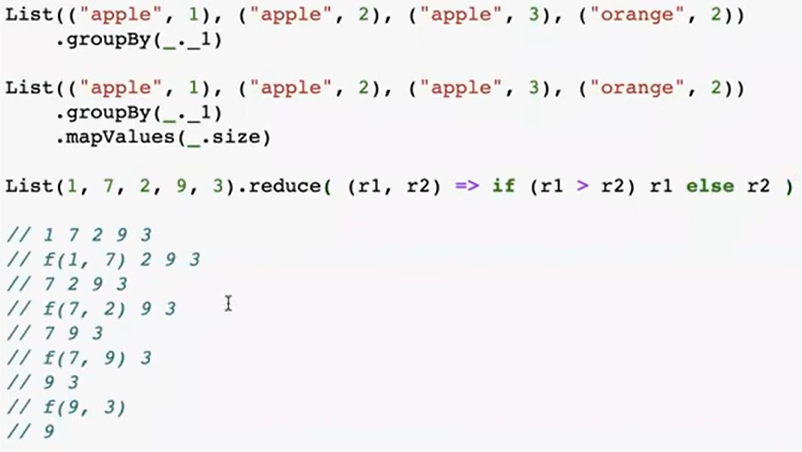

# Scala
## Введение
**Scala** это:
- объектно-ориентированный язык
- функциональный
- статически типизированный
- работает поверх JVM
- может переиспользовать Java-код

**Scala отлично подходит**:
- анализ данных и ETL (**Spark**)
- Потоковая обработка (**Flink**)
- Распределенные серивисы (**Akka**)
- Паралельных и асинхронных вычислений (**Monix, ZIO**)

**Как работать со Scala:**
- Консоль: **Scala** или **Ammonite**
- Онлайн: **Scaltie** или **ScalaFiddle**
- Для разработки: **IntelliJ IDEA** + **Scala Plugin**

## Выражения и типы
`{}` - используются для составления блоков кода
Результатом работы блока является последнее выражение.
```scala
val c : Int = {
    val a : Int = 11
    a + 42
}
println(c) // 53
```

Тип данных `Unit` присваивается выражению, если функция ничего не выводит
```scala
def printer(s : String) : Unit = println(s)
printer("Hello") // Hello
```

`val` - (value) **не**изменяемая переменная (константа)  
`vat` - (variable) изменяемая переменная  
```scala
val xVal : Int = 1
xVal = 2
// error: reassignment to val
```
```scala
var xVar : Int = 1
xVar = 2
println(xVar) // 2
```
**val** позволяет избежать некоторых ошибок, например когда мы при обработке массивов обновляем этот же массив. 

## Методы
```scala
"Some word".toUpperCase
"Some word".toUpperCase()
"Some word" toUpperCase
```
операторы тоже являються методами:
```scala
"Some" concat " word"
"Some" ++ " word"
"Some".++(" word")
```
## Функции
Анонимные функции: `x => x + 1` (как lambda в питоне)

```scala
List(1, 2, 3).map((x : Int) => {x + 1})
List(1, 2, 3).map(x => x + 1)
List(1, 2, 3).map(_ + 1) // _ здесь выступает в качестве placeholder т.к. если указать x + 1 получим ошибку о том что x не найден
```

Методы:
```scala
def incr(x : Int) : Int = x + 1

List(1, 2, 3).map(incr)
```
Можно испольховать `;` для вставки нескольких выражений в одну строку, **вернется все равно последняя**
```scala
def returnSecondOne(x : Int, y : Int) : Int = {x + y ; x - y}
```

## def, val and lazy val
- **def** - выполняется каждый раз при вызове (ассоциация с куском кода)
- **val** - выполняется когда определен
- **lazy val** - выполняется один раз при первом вызове (а не тогда когда определен) 

## Типы данных
- String - строки
- Int, Double, ... - **числа**
- TupleN (Tuple1, Tuple2) - **кортежи**
- List, Set, Map, etc - **коллекции**
- изменяемые коллекции (по умолчанию коллекции не изменяемы)
- Option - возможно есть значение
- Unit - используется если функция ничего не возвращяет

## Управляющие конструкции
**Контрукция if else**
```scala
if (x <= 1) {
    println("x <= 1")
} else if (x <= 2) {
    println("x <= 2")
} else {
    println("x <= 3")
}
```

```scala
if (x <= 1) println("x <= 1") else if (x <= 2) println("x <= 2") else println("x <= 3")
```

**Циклы**
```scala
for (a <- 1 to 10 by 2) {
    println(s"Value of a: ${a}")
}

val testList : List[Int] = List(1, 2, 3)

for (i <- testList) {
    println(i)
}
```

**Pattern Matching**
используется как быстрая альернатива if/else
```scala
x match {
    case 1 => "one"
    case "two" => 2
    case y: Int => s"${y} is scala.Int"
    case _ => "many"
}
```

## Collections
Иерархия коллекций в scala


**List** - множество однотипных эллементов  
```scala
val l : List[String] = List("apple", "banana", "pear")

l.contains("apple") // true
l(0) // apple
```  

**Map** - множество однотипных пар (словарь) 
```scala
val m : Map[String, Int] = Map("apple" -> 2, "banana" -> 5, "pear" -> 10)
m("banana") // 5
m.keys // Set(apple, banana, pear)
m.values // Iterable(2, 5, 10)
m.getOrElse("orange", "fruit") // fruit

m.toList // List((apple,2), (banana,5), (pear,10)) создается список кортежей, по которому можно итерироваться и по ключу и по значению

val newM : Map[String, Int] = m.updated("orange", 7) // Map(apple -> 2, banana -> 5, pear -> 10, orange -> 7)
```

**Set** - множество уникальных объектов
```scala
val s : Set[String] = Set("apple", "banana", "banana", "banana", "banana", "pear")
println(s) // Set(apple, banana, pear)
```

**Tuple** - кортеж хранилище объектов (но при этом это **не итерируемый объект**), это могут быть разные типы данных, но при этом количество эллементов и их типы будут зафиксированны и не получиться вставить в кортеж определенный как `(Int, String, Boolean)` ничего кроме такого количества эллементов с таким же типом данных (**нумерация эллементов начинается с 1**)
```scala
val t = (1, "two", true)
println(t._1) // 1 - обращение идет через ._n и с 1


var t1 : (Int, String, Boolean) = (1, "two", true)
t1 = (1, 2, 3)
// Found:    (2 : Int)
// Required: String
//   t1 = (1, 2, 3)
```

## Option

Указывается если в переменной значения может и не быть
У Option есть два подкласса это **None** и **Some**
```scala
val o: Option[String] = "Hey"
// Found:    ("Hey" : String)
// Required: Option[String]
// если в переменной мы указываем тип Option то и само значение должно иметь тип Option
// это может быть Some(n) - то есть не пустой Option
// или None - то есть пустой Option

val notEmpty: Option[String] = Some("Hey")
val empy: Option[String] = None

println(notEmpty.get)          // Hey
println(empy.getOrElse("You")) // You
```

## Collection operations
```scala
List(1,2,3).map(x => x + 1)     // List -> List ВСЕГДА возвращяет новую коллекцию (нужно для преобразований коллекций)
List(1,2,3).foreach(x => x + 1) // List -> Unit эта операция НЕ возвращяет новую коллекцию (нужно для использования эллементов коллекции в некой функции, типа записи в БД)
List(List(1), List(2, 3), List()).flatten // раскрывает вложенные коллекции (грубо говоря объединяет вложенные коллеции)

List(1,2,3).map(x => List(x, x, x)) // List(List(1, 1, 1), List(2, 2, 2), List(3, 3, 3))
List(1,2,3).flatMap(x => List(x, x, x)) // List(1, 1, 1, 2, 2, 2, 3, 3, 3) (сначала реализуется Map и если в результате появились вложенные коллекции то flatten)
```
У коллекций имеется множество методов


В скала есть метод **reduce** который применяется



```scala
val l = List(1, 2, 3, 4, 5, 6)
println(
  l.reduceRight((x1, x2) => if (x1 > x2) x1 else x2)
)
println(
  l.reduceRight((x1, x2) => if (x1 > x2) {println(s"x1 - $x1, x2 - $x2");x1} else {println(s"x1 - $x1, x2 - $x2");x2})
)
println(
  l.reduceLeft((x1, x2) => if (x1 > x2) {println(s"x1 - $x1, x2 - $x2");x1} else {println(s"x1 - $x1, x2 - $x2");x2})
)
// 6
// x1 - 5, x2 - 6
// x1 - 4, x2 - 6
// x1 - 3, x2 - 6
// x1 - 2, x2 - 6
// x1 - 1, x2 - 6
// 6
// x1 - 1, x2 - 2
// x1 - 2, x2 - 3
// x1 - 3, x2 - 4
// x1 - 4, x2 - 5
// x1 - 5, x2 - 6
// 6

Process finished with exit code 0

```

## Null, None, Nin, Nothing
**Null** - нет значения (пришло из Java)
**None** - пустая Option
**Nil** - пустой список

# ООП: Классы, объекты, трейты
**Class (класс)** - некий прототип из которого мы потом создаем **экземпляры**


**case class** - класс экземпляр (подробнее в блоке по scala из степик)


**Companion object**
*Смотри в блоке по scala из степик, там подробнее*

**Trait (трейт)** 
Многоразовый функционал, который можно добавлять к разным **классам**.

*Смотри в блоке по scala из степик, там подробнее*


**Abstract class**
Способ описать общие свойства и позволить потомкам реализовать их с помощью собственной логики
*Смотри в блоке по scala из степик, там подробнее*

**Implicit**
Implicit - это неявные преобразования и неявные параметры, подробнее    https://dzen.ru/a/XZbBB0OGPwCupbet


**Инструменты scala**
- SBT + IntelliJ IDEA - SBT это как pip в python, IntelliJ IDEA - это среда рахработки
- Библиотеки для парсинга JSON - **circe** или **json4s**
- Typesafe config / Pureconfig - бибилиотеки для работы с файлами **Config**
- ScalaTest - тестирование на scala
- index.scala-lang.org - библотеки для scala

## Дополнения
https://horstmann.com/scala/ - книга для старта
https://alvinalexander.com/ - хороший блок о scala, а так же автор книги cookBook по scala