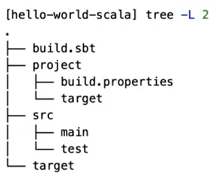

# Введение в Apache Spark

**Apache Spark** - это библиотека для построения приложения по распределенной обработки больших данных. Основными языками для взаимодействия является **python** и **scala**.
Под капотом - Apache Spark это эволюция **Hadoop Map Reduce**.

Большие данные - это когда для обработки и хранения данных не достаточного одного сервера.
Также apache spark позволяет работать с любыми структурированными данными как с **таблицей**.
Также spark позволяет работать с потоковой информацией

Несколько API spark:
- RDD API - это апи, которая позволяет работать с данными как с распределенной коллекцией. 
- DataFrame API
- Structured Streaming API

## Источники данных

DataSource Api - интерфейс для взаимодействия с источниками данных, используя этот коннектор можно взаимодействовать с собственными источниками данных.

Spark может работать как с локальный хранилещем, так и с hdfs и s3 хранилищами.

**Из коробки:**  
spark поддерживает форматы:
- json
- text
- csv
- orc
- parquet

Есть коннекторы к:
- hdfs
- S3
- Локальное хранилище
- **jdbc** - коннектор для баз данных.

## Python vs Scala

**Python**:
- большое сообщество и много библиотек
- низкая скорость работы **RDD API** (если используется DataFrame API, разницы практически нет)
- низкая скорость работы пользовательских функций в DataFrame API и Structured Streaming API
- разработку можно вести в блокноте (написали, поставили расширение .py, запустили)

**Scala**
- нет стабильно работающих ноутбуков, в отличие от python (хотя есть data-bricks)
- высокая скорость работы всех доступных API
- высокая скорость работы пользовательских фунций
- пользовательские функции, написанные на Scala можно использовать и на pyspark
- добавление поддержки новых источников
- для разработки придется использовать IDE
- удобные паттерны для работы с данными - case classes, pattern mathing (match), generic classes и т.д.

## sbt
**sbt** - simple(scala) build tool - утилита для сборки Scala проекта, в том числе в IDE (например в InteliJ). С помощью утилиты собирают scala проекты, запускают тесты, управляют параметры сборки и тестирования, управление зависимостями.

Так выглядит новый sbt проект:

**build.sbt** - основной файл конфигурации куда заносяться все зависимости (библиотеки и версии)
**src/main** - здесь находиться весь код для проекта, при сборки проекта код будет браться отсюда  
**src/test** - папка для кода с тестами  
**project/build.properties** - в этом файле указывается **версия sbt**  

В **гит** нужно грузить **build.sbt, project/build.properties, src**.
Поэтому нужно настроить файл гит-игнор, так чтобы в репозиторий тянулись только эти файлы.

## Рабочая связка
JDK = 1.8
sbt.version = 1.5.8
scalaVersion := "2.11.12"
libraryDependencies += "org.apache.spark" %% "spark-sql" % "2.4.8" % "provided"

1:56