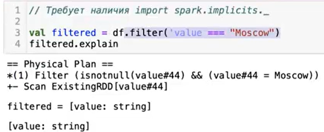
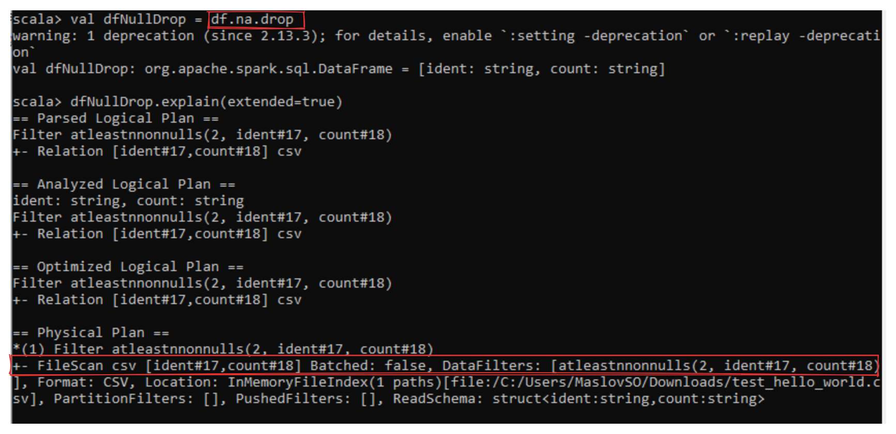

# spark dataframes

**DataFrame** - это ссылка на партицинированные структурированные данные.

Spark приложение состоит из двух частей:
- из драйвера (отвечает за исполнение кода)
- и воркеров (отвечают непосредственно за обработку)  
Регулирование распределение по воркерам происходит с помощью класса `sparkSesssion`

`df.rdd.getNumPartition` - получение количество партиций на которые разбит датафрейм.
`df.prinSchema` - просмотр схемы датафрейма.

```scala
df.show(
    numRows = 20, // количество выводимых строк
    truncate = 100, // количество символов на одну строку, если false, то выводиться любая длинна
    vertical = true // вывод в вертикальном формате
)
```
```scala
// требует наличия import spark.implicits._
// для ' при вызове столбца
// а так же === также является методом над колонкой

import spark.implicits._
import org.apache.spark.sql.functions.{col, expr}

df.filter('value === "Moscow").show
df.fllter($"value" === "Moscow").show
df.filter(col("value") === "Moscow").show
df.filter(expr("value = 'Moscow'")).show

// нет разницы в принципе написания фильтров, план запроса будет одинаков

> Для логических выражений нужно использовать метод `===` т.к. это метод над `Column` и именно `Column` ожидает методы и фунции spark, в то время как **==** отдаст `Bolean`

```
При использовании dataFrame, ваш код анализируется-оптимизируется и превращяется в **набор физических операторов.**
`df.explain` - просмотр плана выполнения запроса (тоесть набор физических операторов)  
`df.explain(extended = true)` - просмотр всех планов запроса:
>**Parser Logical Plan** - просто отражение того что мы написали в коде  
>**Analyzed Logical Plan** - происходит проверка на наличия колонок и правильности применения функций (по типам данных например)  
>**Optimized Logical Plan** - оптимизация запроса  
>**Physical Plan** - сам набор физических операций
>**Adaptive plan** - появился в spark3 (пока не знаю как работает)



Где `value` это название колонки, а `#44` - это внутренний идентификатор колонки для различия нескольких колонок с одинаковым именем.

## withColumn и drop
**withColumn** - позволяет добавить новую или изменить имеющуюся колонку. Как и любой метод трансформации, он создает **новый датафрейм** (тоесть каждый из них создает новый датафрейм)
```scala
df.withColumn("upperCity", upper('value)).show
```
Также можно использовать `select` с перечислением необходимых колонок (тоже создает новый датафрейм но один на все преобразования) (но не всегда это улучшает план запроса)

`spark.sql("""SET -v""").show(100, 200, true)` - просмотр настроек `spark.sql`

**drop** - так же является проецией, то есть как и любой метод он создает новый датафрейм

## Отчистка данных

DF API содержит класс функций **"not available"**, описанный в https://spark.apache.org/docs/latest/api/python/reference/pyspark.sql/api/pyspark.sql.DataFrameNaFunctions.html
В данном пакете есть три функции:
- `na.drop`
- `na.fill`
- `na.drop`

`na.drop` не является проекцией, то есть это фильтрация


## Агрегаты

Операции **groupBy**, **cube**, **rollup** и любые другие агрегаты вызывают **репартиционирование** (перемешивание) данных через операцию **Exchange hashpartitioning**. Что при перекосе в ключах может вызвать outOfMemory, например если одного ключа будет 1 000 000, а другого ключа 5, spark одинаковые ключи положит в одну партицию, то есть 1 000 000 будет лежать в одной партиции, что может привысить запас памяти


## Кеширование
Для кеширования можно использовать `cache` и `persist`
Разница в методах заключается только в том, что `persist` позволяет выбрать куда сохранить данные (оперативная память или жесткий диск воркеров), а `cache` использует значение по умолчанию.

Кеш не предназначен для передачи данных между приложениями он является внутренним для приложения.
Для отчистки памяти нужно вызвать метод `unpersist`

Данные будут положены в кеш после первого экшона после вызова команды `cache` и `persist`

Также важно использовать экшон который пробегает по всем партициям (например **count**) т.к. если будет использоваться функция которая обрабатывает не все партиции, то есть вероятность что и память будет записаны не все данные

## Репартиционирование

RDD и DF представляют собой классы, описывающие коллекции данных. Коллекции разбиты на крупные блоки - **партиции**.
В графе вычисления, который в спарк называется DAG (Direct Acyclic Graph), есть три основных компонента:
> `job` - это весь граф целиком от момента создания DF, до приминения **action** к нему. Состоит из одной или более **stage**

> `stage` - это набор задач, которые выполняются последовательно и зависят друг от друга. Каждый этап создается на основе границ перемешивания (shuffle boundaries), то есть операций (groupBy, windowFunction и т.д.), которые требуют перетасовки данных между исполнителями. Cостоит из большого количества **task**

> `task` - базовая операция над данными 

Одновременно Spark выполняет **N** **task** в которых одновременно обрабатываются **N** партиций. N - это суммарное число доступных потоков на всех воркерах

> то есть для оптимальной обработке данных необходимо чтобы в каждый момент времени было **достаточно** партиций для использования их в потоке. Чтобы ядра не простаивали. (в идеале партиций должно быть в 2-5 раза больше чем количество ядер)

```scala
sc.uiWebUrl // позволяет посмотреть где можно посмотреть Spark UI
// у меня получилось http://192.168.0.15:4040
```


> Каждый `stage` сохраняется на дисковом пространстве

При каждой репартиционировании (то есть перемешивании) нужно убедиться что партиции имеют равное распределение. Спарку все равно на размер партиции, если какая то из партиции в стайдже будет оч большая время работы стейджа будет ограниченно этой партицией (**т.к. одна партиция обрабатывается одним потоком**)

При вычислении агрегатов, оконных функций и соединений могут возникать перкошенные датафреймы - когда одна партиция будет содержать кратно больше данных чем другие. В этом случае мы будем ограничены временем обработки этой партиции одним потоком

Для репартиционирования такого датафрейма можно использовать метод `repartition`
```scala
val repartitonedDf = df.repartition(20)
// будет создано новое количество партиций в данном случае 20 через метод RoundRobinPartitioning
```
**RoundRobinPartitioning** - это метод распределения данных по разделам, который используется по умолчанию, когда вы не указываете конкретное выражение для разделения данных. При использовании RoundRobinPartitioning, Spark равномерно распределяет данные по всем доступным разделам, используя алгоритм “круговой ротации”. Это означает, что каждый следующий элемент данных будет отправляться в следующий доступный раздел, пока все элементы не будут распределены.

```scala
val repartitonedDf = df.repartition(20, col("id"))
```


## Соления
Соль - это некоторая колонка, которая содержит рандомные значения, но которые распрелены равномерно между партициями


```scala
val saltModTen = pmod(round((rand() * 100), 0), lit(10)).cast("int")

val salted = airports.withColumn("salt", saltModTen)
salted.show(numRows = 1, truncate = 200, vertical = true)
```


- Партиционирование - важный аспект распределенных вычислений, от которого напрямую зависит стабильность и скорость вычислений
- В Spark всегда работает правило 1 TASK = 1 THREAD = 1 PARTITION
- Репартиционирование и соление данных позволяет решить проблему перекоса данных и вычислений
- Важно помнить, что репартиционирование использует дисковую и сетевую подсистемы - обмен данными происходит **по сети**, а результат записывается **на диск**, что может стать узким местом при выполнении репартиционирования

## Встроенные функции

Помимо функций в API методы из [org.apache.spark.sql.functions](https://spark.apache.org/docs/latest/api/scala/index.html#org.apache.spark.sql.functions$)

Есть функции в [SQL built-in functions](https://spark.apache.org/docs/latest/api/sql/index.html)
которые вызываются через `expr`
```scala
import org.apache.spark.sql.functions.expr

val newCol: Column = expr("""pmod(id, 2)""")
```

- Spark обладает широким набором функций для работы с колонками разных типов, включая простые типы - строки, числа, и т. д., а также словари, массивы и структуры
- Встроенные функции принимают колонки org.apache.spark.sql.Column и возвращают org.apache.spark.sql.Column в большинстве случаев
- Встроенные функции доступны в двух местах - org.apache.spark.sql.functions и SQL built-in functions
- Встроенные функции можно (и нужно) использовать вместе - на вход во встроенные функции могут подаваться результаты встроенной функции, тк все они возвращают sql.Column

## Встроенные функции
В том случае, если функционала встроенных функций не хватает, можно написать пользовательскую функцию - UDF. Пользовательская функция может принимать до 16 аргументов. Соответствие Spark типов описано [здесь](https://spark.apache.org/docs/latest/sql-ref-datatypes.html)

Необходимо помнить, что null в Spark превращается в null внутри UDF
```scala
import org.apache.spark.sql.functions.{udf, col}

val df = spark.range(0,10)

val plusOne = udf { (value: Long) => value + 1 }

df.withColumn("idPlusOne", plusOne(col("id"))).show(10, false)
```

Пользовательская функция может возвращать:

- простой тип - String, Long, Float, Boolean и т.д.
- массив - любые коллекции, наследующие Seq[T] - List[T], Vector[T] и т. д.
- словарь - Map[A,B]
- инстанс case class'а
- Option[T]

Мы также можем использовать монады Try[T] и Option[T] и для написания пользовательской функции:
```scala
import scala.util.Try
import org.apache.spark.sql.functions.{udf, col}

val df = spark.range(0,10)

val divideTwoBy = udf { (inputValue: Long) => Try(2L / inputValue).toOption }

val result = df.withColumn("divideTwoBy", divideTwoBy(col("id")))
result.printSchema
result.show(10, false)
```

- Пользовательские функции позволяют реализовать произвольный алгоритм и использовать его в DF API
- Пользовательские функции работают медленнее встроенных, поскольку при использовании встроенных функций Spark использует ряд оптимизаций, например векторизацию вычислений на уровне CPU

## join-ы

По типу соединения join-ы деляться на:
- **equ-join** - соединения по равенству одного и более ключей
-  **non-equ join** - соединения по условию, отличному от равенства

## оконные функции
**Оконные функции запускают репартиционирования**