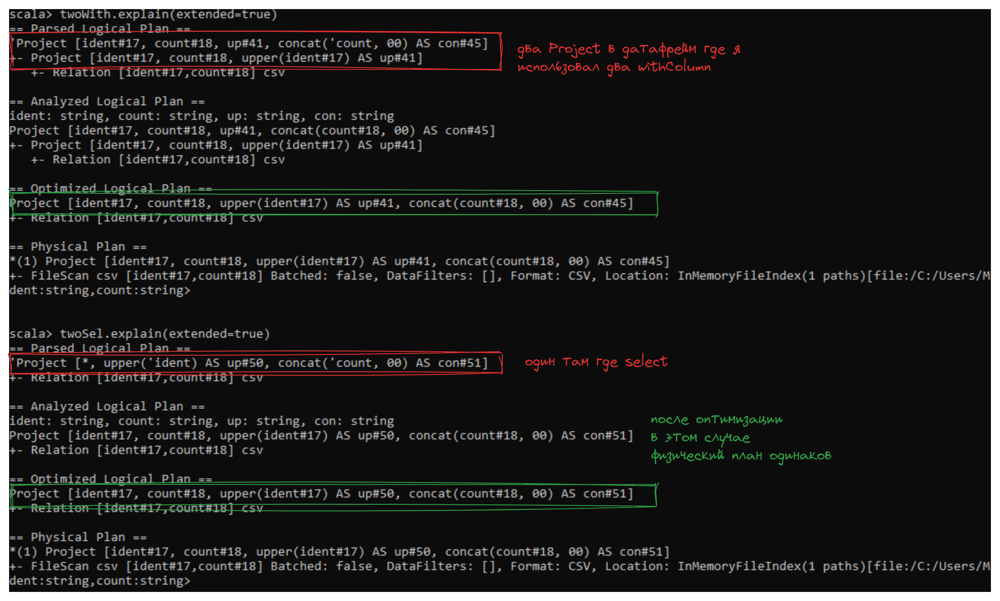
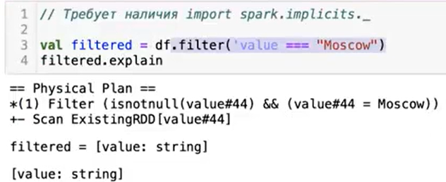
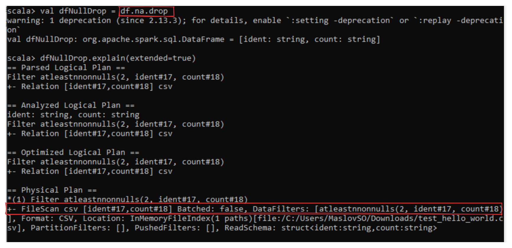

# spark dataframes

**DataFrame** - это ссылка на партицинированные структурированные данные.

Spark приложение состоит из двух частей:
- из драйвера (отвечает за исполнение кода)
- и воркеров (отвечают непосредственно за обработку)  
Регулирование распределение по воркерам происходит с помощью класса `sparkSesssion`

`df.rdd.getNumPartition` - получение количество партиций на которые разбит датафрейм.
`df.prinSchema` - просмотр схемы датафрейма.

```scala
df.show(
    numRows = 20, // количество выводимых строк
    truncate = 100, // количество символов на одну строку, если false, то выводиться любая длинна
    vertical = true // вывод в вертикальном формате
)
```
```scala
// требует наличия import spark.implicits._
// для ' при вызове столбца
// а так же === также является методом над колонкой

import spark.implicits._
import org.apache.spark.sql.functions.{col, expr}

df.filter('value === "Moscow").show
df.fllter($"value" === "Moscow").show
df.filter(col("value") === "Moscow").show
df.filter(expr("value = 'Moscow'")).show

// нет разницы в принципе написания фильтров, план запроса будет одинаков

> Для логических выражений нужно использовать метод `===` т.к. это метод над `Column` и именно `Column` ожидает методы и фунции spark, в то время как **==** отдаст `Bolean`

```
При использовании dataFrame, ваш код анализируется-оптимизируется и превращяется в **набор физических операторов.**
`df.explain` - просмотр плана выполнения запроса (тоесть набор физических операторов)  
`df.explain(extended = true)` - просмотр всех планов запроса:
>**Parser Logical Plan** - просто отражение того что мы написали в коде  
>**Analyzed Logical Plan** - происходит проверка на наличия колонок и правильности применения функций (по типам данных например)  
>**Optimized Logical Plan** - оптимизация запроса  
>**Physical Plan** - сам набор физических операций
>**Adaptive plan** - появился в spark3 (пока не знаю как работает)




Где `value` это название колонки, а `#44` - это внутренний идентификатор колонки для различия нескольких колонок с одинаковым именем.

## withColumn и drop
**withColumn** - позволяет добавить новую или изменить имеющуюся колонку. Как и любой метод трансформации, он создает **новый датафрейм** (тоесть каждый из них создает новый датафрейм)
```scala
df.withColumn("upperCity", upper('value)).show
```
Также можно использовать `select` с перечислением необходимых колонок (тоже создает новый датафрейм но один на все преобразования) (но не всегда это улучшает план запроса)

`spark.sql("""SET -v""").show(100, 200, true)` - просмотр настроек `spark.sql`

**drop** - так же является проецией, то есть как и любой метод он создает новый датафрейм

## Отчистка данных

DF API содержит класс функций **"not available"**, описанный в https://spark.apache.org/docs/latest/api/python/reference/pyspark.sql/api/pyspark.sql.DataFrameNaFunctions.html
В данном пакете есть три функции:
- `na.drop`
- `na.fill`
- `na.drop`

`na.drop` не является проекцией, то есть это фильтрация


## Агрегаты

Операции **groupBy**, **cube**, **rollup** и любые другие агрегаты вызывают **репартиционирование** (перемешивание) данных через операцию **Exchange hashpartitioning**. Что при перекосе в ключах может вызвать outOfMemory, например если одного ключа будет 1 000 000, а другого ключа 5, spark одинаковые ключи положит в одну партицию, то есть 1 000 000 будет лежать в одной партиции, что может привысить запас памяти

1:25