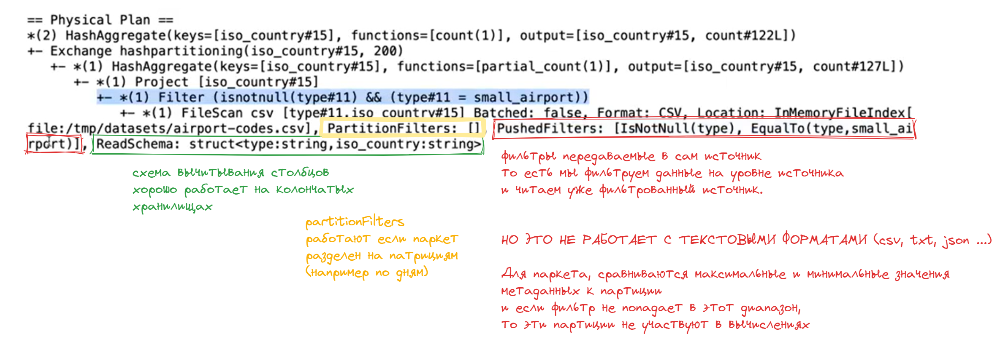
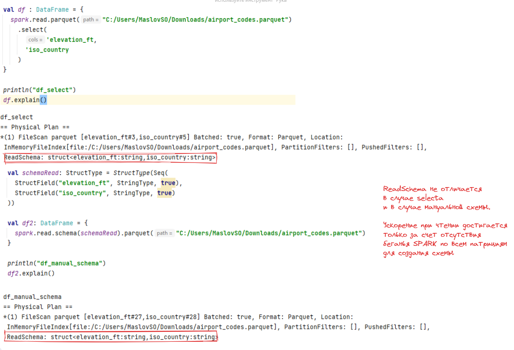
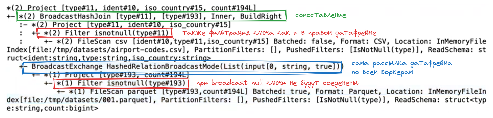
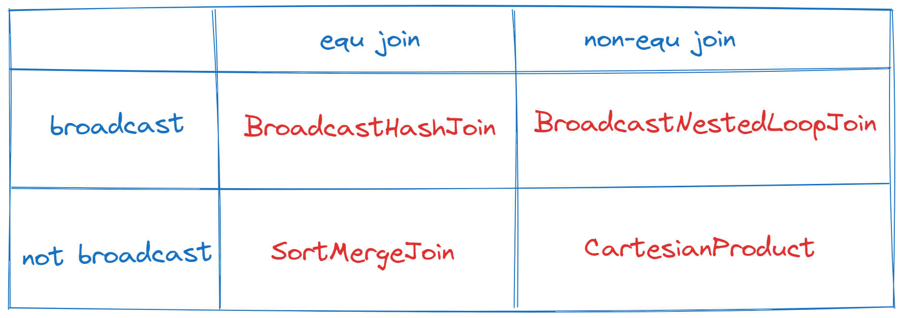
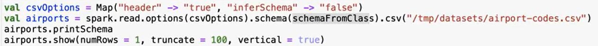
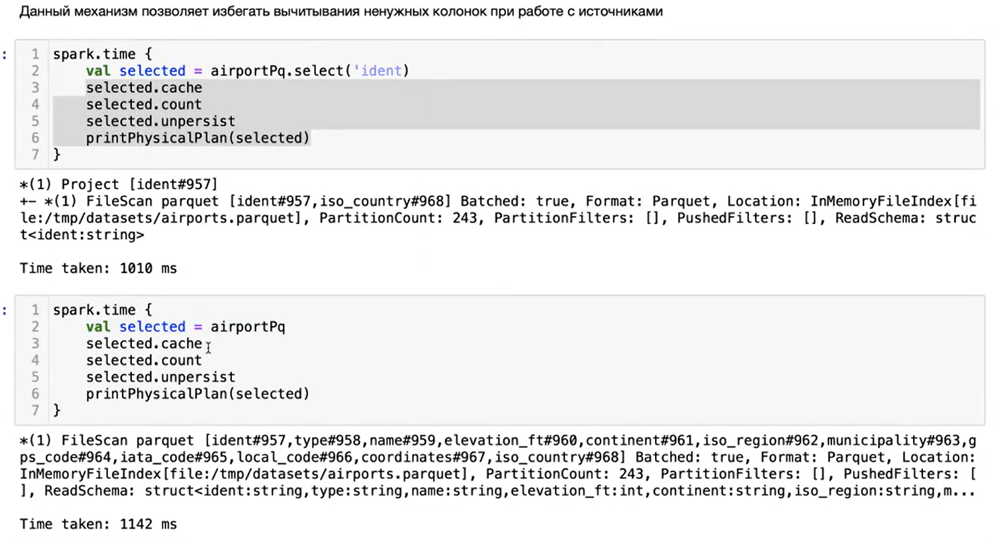
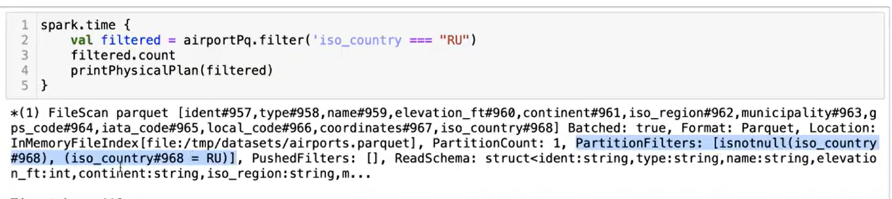
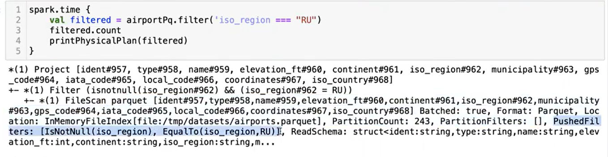

# spark dataframes 2
## План выполнения задач
Любой job имеет под собой план выполнения, который генерируется на основе написанного запроса. План запроса содержит в себе операторы которые потом генерируются в `Java` код.

План выполнения доступен в двух видах:
- метод `explain()` у датафрейма
- на вкладке SQL в Spark UI

Любая оптимизация сосредоточена на нескольких вещах:
- снижение количества shuffle (т.к. он задействует и сетевые соединения, при перемещении блоков данных между воркерами, и дисковое пространство при сохранение нового stage)
- фильтрование данных на уровне источника (для работы с как можно меньшим объемом данных)

>**Parser Logical Plan** - просто отражение того что мы написали в коде  
>**Analyzed Logical Plan** - происходит проверка на наличия колонок и правильности применения функций (по типам данных например)  
>**Optimized Logical Plan** - оптимизация запроса  
>**Physical Plan** - сам набор физических операций
>**Adaptive plan** - появился в spark3 (пока не знаю как работает)

Также можно выгрузить планы запроса, например
`df.queryExecution.executedPlan.toJSON`





## Оптимизация соединений и группировок
Общие правила соединений:
> - фильтрация данных до **join**
> - использовать **equ join** (только равенства без доп условий при соединениях)
> - если можно путем увеличения количества данных можно применить **equ join** вместо **non-equ join**, то делать именно так (например вместо проверки на вхождение в массив, развернуть этот массив)
> - всеми силами избегать **cross-join**
> - если правый датафрейм помещается в память самого маленького **worker'а**, использовать broadcast()

**Виды соединений**
- **BroadcastHashJoin**  
  - работает когда условие - **equ join** (равенство по одному или нескольким ключам)
  - работает когда один из датасетов небольшой и помещяется в память каждого из воркеров
  - может быть использован автоматически, либо явно `broadcast(df)`
  - оставляет левый датасет как есть
  - **копирует правый датасет на каждый датафрейм**
  - составляет **HashMap из правого датасета**, где ключ - кортеж из колонок в условии соединения, а значение это строка из датафрейма соответсвующая первичному ключу
  - **итерируется** по левому датасету внутри каждой партиции и проверяет наличие ключей в **HashMap**
  - при нахождении ключа - передается значение (по сути - это работа со словарем, что быстро)
  - при **broadcast** строки с null в используемом ключе **исключаются** из итогового датафрейма (исправить это можно использую `<=>` оператор сравнения `<=>` это `eqNullSafe`)
  


- **SortMergeJoin**
  - работает когда условие - **equ join** (равенство по одному или нескольким ключам) это означает что ключи являются сортируемыми
  - р**епартиционирует оба датасета на 200 партиций** по ключу (ключам) соединения
  - сортирует партиции каждого из датасетов по ключу (ключам) соединений
  - используя сравнение левого и правого ключей, обходит каждую пару партиций и соединяет строки с одинаковыми ключами
  
- **BroadcastNestedLoopJoin**
  - будет выполняться при **not-equ join**
  - работает когда один из датасетов небольшой и помещяется в память каждого из воркеров
  - может быть использован автоматически, либо явно `broadcast(df)`
  - оставялет левый датасет как есть
  - копирует правый датасет на каждый воркер
  - проходит вложенным циклом по каждой партиции левого датасета и копией правого датасета и проверяет прописанное вами условие
  - медленне чем обычный броадкаст т.к. используется вложенный цикл (из-за сложных условиях) и не составляет словарь, а копирует фрейм как есть
  - быстрее чем SortMergeJoin т.к. отсутствует репартиционирование и сортировка
  
- **CartesianProduct**
  - создает пары партиции каждой левой к каждой правой (получается перекрестное умножение)
  - релоцирует каждую пары на один воркер и проверяет условие соединений
  - на выходе создает **LeftCountPartition** * **RightCountPartition** (например если у нас есть 100 000 партиций слева и 1000 справа на выходе быдет создано 100 000 000 партиций) 
  - работает медленне всего и часто приводит к OutOfMemory (OOM)
  - возникает при **not-equ join** и когда датафрейм не помещяется в память воркеров
  - а также при кросс джоине

Как возникают те или иные джоины


## Cнижение количества shuffle

В ряде случаев можно уйти от лишних shuffle операций при выполнении соединения. Для этого оба DF должны иметь одинаковое партиционирование - одинаковое количество партиций и ключ партиционирования, совпадающий с ключом соединения. (например если мы читаем один и тот же источник)

Разница между планами выполнения будет хорошо видна в Spark UI на графе выполнения в Jobs и плане выполнения в SQL

```scala
spark.time { 
    val left = airports
    val right = airports.groupBy('type).count

    val joined = left.join(right, Seq("type"))

    joined.count
}
```

```scala
spark.time { 
    val airportsRep = airports.repartition(200, col("type"))
    val left = airportsRep
    val right = airportsRep.groupBy('type).count

    val joined = left.join(right, Seq("type"))

    joined.count
}
```
т.к. сначала идет пепартиционирование подходящее под оба варианта обработки, мы сокращяем количество стейджей

## Управление схемой данных

В DF API каждая колонка имеет свой тип. Он может быть:
- скаляром - `StringType`, `IntegetType` и т.д.
- массивом - `ArrayType(T)`
- словарем - `MapType(K, V)`
- структурой - `StructType()`

DF целиком же имеет схему описанную с помощью класса **StructType**


Чтение файлов с указанием схемы будет более быстрое т.к. не потребует пробегаться по файлам


## Оптимизатор запросов Catalyst

Catalyst - выполняет оптимизацию запросов с целью ускорения их выполнения.
Соновные методы методы:
- **Column projection**  
  Данный механизм позволяет избегать вычитывания ненужных колонок при работе с источниками. **Работает с parquet, orc и колончатыми источниками**
  
  При указании в **select** или (groupBy) вычитывает только используемые колонки (это видно по двум разным параметрам **ReadSchema** на скриншоте)

- **Partition pruning**  
  Позволяет избегать не нужных партиций (если источник партицирован по какой либо колонке и сохранен так что спарк ее понимает).
  
  При фильтрации по колонке которая является основой для **партиционирования источника** вычитывает только папки с указанными партициями

- **Predicate pushdown**  
  Данный механизм позволяет "протолкнуть" условия фильтрации данных на уровень dataSource. В частности для паркета, сравниваются **максимальные и минимальные значения в партициях** и если фильтр не попадает в этот диапазон, то эти партиции не участвуют в вычислениях.
  Также отлично работает с базами данных

  


- **Constant folding**  
  Данный механизм убирает `cast` если вы кастити в тот же тип данных что и колонка

- **Constnat folding**
  Сокращяет количество констант, используемых в физическом плане.
  Если вы пропишите некое выражение которое гарантированно даст один результат (типа `lit(3) > lit(1)` всегда даст `true`) то оптимизатор сразу пропишет в план `true` вместо выражения

- **Combine filters**
  Данный механизм объединяет фильтры. То есть при наличии нескольких фильтров оптимизатор объединяет их в один.