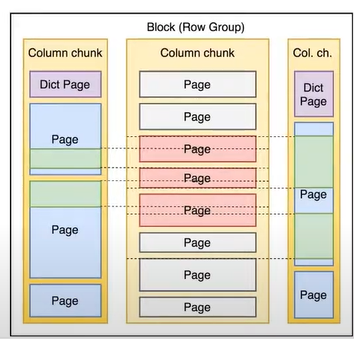
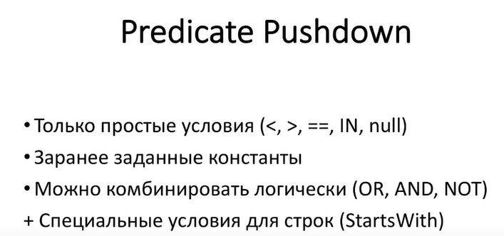

# data frames sources

## Текстовые форматы данных
`json` - JSON строки
`csv` - плоские данные с разделителями
`text` - просто текстовые строки с единственной колонкой **value: String**  
**Преимущества**
- простая интеграция
- поддержка партицирования и сжатия  
**Недостатки**
- отсутствие оптимизаций
- низкая скорость чтения сжатых данных
- слабая типизация
>`df.rdd.getNumPartitions` - получение количества партиций, на которые разбит фрейм  
>При необходимости можно запустить `df.repartition(n)` для репартиционирования и увеличения паралеллизации 

Если считывать архивированные текстовые форматы, то его невозможно разделить на несколько партиций при чтении и из-за этого могут быть проблемы с превышением лимита памяти

Режимы записи:
`overwrite` - переписывает всю директорию целиком и партицию, если используется партиционирования  
`append` - дописывает новые файлы к текущим  
`ignore` - не выполняет запись (можно проверить правильность написания кода)  
`errod` или `errorifexists` - возвращяет ошибку, если директория уже существует
## orc и parquet
parquet - это файловый формат памяти.
Это колоночный формат хранения данных, то есть запись происходит в колонки.
Колонки из одной партиции можно читать паралелльно

Паркет поддерживает **pushed filters**  при чтении отбираются только те блоки метаданные которых подходят для указанных фильтров

1:02