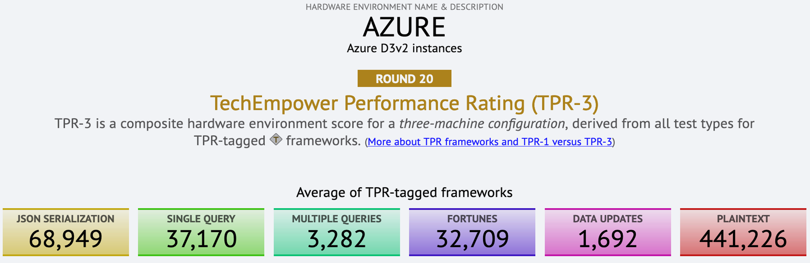

# Расчет нагрузки на систему
**Основные метрики для расчета:**
- пользовательский трафик
- сетевой трафик и соединения
- нагрузка на вычислительную мощность
- необходимое дисковое пространство и расчет потенциального прироста объема хранили

## Пользовательский трафик
Для подсчета необходимого трафика нужно оценить **потенциальную аудитория системы** и подсчитать **общее количество пользователей**.

Если закрытая система, то оцениваем штатное расписание и обязанности работников, а также закладываем возможность прироста численности рабочих.

Если это открытая система, то оцениваем метрики ближайших конкурентов.

Метрики для оценки:
> 1. **Monthly Active User, MAU** - количество активных пользователей в месяц
> 2. **Daily Active User, DAU** - количество активных пользователей в день
> 3. Общее количество пользователей на каком-то горизонте (например, 5 лет)
> 4. Сколько какого контента в среднем производит средний пользователь (**read/write**)

Отталкиваясь от входных бизнес-показателей мы сможем перейти к оценкам нагрузки:
> 1. Какое количество запросов в секунду (**RPS**) будет к частям системы
> 2. Какое количество одновременных соединений нужно будет удержать
> 3. Какой будет нагрузка на сетевой канал и какой общий трафик мы потратим
> 4. Какое будет приращение занимаемого места и сколько данных накопиться
> 5. Во сколько нам обойдутся трафик и железо, которые смогут все это поддерживать

## Сетевая нагрузка
**Сетевая нагрузка** состоит из количество соединений в единицу времени и общий объем трафика, который может пройти через сеть за единицу времени.

Современный сервер способен выдержать **от 10 до 100** соединений одновременно.

Максимальный предел трафика упирается в пропускную способность выбранной технологии и канала связи:
(сетевой трафик измеряют в **битах** (т.к. байты могут одни производители как 6, а другие как 8, а бит это бит всегда), приставки гига(млрд) и мега(млн) это как в СИ)
1. Облачные технологии - до **1GbE** в секунду
2. Витая пара — до **10GbE** в секунду;
3. Оптоволокно стандарта QSFP+ - до **40 GbE**;
4. Infiniband (IB) — **100+ GB**. Этот вид соединений используется в суперкомпьютерах и в огромных дата-центрах (очень дорогой вариант)

Также можно вывести общую стоимость трафика. Облачные провайдеры, например оценивают 1Gb трафика от 1 до 10 центов.

## Вычислительная нагрузка
Под вычислительной нагрузкой обычно подразумивают **вычисление** количества одновременных запросов пользователей к сервису **(RPS)**
В зависимости от операции вычислительная нагрузка разнится. Для получения первоначальных данных можно использовать бенчмарки

По грубой оценке можно исходить из того, что в **облаке** мы сможем выдерживать:

100 тыс RPS - для простых операций.  
10 тыс RPS - для запросов на чтение из БД  
1 тыс RPS - для запросов на запись в БД

Для более мощных вычислений необходимы более мощные машины.

## Нагрузка на хранилище
Средние показатели технологий хранения и стоимость:
> - **HDD** со скоростью 100-300 МБ/с, каждый диск хранит до 20 ТБ по цене до $500;  
> - **NVMe SSD** со скоростью 3-5 ГБ/с, каждый диск хранит до 8 TБ по цене до $2000;   
> - Оперативная память (**RAM**) со скоростью 50 ГБ/с, стоимость планки 128 ГБ около $1000.  

В среднем хранение 1 ТБ обойдётся в около $10000 в RAM, $300 на SSD и $30 на HDD.
Можно прикидывать, что в одном сервере будет до 1 ТБ RAM, 50 ТБ SSD или 200 ТБ HDD.
Если дисков много, в игру вступает и среднее количество отказов за год (**AFR**) в размере 1%.

## Итого
**Трафик**: MAU, DAU, прирост контента в день, всего за 5 лет, соотношение R/W;  
**Сеть**: С10k давно не вопрос, 1 Gbps даже в облаке, платим не более $0.1/GB;  
**Вычисления**: отдаём 100к текста, считываем 10к и записываем 1к простых запросов в БД;  
**Хранилище**: HDD 300 MB/s и $30/TB, SSD 5 GB/s и $300/TB, RAM 50GB/s и $10000/TB;  
В одну машину при этом можно поставить до 1 TB RAM, 50 TB SSD или 200 TB HDD.