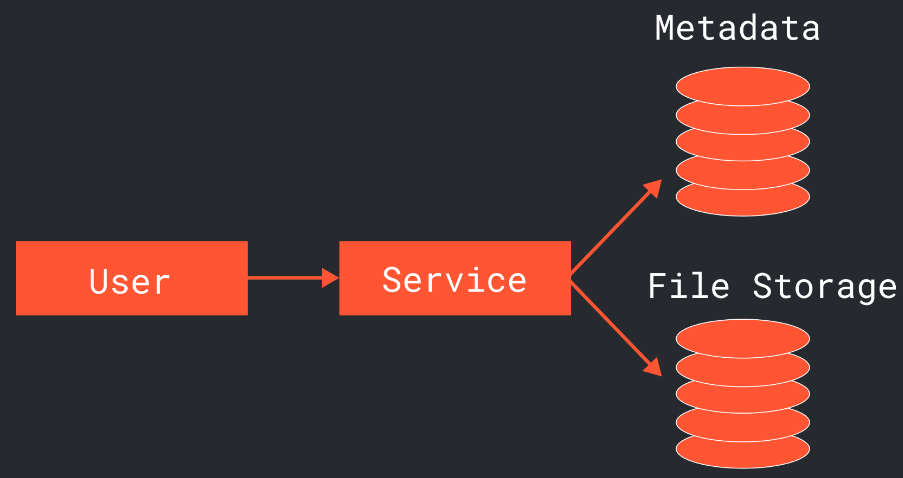
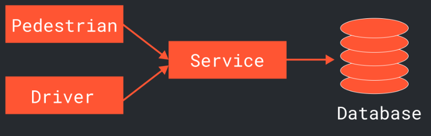
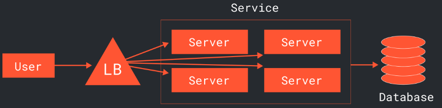

# Высокоуровневый дизайн
**Высокоуровневый дизайн** - дизайн минимально учитывает основные сценарии взаимодействия с системой, но при этом не отражает всю сложность взаимодействия между большими количестовм реальных компонентов системы и не принимает во внимание ту нагрузку которая будет возложена на систему в продуктовой среде.
## Общий дизайн
Общий дизайн когда часть системы взаимодействует с пользователем (**front-end**), часть системы производит работу вне ведения пользователя (**back-end**), а так же есть какая то база данных подходит почти для всего

При работе системы с файлами занимающими много места для хранилищая создают базы данных с **метаданными** о файлах и БД с самими файлами (фото, видео, большие тексты и т.п.)

При работе с приложением разнящихся по функционалу груп пользователей (продавец-покупатель, тренер-атлет, водитель-пассажир) важно отметить взаимодействие с **каждой группой** (+ само взаимодействие будет отличаться)

Для системы с большим объемом пользователей сразу необходимо обозначить **балансировщик нагрузки**
