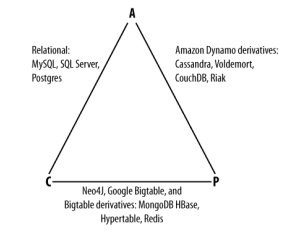
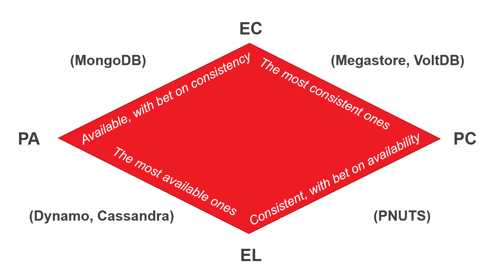
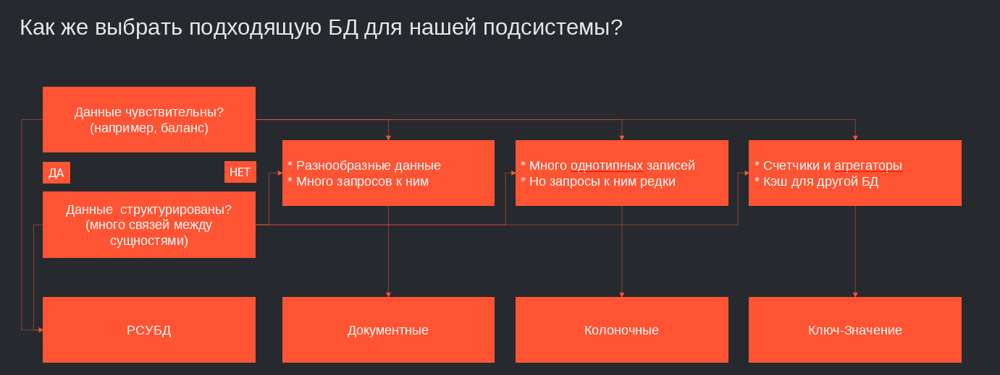

# Выбор баз данных
Требования **ACID**:
- **Atomicy**- Атомарность. Гарантирует, что транзакция (набор команд) будет выполнена целиком или не будет выполнена вовсе.
- **Consistency** - Согласованость или консистентность. В любой момент времени при работе с БД работа ведется с актульной весией данных (вытекает из пред пункта т.к. промежуточные варианты транзакций не допустимы.)
- **Isolation** - Изолированность. Во время выполнения транзакции другие транзакции не должны на нее влиять
- **Durability** - Надежность. Если пользователь получил уведомление от том что транзакция выполнена. Ничто не должно отменить изменения внесенные в рамках этой транзации.
## Виды БД
Основные виды БД:
- **Реляционные** - базы данных, записи в которых храняться в виде таблиц и имеют определенные отношения между таблицами. Сюда относяться все СУБД и базы отвечающие требованиям ACID. (MySQL, PostgreSQL, SQL Server, SQLIte)
- БД типа **key-value** - поддерживают и хранят только наиболее простые операции с записями по ключу (Redis, DinamoDB, MemcacheDB)
- **Колочные** БД - БД в которых данные храняться в виде набора колонок не связанные между собой. Каждая строка которую нужно сохранить в базу, разбивается на части, каждая часть записывается в свою колонку. (ClickHouse, Vertica, Hbase, Cassandra)
- **Документные** БД - хранят данные в сложных древовидных структур типа JSON (MongoDB, CouchDB, Amazon DocumentDB)
- **Временные БД** - или БД временных рядов (InfluxDB, TimescaleDB)
- **Графовые БД**

> **реляционные БД** - можно считать базой данных по умолчанию. Все реляционные БД соблюдают ACID  
> **БД типа key-value** - как ключи так и значения могут быть чем угодно: от простых до сложных составных объектов. Отличаются от реляционных БД большой скоростью работы (хранение даннх в оперативной памяти) и масштабируемость. Можно исползовать как кеш  
> **колоночные БД** - отлично подходит для использования при сценариях на "чтение" для BI или data Warehouse  
> **документные БД** - каждый отдельный документ может представлять из себя разные структуры, такие БД удобны для каталожной информации

Cap теорема для БД:

PACELC теорема:
оскольку теорема PACELC основана на CAP, она также использует его определения. Эта теорема используется в том случае, когда разделения не происходит.
Вся теорема сводится к if P -> (A or C), else (L or C), или же:
В случае наличия разделения (P) надо выбирать между доступностью (A) и согласованностью (C).
Иначе (Else) мы можем дополнительно выбирать между меньшей задержкой (L) и согласованностью (C).
Latency — это время, за которое клиент получит ответ и которое регулируется каким-либо уровнем consistency. Latency в некотором смысле представляет собой степень доступности.

Простой сценарий по выбору БД:
