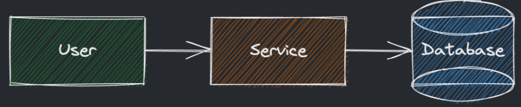
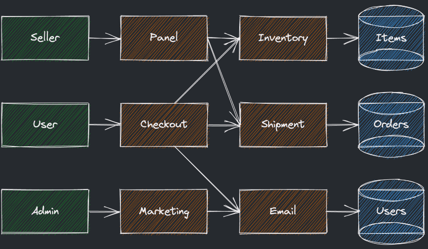
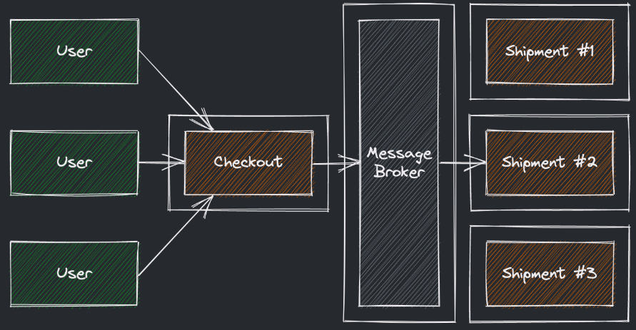
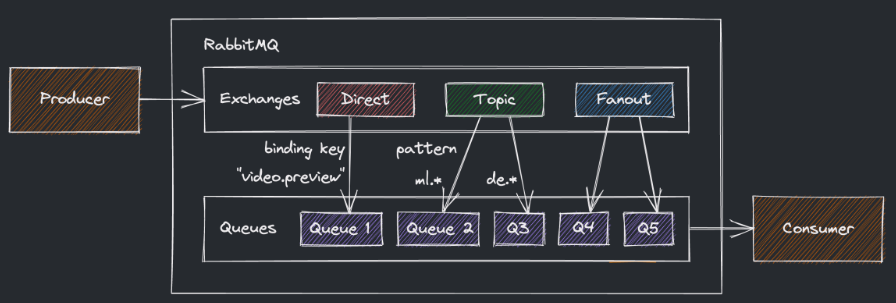
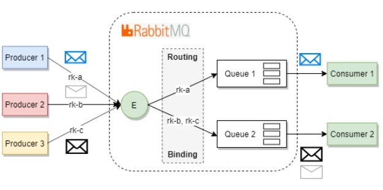
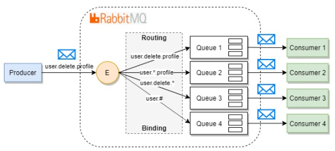
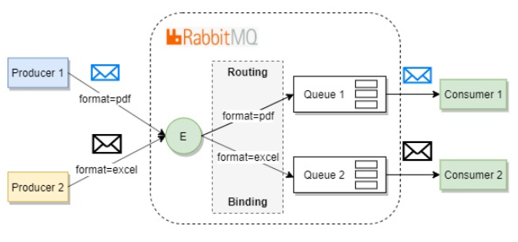

# Модульный подход к дизайну
При модудульном подходе к дизайну вместо высокоуровнего дизайна

Используют модульный дизайн:

Таким образом от обстрактных квадратов мы переходим к:
- Реальным **акторам** который взаимодействуют между собой
- категориям акторов
- сценариям взаимодействия
- функционалу сервисов
**Преимущества и сложности подхода:**
- Мы сразу отображаем картину того какие смысловые части сервиса должны быть реализованы
- Легко переносить функциональные требования в дизайн, на каждое требование можно выделить отдельный модуль
- У разных модулей разная нагрузка, масштабировать их можно независимо (но нужны будут балансировщики)
**Минусы:**
- Со временем зависимости могут расти
- Неравномерная нагрузка на разные сервисы
**Сложности:**
- Сложность образующихся связей между частями системы
- Продолжение работы зависимого сервиса зависит от используемого

## Очереди сообщений:
**Очередь сообщений** - сущность, в которую будут приходить сообщения от разных сервисов, которые называются **продюсерами**, далее сообщения будут использовать другие сервисы называемые **консьюмерами** (получают сообщения и осуществляют какую то работу над ними)  
Приложения могут быть как продьюсерами, так и консьюмерами, так и тем и другим одновременно. Сообщения лежат в очереди до тех пор, пока какой-либо консьюмер не получит их.  
Очереди сообщений реализуются внутри какого либо **брокера сообщений**

Использование очереди сообщений позволяет:
- Разъединить сервисы на логические составляющие и не использовать друг друга напрямую;
- Разъединённые сервисы можно независимо и просто масштабировать за счёт количества воркеров;
- Очереди лежат на отдельном инстансе и основные свободны от лишней работы, косвенно ускорены.

## Сценарии взаимодействия с брокером сообщений: 
**push based подход** — брокер получает сообщение и тут же посылает его в какой-то консьюмер, подписанный на данный вид сообщений;
**pull based подход** — сообщения, посылаемые брокеру, складываются, хранятся некоторое время, а потом приходит консьюмер и забирает нужное количество сообщений.

## RabitMQ
> Продьюсеры отправляют сообщения не в очередь напрямую, а в обменник (exchange);
>   
> Обменник в свою очередь отвечает за маршрутизацию сообщений по разным очередям;
>
> Сообщения маршрутизируются на основе привязок (binding, подобие доменного адреса) и ключей маршрутизации (routing keys).

**Типы используемых обменников**
- **Direct**: сообщение отправляется в очередь, **ключом маршрутизации** которой совпадает с **ключом маршрутизации** сообщения (Поиск соответствия происходит при помощи проверки строк на эквивалентность);
  
- **Topic**: сообщения отправляются в очереди, ключ которых удовлетворяет шаблону (ри создании шаблона используются 0 или более **слов** (буквы AZ и az и цифры 0-9), разделенных точкой, а также символы **\*** (одно любое **слово**) и # (0 или несколько любых **слов**).
  
- **Fanout**: все сообщения доставляются во все очереди даже если в сообщении задан ключ маршрутизации
- **Header**: маршрутизация осуществляется на основе заголовков (headers) в сообщениях. `headers` представляет собой `Dictionary<ключ, значение>`.
  
  
RabbitMQ хранит сообщение **до тех пор**, пока принимающее приложение не подключится и не получит его из очереди. Клиент может **подтвердить** получение сообщения сразу или после того, как полностью обработает его. Как только такое подтверждение получено, сообщение удаляется из очереди.

## Apache Kafka

## RabbitMQ vs Kafka
Для чего лучше подходит Kafka
Лучше всего для стриминга из A в B без сложной маршрутизации, но с максимальной производительностью;
Идеально для логирования событий, обработки потока и отслеживания последовательных изменений в системе;
Подходит для обработки данных в многоуровневых пайплайнах.
Кратко: используем для хранения и последующей, возможно повторной, обработки и анализа потоковых данных.

Для чего лучше подходит RabbitMQ
Применяется для тяжёлых фоновых задач, а также коммуникации внутри сложных приложений;
Идеально для веб-сервисов с низкими задержками благодаря делегированию нагрузки множеству воркеров;
Также подходит для фоновых и долгоиграющих задач вроде конвертации видео или обработки изображений.
Кратко: используем с долгими фоновыми задачами и для общения и интеграции между различными сервисами.