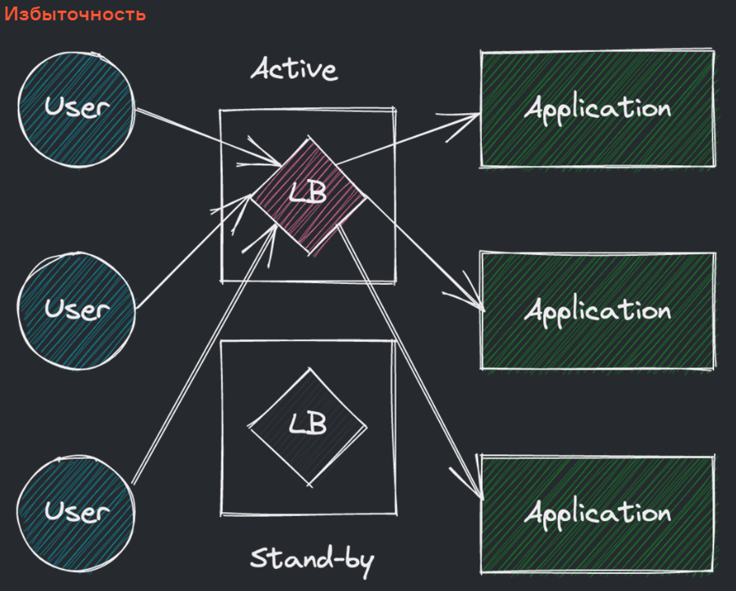
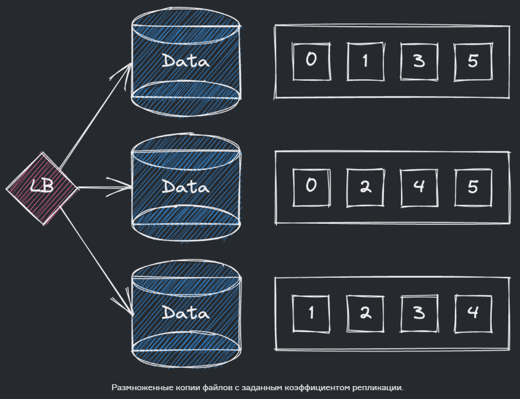
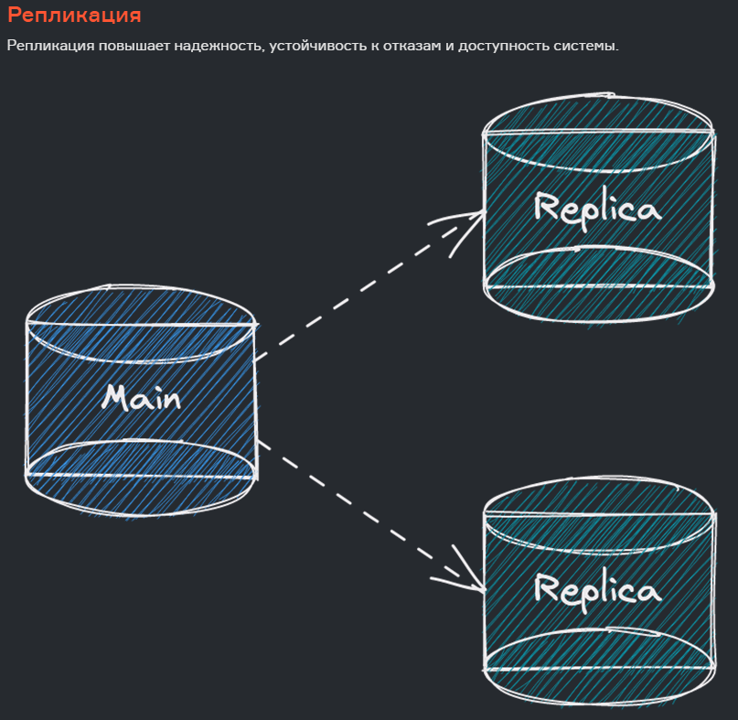
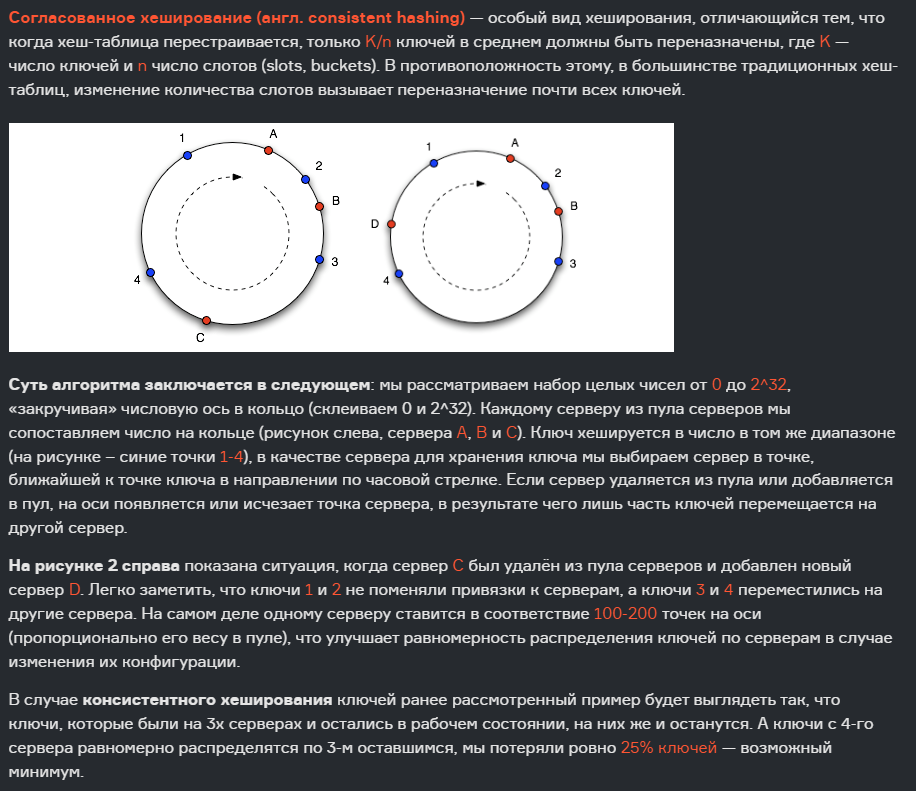
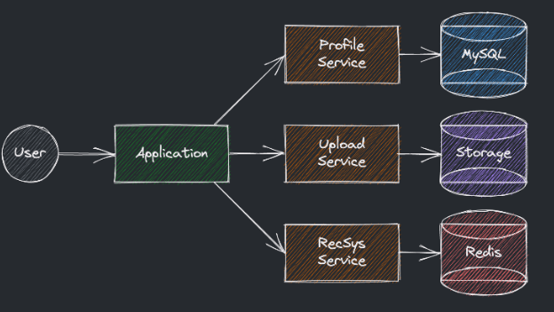
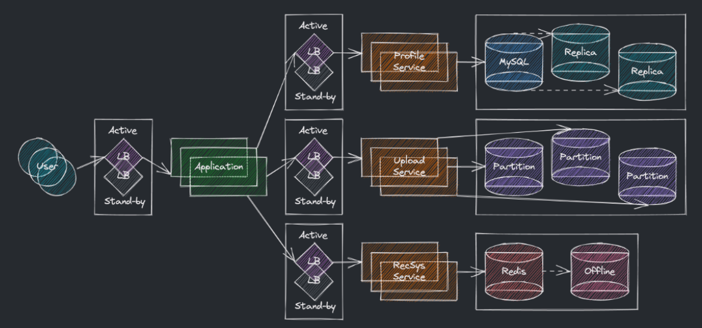

# Масштабирование системы
## Балансировка нагрузки
**Балансировка нагрузки** - распределение заданий между несколькими сетевыми устройствами с целью **оптимизации** использования ресурсов, **сокращения** времени обслуживания, а также предотвращение **перегрузки** какой-либо из частей системы

**Балансировщик нагрузки (load balancer)** - компонент системы, который перераспределяет передаваемый трафик между разными приложениями, сервисами и хранилищами. Балансировщик также может следить за статусом сервисов, в которые он передает запросы, чтобы перестать передавать запросы к серверам, переставшим отвечать в течение заданного времени.

**Принцип работы балансировщика нагрузки**:
- Анализ того какие сервисы готовы принять и обработать запрос пользователей
- Выбор наиболее подходящего сервиса по заданному алгоритму

**Алгоритмы выбора наиболее подходящего сервера**
- По **количеству соединений** - приоритет серверу с минимальным количеством подключений
- По **времени ответа** - приориет серверу с наименьшей задержкой перед ответом
- По **трафику** - приоритет серверу с минимальной сетевой нагрузкой
- **Round-robin** - на каждый запрос меняем сервер по кругу из заранее определенной очереди
- **Weighted round-robin** - серверы получают веса на основании характеристик выше
- **Пользовательский хеш** - выбираем сервер на основании хеша(IP, user_id, ...)
  
**Преимущества использования балансировщика**
- Улучшается пользовательский опыт за счёт передачи запроса подходящему серверу;
- Снижается нагрузка на каждый из серверов за счёт распределения запросов между ними;
- Справляемся с отказом части серверов, по крайней мере, в случае stateless сервиса;
- Умные балансировщики могут даже предсказывать рост нагрузки и инициировать автоскейлинг.
## Распределение данных
Есть несколько основных подходов для распределения данных:
**Секционирование (или партицирование, partitioning)** - разделение (разбиение) больших хранимых файлов или объектов в базах данных на логические части по каким-то критериям. Секционирование повышает масштабируемость и производительность системы

**Избыточность и репликация**. Под **избыточностью** понимается дублирование важных элементов системы для повышения надежности. Под **репликацией** понимается копирование данных в избыточные сервисы для консистентности.
### Секционирование
**Вертикальное секционирование** (по умолчанию) подразумевает выделение разных смысловых частей данных и последующее вероятное разнесение их по разным машинам, запас тем самым ограничен; (смысловых частей может быть ограниченное количество, одна смысловая единица всегда храниться на одной машине какой бы большой она не была)  
**Горизонтальное секционирование**, оно же шардирование (sharding) подразумевает разбиение данных на уровне таблиц по выбранному ключу, например, дню недели или почтовому индексу и разнесение их по разным машинам

**Способы секционирования записей**:

**На основе ключа или хеша:** применяем хеш-функцию к какому-либо из полей и получаем номер партиции. (хеш преобразуем в число и берем остаток от деления какого либо числа) Например, если мы располагаем сотней серверов и сохраняем время создания записей как int, то номер партиции можно определить по формуле «timestamp % 100». (остаток от деления (число всегда будет от 0 до 99)) При удачном выборе такого ключа данные будут распределены предопределённым образом и равномерно. Из минусов — фиксированное количество серверов. Выпадет один и начнется перекос в нагрузке;

**По спискам** — мы можем заранее распределить все поступающие записи по предопределённым группам на основе страны, дня недели и т.п., понимая, как соотносится нагрузка из разных групп;

**Round-robin** разбиение — меняем партиции по кругу с каждой новой поступающей записью;

**Составное разбиение** — комбинируем что-либо из вышеупомянутого.

**Недостатки метода**
**Выполнение JOIN-ов** — они теперь затрагивают данные на нескольких серверах и часто невыполнимы. Частично решается денормализацией БД;  
Большинство РСУБД **не могут следить** за валидностью внешних ключей на разных серверах;  
**Ребалансировка** — иногда нам нужно изменить способ шардирования, если поздно поняли уязвимость текущего способа, и как следствие получили неравномерность данных или запросов по серверам. Скорее всего это приведёт к пересылке всех данных между серверами и недоступности все это время.

## Избыточность 

## Репликация

Для гарантии **консистентонсти** есть лве стратегии:
**Кворум**

**Лидер и последователи** - В каждый момент времени есть только один лидер, который осуществляет репликацию данных. Последователи пишут данные по запросу лидера, служат резервной копией и помогают при чтении. В случае отказа лидера один из последователей становится новым лидером.

## Пример подготовки системы к масштабированию:

## Выводы
- При масштабировании и увеличении трафика появляется необходимость в балансировщике нагрузки;
- При масштабировании и увеличении трафика появляется необходимость секционировать данные;
- Для повышения надежности можно добавлять избыточные сервисы и реплицировать данные;
- Есть разные парадигмы для синхронизации реплик, такие как кворум или лидер и последователи;
- При шардировании нужно выбирать ключ так, чтобы был баланс и в нагрузке, и в занимаемом месте;
- При генерации ключа для выбора шарда стоит прибегать к консистентному хешированию.