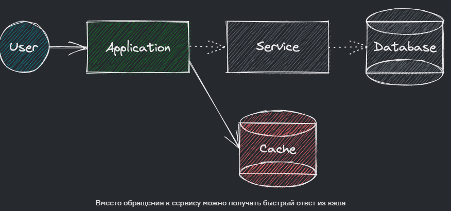
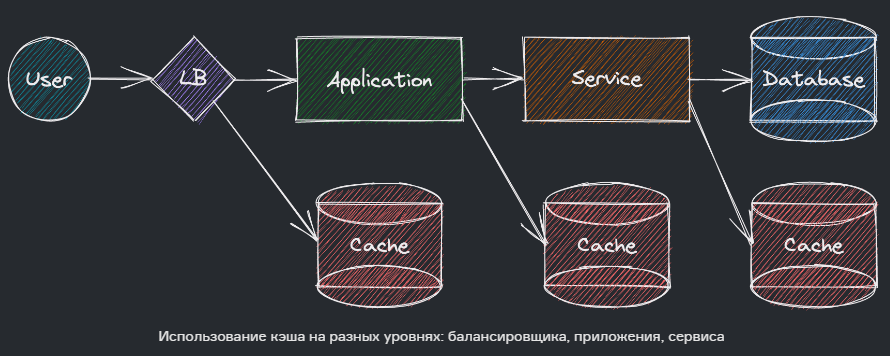
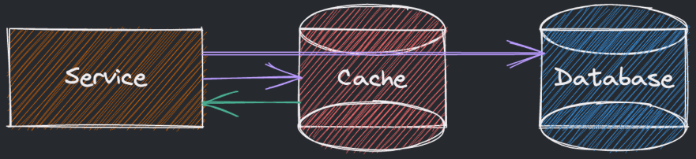
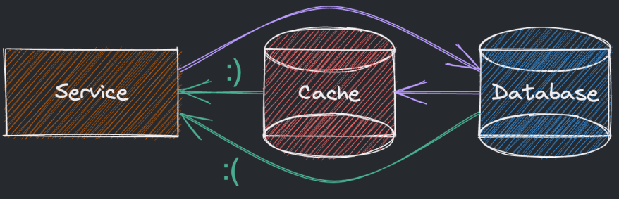
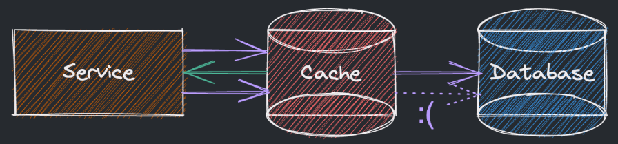
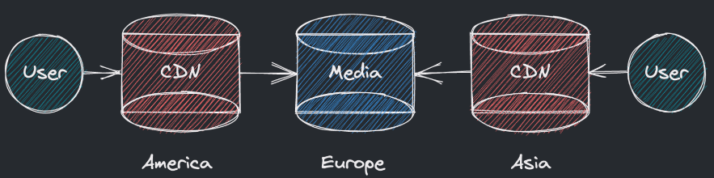

# Повышение отзывчивости
## Кеширование данных
**Самый лучший способ ускорить вычисления** - не совершать их (то есть сделать их заранее и результат сохранить в хранилище с быстрым доступом). Для этого существует **кеш**.

**Эффективность кеширования строиться на следующих предположениях:**
- Большинство обращений происходит к недавним данным.
- Большая часть нагрузки приходиться на малую часть запросов/данных (**принцип Парето 80-20**)
    

**Кеш может распологаться на любом из уровней:**

- На запрос к фронтенду отдаем уже собранную страницу;
- Для запроса на вычисления предоставляем сразу готовый ответ;
- Для данных используем RAM вместо SSD, SSD вместо HDD и HDD вместо сети.
- Экономим большую часть железа, ценой малого количества более дорогих машин. **А отзывчивость лучше**
  
## Инвалидация кэша
>There are only two hard things in Computer Science: cache invalidation and naming things — Phil Karlton

Рано или поздно данные в кеше "протухнут", то есть в БД будут прогружены более актуальные данные, а в кеше остануться старые.
В таком случае необходимо производить инвалидацию кеша.
### Способы инвалидации кеша
1. **Сквозная запись**: данные сразу записываются и в источник, и в кэш.

**Плюсы**: гарантированная консистентность, минимизация потерь.  
**Минусы**: запись становится даже медленнее из-за двух операций.

2. **Запись в обход**: данные сначала записываются в БД, минуя кеш, а затем происходит синхронизация кеша.

**Плюсы**: не нагружаем кэш записью невостребованных данных.  
**Минусы**: для недавних данных считывать нечего, идём в источник.

3. **Реверсивная запись**: данные сначала записываются в кэш, а затем происходит синхронизация с основной БД.

**Плюсы**: низкие задержки и высокая пропускная способность на запись.  
**Минусы**: можно потерять недавние данные, не продублированные в источник.

### Вытеснение данных
По правилу **80-20** мы храним 20% данных в кэше, но как вытеснять место под актуальные данные?

**First In First Out (FIFO)**: удаляем самые давние записи несмотря на их популярность;
**Last In First Out (LIFO)**: удаляем самые свежие записи несмотря на их популярность;
**Least Recently Used (LRU)**: удаляем записи, не использованные дольше всего;
**Most Recently Used (MRU)**: удаляем самые недавние из использованных записей;
**Least Frequently Used (LFU)**: ведем счёт обращений, удаляем самые непопулярные;
**Random Replacement (RR)**: удаляем случайно выбранные записи.

Одним из оптимальных вариантов видится комбинация из принципов в основе LRU и LFU.

В некоторых системах вместо 20-80/80-20 может быть и 1-20-79/50-40-10 (пользователи-звёзды).

В таких случая стоит выделить пользовательские кластеры с ещё более глубоким кешированием.

### Content Delivery Network
Особым видом кэша можно считать **Content Delivery Network (CDN)** — это распределённые хранилища данных, которые используются в крупных системах, покрывающих различные регионы и даже весь мир.

Инстансы CDN распределены по местам присутствия сервиса и особо полезны в случаях использования часто запрашиваемых медиа файлов вроде изображений, звука или видео.

При запросе файла CDN отдаст его напрямую при наличии, иначе же обратится к центральным серверам.

