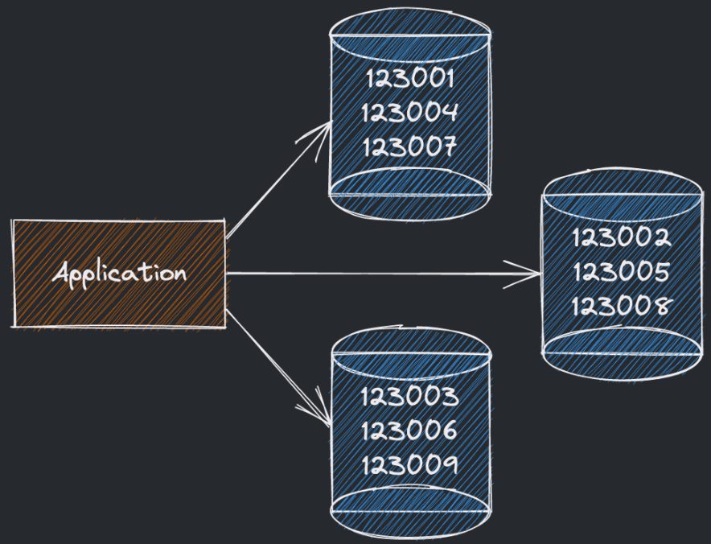
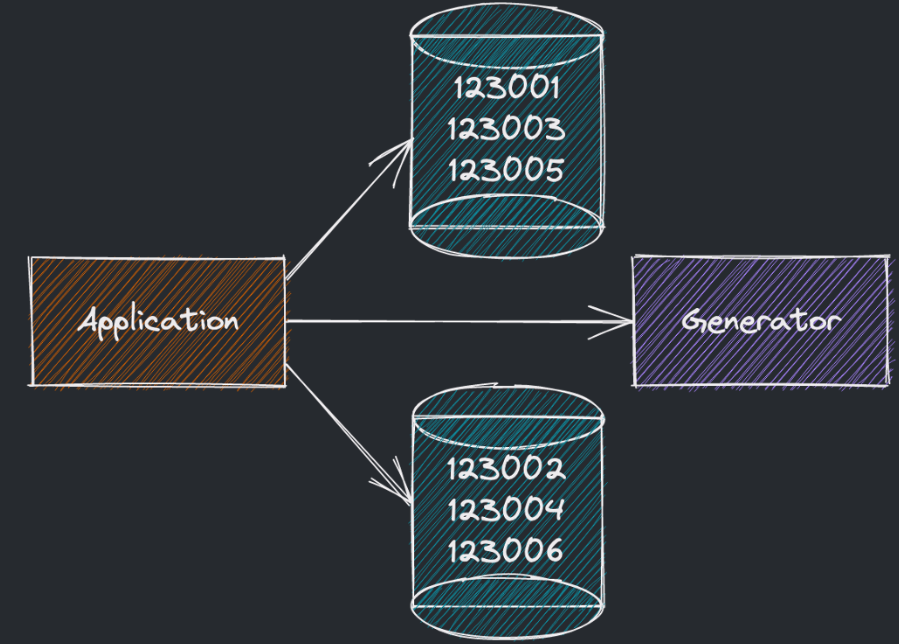

# Индексирование БД
**Индексация баз данных** – это как наличие указателей в словаре или оглавления в книге. **Указатели/индексы** помогают вам быстрее найти нужную информацию, поскольку вы знаете, где искать. В базах данных индексация помогает ускорить процесс поиска данных, поскольку она позволяет системе быстро определить, где, **физически**, в памяти хранятся нужные вам данные.  
Индексы храняться в отдельной таблице.

**Плюсы**:  
Увеличение скорости поиска записей по ключу в индексе (O(N) -> O(logN));
Ускоренный выбор нужного шарда в случае распределённой БД.  
**Минусы**:  
При обновлении данных нужно обновить не только их, но и записи в индексе; Как итог, уменьшается скорость записи, обновления и удаления записей в таблице.  
**Когда применяем**:  
Поиск по многочисленным или распределённым записям в БД становится бутылочным горлышком.
**Когда не применяем**:  
Если операций на запись значительно больше операций на чтение, то индексирование только во вред.

**Лишние индексы не строим**, а более ненужные не забываем удалять.

## Создание ID записей
Ещё один вопрос, который необходимо разрешить в случае **распределённой системы**, — это генерация ID. В случае разделения таблиц по нескольким машинам простого автоинкремента на 1 **уже не хватит**.

**Что хотелось бы видеть**:
- Уникальные целочисленные значения (int64) ID;
- Не обязательно увеличивающиеся с шагом 1;
- В целом (по часам) идущие в порядке генерации;
- Которых будет хватать на десятки тысяч генераций в секунду.
  
### **Самостоятельная генерация инстансом**
Один их способов — это создание ключей каждым основным инстансом БД самостоятельно. Идентификаторы все также инкрементирутся, **но начало** у разных инстансов будет разное (1-у первого, 2-у второго и т.д.), а **шаг инкремента** будет **равен количеству инстансов**.  
**Плюсы**:
- При первоначальном создании масштабируется под нужное количество серверов.  
  
**Минусы**:  
- Идентификаторы могут «разбежаться» со временем и стать не сравнимыми между серверами;
- Масштабирование подхода статично и с**ложно подстроиться под изменение количества машин**.
  

### **Universally unique identified (UUID)**

Universally unique identified (**UUID**) — это универсальный 128-битный идентификатор сущностей, который по стандарту содержит в себе, в числе прочего, временную отметку и идентификатор устройства.
**Пример UUID**: 123e4567-e89b-12d3-a456-426614174000

**Плюсы**:

- Идентификаторы создаются независимо, основными репликами базы данных;
- Легко масштабировать, т.к. нет необходимости в координации между ними.
**Минусы**:
- 128 бит по стандарту больше 64-х бит;
- Идентификаторы не линейны по времени;
- Идентификаторы не целочисленные.

### Сервис-генератор
Ещё одним подходом является использование отдельного сервиса-генератора ID с инкрементом.

При создании записей в БД приложение обращается к нему за получением нового идентификатора

**Плюсы**:
- Получаем числовые упорядоченные линейно упорядоченные по времени ID;
- Подход легко масштабируется для систем не сильно большого объема.

**Минусы**:
- Генератор является единой точкой отказа в системе, без него ничего не записать в систему;
- Для добавления надёжности нужно будет отдельно думать про избыточность и синхронизацию.

### Как в Twitter
Пока что все рассмотренные подходы имели те или иные недостатки по модулю наших требований. Еще один пример генерации ID был предложен компанией Twitter:

**В качестве идентификатора твита выступает 64-битное число, которое содержит в себе:**

- **(1) бит** Зарезервированный бит;
- **(41) бит** Временную метку с момента начала работы Твиттера;
- **(5) бит** Идентификатор датацентра;
- **(5) бит** Идентификатор машины в датацентре;
- **(12) бит** Последовательный номер в рамках миллисекунды по модулю датацентра/машины.

**Плюсы**:
- Помещаемся в 64 бита;
- Все ID генерируются независимо;
- Все ID упорядочены с точностью до секунд (зависит от NTP сервера);
- Каждая машина в теории может генерировать несколько миллионов ID в секунду;
- Упрощается маршрутизация при доступе к данным, тем самым в целом повышается отзывчивость.