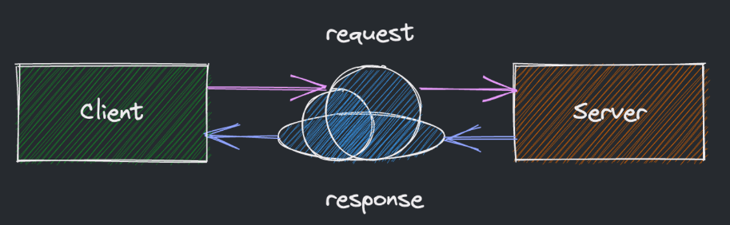
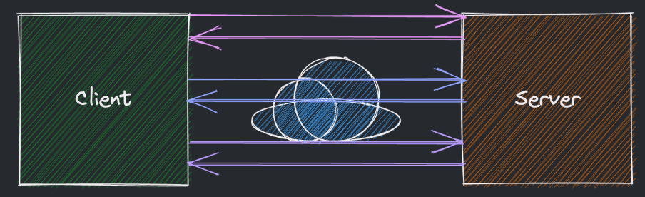
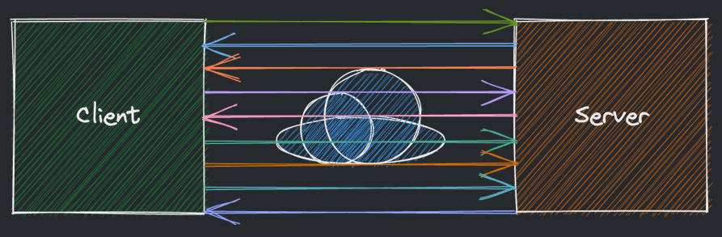
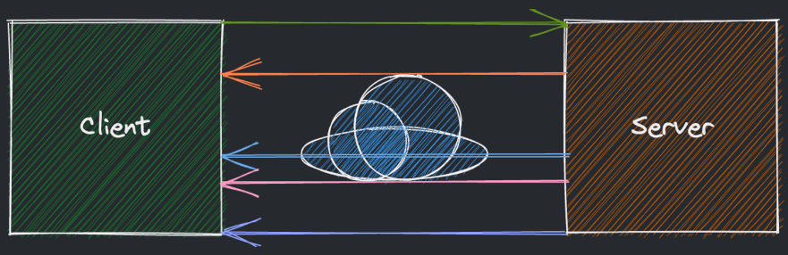

# Соединения и протоколы
Типичное взаимодействие между клиентским приложением и сервером по HTTP выглядит как:

Клиент открывает соединение с сервером;
Клиент отправляет запрос на сервер;
Сервер подготавливает ответ;
Сервер отправляет ответ по открытому соединению.

## AJAX Polling
При необходимости получить дополнительные данные на странице можно воспользоваться AJAX.

AJAX Polling — это подход, при котором клиент постоянно опрашивает сервер об изменениях. При отсутствии изменений сервер возвращает пустой ответ.

Взаимодействие между клиентом и серверов при AJAX Polling устроено следующим образом:

- Клиент открывает соединение и запрашивает страницу по HTTP;
- Уже со страницы затем поступают запросы с интервалом;
- Сервер подготавливает ответ на каждый такой запрос;
- Клиент повторяет данный сценарий взаимодействия с другой страницей.

Минусы подхода AJAX Polling для обновления данных на клиенте:

- Необходимо постоянно опрашивать сервер вне зависимости от наличия обновлений;
- Большая часть ответов приходит пустая, забивая при этом HTTP канал.
## HTTP Long-Polling
Альтернативой AJAX Polling является HTTP Long-Polling.

В отличие от AJAX Polling здесь уже сервер управляет отсылкой данных. Клиент же создает «висящие» запросы, дожидается ответа и сразу же посылает новый запрос.

Взаимодействие между клиентом и серверов при HTTP Long-Polling устроено следующим образом:

- Клиент открывает соединение и запрашивает страницу по HTTP;
- Уже со страницы затем в свою очередь поступают запросы к серверу;
- При наличии обновлений сервер посылает ответ на запрос клиенту;
- Клиент затем почти сразу посылает новый такой же запрос;
- У каждого установленного соединения есть таймаут, чтобы они не висели бесконечно.

## Веб-сокеты
Еще одним способом взаимодействия между клиентом и сервером является использования веб-сокетов:

- Соединение устанавливается клиентом через специальную процедуру (handshake);
- Веб-сокеты предоставляют долгоиграющее соединение между клиентом и сервером;
- И клиент, и сервер могут обмениваться данными в произвольном порядке;
- Коммуникация обеспечивается с минимальными издержками.
- Фактически веб-сокеты позволяют установить двусторонний диалог между клиентом и сервером.

## Server-Sent Events
Способ взаимодействия через **Server-Sent Events (SSEs)** похож в чём-то и на веб-сокеты, и на **Long-Polling**.

- После первичного получения данных клиент подписывается на обновления с сервера.
- Если же клиенту данные нужно наоборот передать, он может воспользоваться другим протоколом.

Взаимодействие между клиентом и серверов через SSEs устроено следующим образом:

- Клиент открывает соединение и запрашивает страницу по HTTP;
- Открытая страница открывает соединение с сервером;
- Сервер посылает данные клиенту в случае наличия обновлений;

Этот способ подходит для систем, где сервер присылает клиенту обновления **в реальном времени**.

