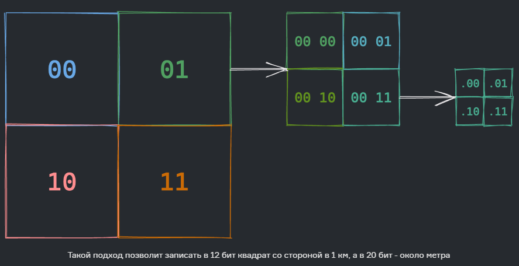
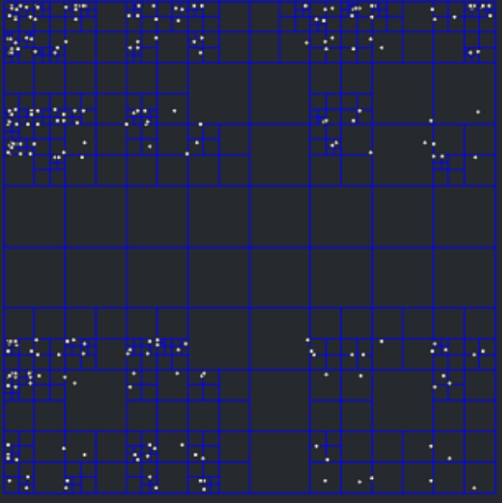

# Поиск по геолокации
Простой поиск
>
```sql
SELECT * FROM restaurants
WHERE (latitude BETWEEN 41.7167 – R AND 41.7167 + R) AND
      (longitude BETWEEN 44.7853 – R and 44.7853 + R)
```
Проблема такого подхода – в необходимости сканировать всю таблицу с заведениями целиком.

Можно ускорить поиск за счет индексирования, но только в одном измерении. Полученные «полосы» все равно придется дорого JOIN’ить.
## GeoHash
Для поиска точки на карте или набора каких-то точек, оптимально разбить карту на отдельные квадраты, каждому из которых задавать **адрес**. При этом большие квадраты разбиваются на более мелкие с постепенным увеличением **адреса** последних.


Итоговый адрес ячейки записывается в виде строки. Чтобы найти точки поблизости, достаточно изучить ячейки с общим **префиксом**.

Особенности использования GeoHash для поиска ближайших локаций:

- Если префикс у двух точек совпадает до какой-то степени, это гарантирует их близость;
- **Обратное не верно** — достаточно близкие точки **могут не иметь** общего префикса вообще;
Найти ближайшие места можно простым 
```sql
SELECT * FROM places WHERE geohash LIKE ‘prefix%'
```
- Также два заведения совсем рядом могут иметь разный хеш, поэтому стоит включать соседние клетки;
- При необходимости расширить зону поиска достаточно немного уменьшить префикс;
- Можно создавать локальный геохэш для областей присутствия.
  
## QuadTree
**Дерево квадрантов** (также квадродерево, 4-дерево, **quadtree**) — дерево, в котором у каждого внутреннего узла ровно 4 потомка. Деревья квадрантов часто используются для рекурсивного разбиения двухмерного пространства по 4 квадранта (области). Области представляют собой квадраты, прямоугольники или имеют произвольную форму. Англоязычный термин **quadtree** был придуман Рафаэлем Финкелем и Джоном Бентли в 1974 году. Аналогичное разбиение пространства известно как Q-дерево.

Общие черты разных видов деревьев квадрантов:

- разбиение пространства на адаптирующиеся ячейки (adaptable cells);
- максимально возможный объём каждой ячейки;
- соответствие направления дерева пространственному разбиению.
- Предлагаемый подход также разбивает карту на квадраты, но делает это более оптимально — динамически увеличивает глубину разбиения в зависимости от количества точек


**Особенности использования QuadTree для поиска ближайших локаций:**

- Построение дерева линейно по количеству точек интереса;
- Соответствие между искомой позицией и листом в дереве находится за считанные шаги;
- Для поиска ближайших точек интереса либо останавливаемся в листе, либо поднимаемся выше;
- Два заведения совсем рядом могут попасть в разные ячейки, поэтому можно взять соседние;
- При необходимости расширить зону поиска достаточно подняться на один уровень выше;
- Расширение зоны поиска происходит в неравной степени по сторонам света и по диагонали;
- Все решение легко умещается в оперативную память и поиск проходит стремительно.


## Сравнение двух подходов
### Особенности использования геохеширования:
- легко реализовать, не надо ничего «строить»;
- легко найти заведения (точки интереса) в определённом радиусе;
- нельзя адаптировать гранулярность сетки, только перестраивать заново;
- для добавления/удаления записи в индексе достаточно добавить/удалить одну строчку в таблице.
### Особенности использования квадродерева:
- чуть сложнее реализовать, т.к. нужно строить дерево поиска;
- легко найти top-k ближайших точек интереса;
- можно адаптировать глубину тех или иных участков дерева со временем;
- добавление/удаление записей включает спуск по дереву и балансировку при необходимости.